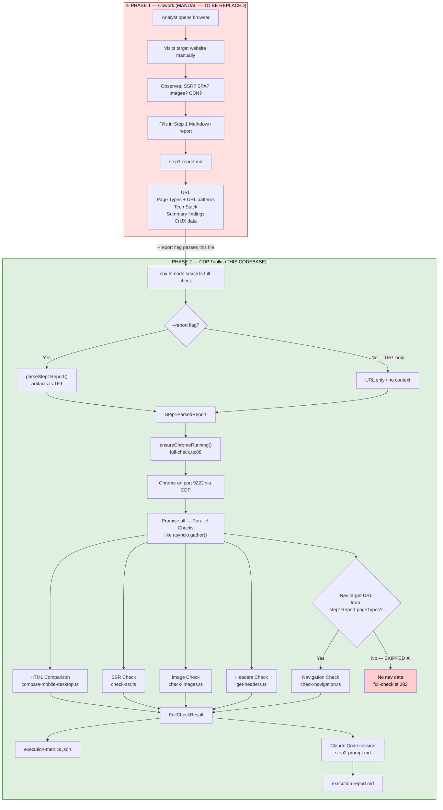
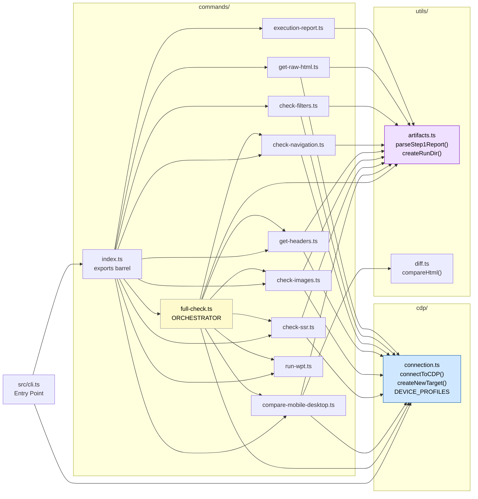

# Module 1 — The Big Picture

## Two-Phase Workflow

```mermaid
flowchart TD
    subgraph PHASE1["⚠️ PHASE 1 — Cowork (MANUAL — TO BE REPLACED)"]
        direction TB
        A1[Analyst opens browser] --> A2[Visits target website manually]
        A2 --> A3[Observes: SSR? SPA? Images? CDN?]
        A3 --> A4[Fills in Step 1 Markdown report]
        A4 --> A5[step1-report.md]
        A5 --> A6["URL
Page Types + URL patterns
Tech Stack
Summary findings
CrUX data"]
    end

    subgraph PHASE2["PHASE 2 — CDP Toolkit (THIS CODEBASE)"]
        direction TB
        B1["npx ts-node src/cli.ts full-check"] --> B2{--report flag?}
        B2 -->|Yes| B3["parseStep1Report()
artifacts.ts:169"]
        B2 -->|"No — URL only"| B4[URL only / no context]
        B3 --> B5[Step1ParsedReport]
        B4 --> B5
        B5 --> B6["ensureChromeRunning()
full-check.ts:88"]
        B6 --> B7[Chrome on port 9222 via CDP]
        B7 --> B8["Promise.all — Parallel Checks
like asyncio.gather()"]
        B8 --> C1["HTML Comparison
compare-mobile-desktop.ts"]
        B8 --> C2["SSR Check
check-ssr.ts"]
        B8 --> C3["Image Check
check-images.ts"]
        B8 --> C4["Headers Check
get-headers.ts"]
        B8 --> C5{"Nav target URL
from step1Report.pageTypes?"}
        C5 -->|Yes| C6["Navigation Check
check-navigation.ts"]
        C5 -->|"No — SKIPPED ❌"| C7["No nav data
full-check.ts:283"]
        C1 & C2 & C3 & C4 & C6 --> D1[FullCheckResult]
        D1 --> D2[execution-metrics.json]
        D1 --> D3["Claude Code session
step2-prompt.md"]
        D3 --> D4[execution-report.md]
    end

    A6 -->|"--report flag passes this file"| B1

    style PHASE1 fill:#ffe0e0,stroke:#cc0000,color:#000
    style PHASE2 fill:#e0f0e0,stroke:#006600,color:#000
    style C7 fill:#ffcccc,color:#000
```

---

## Module Dependency Graph

```mermaid
graph LR
    CLI["src/cli.ts
Entry Point"]

    subgraph CMD["commands/"]
        FC["full-check.ts
ORCHESTRATOR"]
        ER["execution-report.ts"]
        CMH["compare-mobile-desktop.ts"]
        SSR["check-ssr.ts"]
        IMG["check-images.ts"]
        HDR["get-headers.ts"]
        NAV["check-navigation.ts"]
        FLT["check-filters.ts"]
        RH["get-raw-html.ts"]
        WPT["run-wpt.ts"]
        IDX["index.ts
exports barrel"]
    end

    subgraph CDP["cdp/"]
        CONN["connection.ts
connectToCDP()
createNewTarget()
DEVICE_PROFILES"]
    end

    subgraph UTL["utils/"]
        ART["artifacts.ts
parseStep1Report()
createRunDir()"]
        DIF["diff.ts
compareHtml()"]
    end

    CLI --> IDX
    CLI --> CONN

    IDX --> FC & ER & CMH & SSR & IMG & HDR & NAV & FLT & RH & WPT

    FC --> CMH & SSR & IMG & HDR & NAV & WPT
    FC --> ART
    FC --> CONN

    CMH --> CONN & DIF & ART
    SSR --> CONN & ART
    IMG --> CONN & ART
    HDR --> CONN & ART
    NAV --> CONN & ART
    FLT --> CONN & ART
    RH --> CONN & ART

    ER --> ART

    style FC fill:#fffacd,stroke:#999,color:#000
    style CONN fill:#d0e8ff,stroke:#0055aa,color:#000
    style ART fill:#f0e0ff,stroke:#7700cc,color:#000
```
