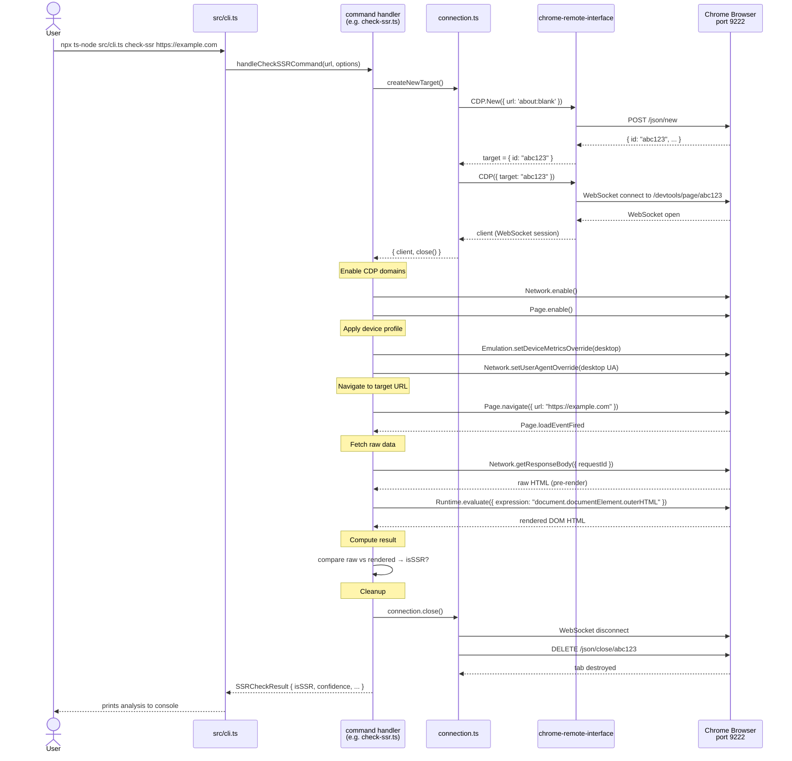

# Module 2 — The CDP Connection Layer

**File:** `src/cdp/connection.ts`

---

## What CDP Actually Is

Chrome DevTools Protocol (CDP) is the internal API that Chrome exposes when it runs with
`--remote-debugging-port=9222`. It is the same protocol that powers Chrome DevTools
when a developer presses F12 — the difference is that here, *the CLI code* is the one
pressing F12, not a human.

Chrome exposes this API over a **WebSocket**. The npm package `chrome-remote-interface`
is the client library that speaks this protocol — it accepts JSON commands
and sends back JSON events and responses.

**Analogy:** Think of it exactly like SSH-ing into a running server.
- Chrome is the server
- Port 9222 is the SSH port
- Each browser tab is a separate **target** (its own process)
- When a connection is made to a target, a WebSocket session is established — the **connection** —
  through which commands are sent ("navigate to this URL", "evaluate this JS", "intercept network requests")
  and events are received ("page loaded", "request made", "DOM changed")

---

## Target vs. Connection

This distinction is central to understanding every command in this codebase.

| Concept | In Chrome | Analogy |
|---|---|---|
| **Target** | A browser tab (or Worker, extension background page). Identified by a UUID. Exists independently of whether anything is connected to it. | A running process on the server |
| **Connection** | A WebSocket session attached to a target. The channel through which you send CDP commands and receive events. | An SSH channel into that process |

Multiple connections can be opened to the same target (this codebase never does).
A target persists even after disconnection. When `createNewTarget()` closes,
it does two distinct things: closes the WebSocket channel *and* terminates the tab.

---

## The Two Connection Functions

### `connectToCDP(config?)` — attach to an existing tab

```
CDP.List()  →  find first 'page' target  →  CDP({ target: id })  →  return { client, close }
```

Calls `CDP.List()` to enumerate all open targets, finds the first one that is a
regular page (filters out `chrome://` extension pages and devtools panels),
then opens a WebSocket connection to it.

**When is this used?** Mostly for inspection utilities — the `targets` command,
or `start-chrome`'s verification step. It is also appropriate for attaching
to a tab the user already has open and loaded.

**Limitation:** If Chrome has no open regular tabs, this function will fail.

---

### `createNewTarget(config?, url?)` — spawn a fresh, isolated tab

```
CDP.New({ url })  →  new tab created  →  CDP({ target: tab.id })  →  return { client, close }
```

Creates a brand new tab via `CDP.New()`, then immediately connects to it.
Its `close()` function does **more** than `connectToCDP`'s close:

```typescript
close: async () => {
  await client.close();          // disconnect WebSocket
  await CDP.Close({ id: target.id });  // destroy the tab
}
```

**Why does this matter?** Every check command calls `createNewTarget()`.
Each check gets a clean, isolated tab — no leftover cookies, no navigation
history, no state from any other check. This isolation is what makes
`Promise.all()` safe: five checks run in five separate tabs in parallel
without interfering with each other. Without this, check A might navigate
away from the URL while check B is still reading from it.

---

## DEVICE_PROFILES

```typescript
export const DEVICE_PROFILES = {
  desktop:     { viewport: 1920×1080, mobile: false, userAgent: "Chrome/Mac" },
  mobile:      { viewport: 412×915,   mobile: true,  userAgent: "Chrome/Android Pixel 7" },
  mobileIPhone:{ viewport: 390×844,   mobile: true,  userAgent: "Safari/iPhone" },
}
```

Many e-commerce sites serve **structurally different HTML** to mobile vs. desktop —
different components, different lazy-loading thresholds, sometimes a completely different
frontend framework. If Chrome navigates to a page without a device profile override,
Chrome identifies itself as a desktop browser and the site serves desktop HTML.

These profiles are applied via CDP's `Emulation` domain at the start of each check:
- `Emulation.setDeviceMetricsOverride()` — sets viewport dimensions and pixel density
- `Network.setUserAgentOverride()` — tells the site it's talking to a Pixel 7 or iPhone

The `compare-mobile-desktop.ts` check is the only one that uses both profiles in a single
run — it explicitly needs both to diff the HTML differences between them.

---

## Sequence Diagram — CLI Command → CDP → Result


