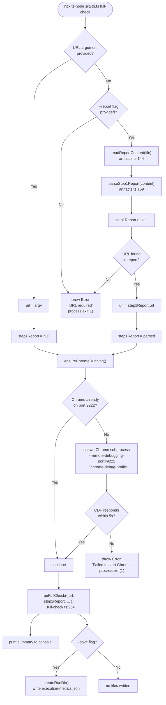

# Module 3 — The CLI Entry Point

**File:** `src/cli.ts`

---

## How Commander.js Works

Commander.js is the TypeScript equivalent of Python's Click library.
Each `.command('name')` block is a `@click.command()`, each `.option()` is a
`@click.option()`, and `.action(async (args, options) => { ... })` is the
decorated function body. The final `program.parse()` at line 335 is the
equivalent of `if __name__ == "__main__": cli()`.

`cli.ts` is deliberately thin — it only declares the command surface (names,
options, descriptions) and immediately delegates to handler functions imported
from `src/commands/`. No business logic lives here. This file does not require
significant modification for the refactor.

---

## full-check Decision Tree

---

## The One Meaningful Difference: full-check vs. Individual Commands

Individual commands (`check-ssr`, `check-images`, etc.) take a URL, run one
check, print the result, and exit. They are stateless one-shots.

`full-check` does three extra things no individual command does:
1. **Bootstraps Chrome automatically** — individual commands fail if Chrome isn't running; `full-check` starts Chrome automatically
2. **Reads and threads Step 1 context** — parses the report file and passes the resulting `Step1ParsedReport` object down into `runFullCheck()`, where it gates the navigation check
3. **Writes `execution-metrics.json`** — records timing and error data for the post-session `execution-report` command to consume later
