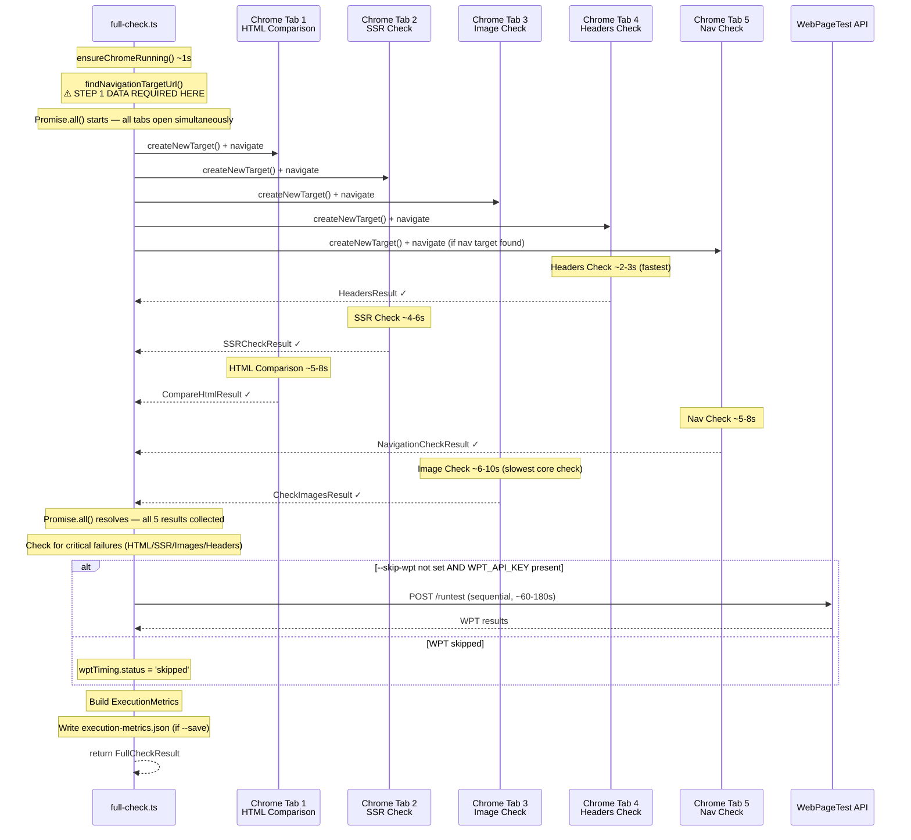
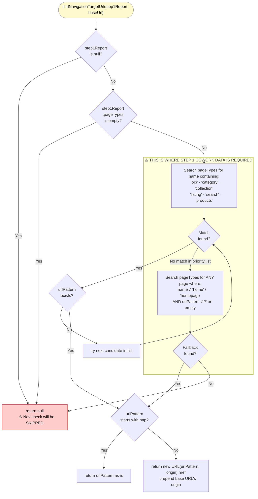

# Module 4 — The Full Check Orchestrator (CRITICAL)

**File:** `src/commands/full-check.ts`

This is the file you will modify for the refactor.

---

## Concept 1 — Promise.all() / Parallel Execution

### ELI5
Imagine you need to make dinner: bake a cake, boil pasta, and toss a salad.
You could do them one at a time — finish the cake, then start the pasta, then the salad.
Total time: 60 minutes. Or you could put the cake in the oven, boil the pasta while it bakes,
and toss the salad at the same time. Total time: ~20 minutes (the slowest task).
`Promise.all()` is the second approach — it starts all the checks simultaneously and
waits for the last one to finish before collecting all the results.

### Technical
`Promise.all(arrayOfPromises)` returns a single Promise that resolves when ALL input
Promises have resolved, collecting results **in order** into an array. If ANY Promise
rejects, `Promise.all()` rejects immediately and discards the others.

This is identical to Python's `asyncio.gather()`. In this codebase:

```typescript
// full-check.ts:346
const [htmlResult, ssrResult, imageResult, headerResult, navResult] =
  await Promise.all(checkPromises);
```

Each check runs in its own Chrome tab (via `createNewTarget()`). All four tabs are
open and navigating simultaneously. Total wall-clock time ≈ the slowest individual
check, not the sum of all checks.

**Critical nuance:** the checks do NOT share a Chrome tab.
`Promise.all()` is safe here precisely because of the tab isolation in `createNewTarget()`.
If they shared a tab, parallel navigation would corrupt each other's data.

### Refactor Implications
If autonomous page discovery is added (crawling the homepage to find a nav target URL),
that discovery step MUST complete BEFORE `Promise.all()` starts — because the
navigation check depends on its result. Discovery cannot run in parallel with the
nav check itself.

---

## Concept 2 — trackCheck() / The Timing Wrapper

### ELI5
Every check is wrapped in a function called `trackCheck`. Think of it as a
stopwatch + error catcher combined. It presses start before the check runs, presses stop
when it finishes (or crashes), and always hands back the result AND the timing data —
even if the check crashed. That way the orchestrator always gets a full picture,
not just a success/failure boolean.

### Technical

```typescript
// full-check.ts:161
async function trackCheck<T>(
  name: string,
  fn: () => Promise<T>,
  baseTime: number
): Promise<{ result: T | null; timing: CheckTiming }>
```

The `<T>` is a TypeScript generic — equivalent to Python's `TypeVar`. It means:
"I don't know what type `fn` returns, but whatever it is, I'll preserve it in my output."
This lets a single wrapper function handle `CompareHtmlResult`, `SSRCheckResult`,
`CheckImagesResult`, etc., without losing type safety.

The key design decision: **`trackCheck` NEVER re-throws errors.** A crashed check
returns `{ result: null, timing: { status: 'failed', error: "..." } }` and resolves
normally. This is why `Promise.all()` never rejects due to a single check failure
— all timing data is always collected, even for failed checks.

The exception is the post-gather check at line 355:
```typescript
if (!htmlResult.result || !ssrResult.result || !imageResult.result || !headerResult.result) {
  throw new Error('One or more critical checks failed.');
}
```
HTML comparison, SSR, images, and headers are "critical" — if any of them fail,
the entire run aborts. Navigation check failure is demoted to a warning instead.

### Refactor Implications
Any new check added (e.g., page discovery, bot wall detection) should also be
wrapped in `trackCheck`. This provides timing data for free and ensures a discovery
failure doesn't crash the entire run.

---

## Concept 3 — ExecutionMetrics / The Run's Paper Trail

### Technical

```typescript
// full-check.ts:39
interface ExecutionMetrics {
  startTime: string;            // ISO 8601 timestamp
  endTime: string;
  totalDurationMs: number;      // wall-clock duration
  checks: {
    htmlComparison: CheckTiming;
    ssrCheck:       CheckTiming;
    imageCheck:     CheckTiming;
    headerCheck:    CheckTiming;
    navigationCheck: CheckTiming | null;  // null = skipped
    wpt:             CheckTiming | null;  // null = not run
  };
  errors:   ExecutionError[];   // critical failures (check name + message)
  warnings: string[];           // non-critical issues
}

interface CheckTiming {
  name:       string;
  startMs:    number;   // ms since run start (not wall clock)
  endMs:      number;
  durationMs: number;
  status:     'success' | 'failed' | 'skipped';
  error?:     string;
}
```

`startMs`/`endMs` are relative to `baseTime` (the run's start epoch). This means
you can reconstruct a Gantt chart of which checks ran concurrently from a single
JSON file. The `execution-report` command reads this file to generate the CC session
documentation and cost estimates.

### Refactor Implications
The `ExecutionMetrics` interface will need a new `CheckTiming` slot for any new
pre-step added (e.g., page discovery). It also requires a new `warnings` entry
for the case where discovery runs but finds no suitable nav target.

---

## Concept 4 — findNavigationTargetUrl() / THE GAP

### ELI5
This function is the structural engineer asking: "Which part of the land should I
drill into?" Without the architect's sketch (the Step 1 report), it has no idea
where to drill and simply tells the engineer to skip the soil test entirely.
It looks at the list of page types the analyst found in Phase 1 — "PLP at /shoes",
"Homepage at /", "PDP at /shoes/nike-air-max" — and returns the URL of the
most diagnostic page to test navigation against.

### Technical

```typescript
// full-check.ts:199
function findNavigationTargetUrl(
  step1Report: Step1ParsedReport | null,
  baseUrl: string
): string | null
```

**Decision logic (in order of priority):**

1. If `step1Report` is null, or `step1Report.pageTypes` is empty → **return null immediately**
2. Search `pageTypes` for a name containing: `plp`, `category`, `collection`, `listing`, `search`, `products`
3. If found with a `urlPattern` → resolve to full URL (prepend origin if relative)
4. If no PLP found → take the first non-homepage page with a `urlPattern !== '/'`
5. If still nothing → **return null**

When null is returned, at `full-check.ts:331`:
```typescript
const navCheckPromise = navTargetUrl
  ? trackCheck('Navigation Check', () => checkNavigation(...), baseTime)
  : Promise.resolve(null);   // ← silently skipped
```

The navigation check produces no data. `FullCheckResult.navigationCheck` is null.
The Claude Code session receives no information about hard vs. soft navigation.

**This is the exact gap the refactor must close.**

### Refactor Implications
The fix lives here. We need to replace the null path with a call to a new
function — something like `discoverNavigationTarget(url)` — that autonomously
crawls the homepage, scores candidate links by URL pattern heuristics
(contains `/category/`, `/collection/`, `/c/`, `/shop/`, etc.), picks the
highest-confidence candidate, and returns its URL. That function runs as a
pre-step before `Promise.all()` begins.

---

## Diagram 1 — Parallel Execution Timeline (sequenceDiagram)



---

## Diagram 2 — findNavigationTargetUrl() Decision Logic



---

## What FullCheckResult Contains

```typescript
// full-check.ts:70
interface FullCheckResult {
  url:             string;
  timestamp:       string;
  htmlComparison:  CompareHtmlResult;        // mobile vs desktop HTML diff
  ssrCheck:        SSRCheckResult;           // isSSR, confidence, evidence
  imageCheck:      CheckImagesResult;        // format stats, lazy load issues
  headerCheck:     HeadersResult;            // CDN, CSP, cache-control
  navigationCheck: NavigationCheckResult | null;  // 'hard'|'soft', method
  wptResult:       Record<string, unknown> | null; // LCP, CLS, waterfall
  step1Report:     Step1ParsedReport | null; // raw Phase 1 data, passed through
  executionMetrics: ExecutionMetrics;        // timing + errors + warnings
  savedTo?:        string;                   // output dir path if --save
}
```

Note that `step1Report` travels all the way through to the output. The Claude Code
session (driven by `step2-prompt.md`) receives this entire object and uses the
Phase 1 findings alongside the Phase 2 CDP results to write the final report.
When Phase 1 is automated, this field will be populated programmatically.

---

## The Refactor's Insertion Point

```
runFullCheck()
│
├── ensureChromeRunning()
│
├── ← INSERT HERE: discoverNavigationTarget(url)
│     runs BEFORE Promise.all()
│     populates navTargetUrl autonomously
│     wrapped in trackCheck() for timing + error safety
│
├── findNavigationTargetUrl()     ← modify to use discovered URL as fallback
│
└── Promise.all([
      htmlCheck, ssrCheck, imageCheck, headerCheck,
      navCheck  ← now has a target URL from discovery
    ])
```
