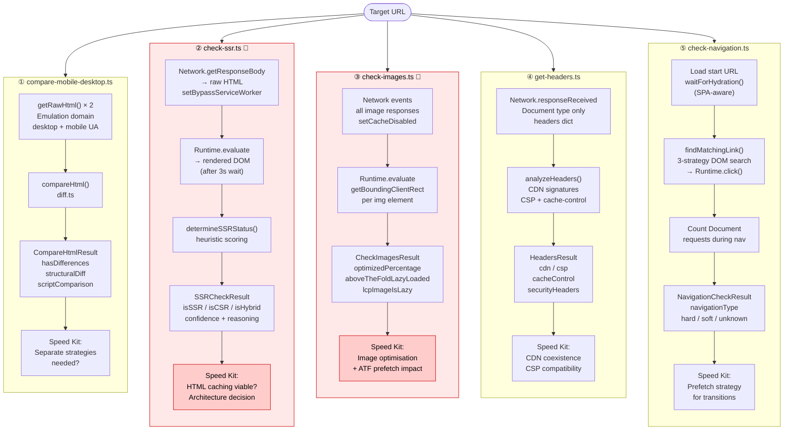

# Module 5 — The Five Individual Check Commands (IMPORTANT)

Files: `check-ssr.ts` · `compare-mobile-desktop.ts` · `get-headers.ts` ·
`check-images.ts` · `check-navigation.ts`

---

## Check 1 — SSR Detection (`check-ssr.ts`) 🔴 BOT-SENSITIVE

**Question it answers:** "Does the server render the full page HTML before sending it
(SSR), or does it ship a near-empty shell and let JavaScript build the page in the browser
(CSR/SPA)?" This is the single most important Speed Kit feasibility signal — it determines
the entire caching and acceleration strategy.

**How it works:** The check exploits the fact that CDP lets you intercept the raw
HTTP response body *and* the post-JavaScript rendered DOM in the same browser session.
It captures both, then compares them using heuristics:

| Signal | Conclusion |
|---|---|
| Hydration markers in raw HTML (`__NEXT_DATA__`, `data-reactroot`, `data-v-`) | SSR — confidence HIGH |
| Raw text > 1000 chars AND raw/rendered text ratio > 70% | SSR — confidence MEDIUM |
| Product data + `<main>` structure in raw HTML | SSR — confidence MEDIUM |
| Raw body empty/minimal, rendered body has content | CSR — confidence HIGH |
| Rendered HTML is 5× larger than raw HTML | CSR — confidence HIGH |

Notable implementation detail: sets `Network.setBypassServiceWorker({ bypass: true })`
before navigating — this ensures the raw HTML is the true server response, not a cached
or intercepted version served by a service worker.

**CDP domains used:** `Network` (responseReceived event → requestId → getResponseBody),
`Page` (navigate + loadEventFired), `Runtime` (evaluate → rendered DOM after 3s wait),
`Emulation` (setUserAgentOverride)

**Return type:** `SSRCheckResult`
```
rawHtml:     { length, hasContent, contentIndicators }
renderedHtml:{ length, hasContent, contentIndicators }
analysis:    { isSSR, isCSR, isHybrid, confidence: 'high'|'medium'|'low', reasoning }
```

**Speed Kit implication:**
- SSR → Speed Kit can cache the server-rendered HTML at the edge and serve it instantly.
  Highest potential impact.
- CSR → The initial HTML is a near-empty shell. Speed Kit shifts focus to API response
  caching and resource optimisation. Positive impact but different implementation.
- Hybrid → Most modern frameworks (Next.js, Nuxt): SSR shell + client hydration.
  Speed Kit can cache the shell and prefetch data API calls.

**🔴 Bot wall failure mode (MOST DANGEROUS):**
A bot wall page has substantial text content, a non-empty body, and no hydration markers.
The text-content heuristic fires: raw text > 1000 chars, ratio close to 1.0 →
**declares SSR with medium confidence**. This is a silent false positive.
The `visibleTextSample` field in the result would show bot wall text ("Please verify
you are human...") but nothing in the pipeline checks for this.
Consequence: the entire Speed Kit architecture recommendation is built on bad data.

---

## Check 2 — Mobile/Desktop HTML Comparison (`compare-mobile-desktop.ts`)

**Question it answers:** "Does this site serve structurally different HTML to mobile vs
desktop browsers, or is it responsive (same HTML, CSS-only differences)?" This determines
whether Speed Kit needs separate mobile/desktop optimization strategies.

**How it works:** Calls `getRawHtml()` twice sequentially — once with the desktop device
profile, once with the Pixel 7 mobile profile. Both fetches bypass the service worker for
raw server responses. Then passes both HTML strings to `compareHtml()` in `diff.ts`,
which produces a unified diff patch and a structural analysis.

Note: the two fetches are **sequential, not parallel** (desktop first, then mobile).
This adds latency (~5-8s total vs ~3-4s if parallelised) but keeps the implementation simple.

**CDP domains used:** `Network` (responseReceived → raw HTML body), `Page` (navigate +
loadEventFired), `Emulation` (setUserAgentOverride + setDeviceMetricsOverride),
`Network.setBypassServiceWorker`

**Return type:** `CompareHtmlResult`
```
mobile:     { html, statusCode, timing: { ttfb, total } }
desktop:    { html, statusCode, timing: { ttfb, total } }
comparison: {
  hasDifferences, addedLines, removedLines, summary,
  structuralDiff: { headDiff, bodyDiff, scriptDiff, styleDiff, metaDiff, linkDiff },
  scriptComparison: { onlyInMobile[], onlyInDesktop[], common[] }
}
```

**Speed Kit implication:**
- No differences → Fully responsive site. Single optimisation strategy, simpler Speed
  Kit integration.
- Differences in `<script>` tags → Different JS bundles served per device. Speed Kit
  needs device-aware caching rules.
- Differences in `<body>` → Separate mobile/desktop HTML. May require two distinct
  Speed Kit configurations.

**Failure modes:** Does not detect visual/CSS differences — only HTML structure.
A site could render completely differently on mobile while having identical raw HTML.
If both requests hit a bot wall with identical content, the diff reports
"no differences" — which looks like clean responsive design.

---

## Check 3 — Response Headers (`get-headers.ts`)

**Question it answers:** "What HTTP response headers does the server send?
Is there a CDN? A Content-Security-Policy? What is the caching strategy?"
These headers directly constrain how Speed Kit can be deployed.

**How it works:** Subscribes to `Network.responseReceived` before navigating.
When the main `Document` request fires, extracts the full headers dict and status code.
Then runs `analyzeHeaders()` which inspects header values for CDN signatures
(`cf-ray` → Cloudflare, `x-amz-cf-id` → CloudFront, `x-served-by`, `via`, etc.),
CSP presence, cache-control directives, and security headers.

**CDP domains used:** `Network` (responseReceived event for Document type),
`Page` (navigate + loadEventFired), `Emulation` (setUserAgentOverride),
`Network.setBypassServiceWorker`

**Return type:** `HeadersResult`
```
statusCode: number
headers:    Record<string, string>   (raw headers dict)
analysis:   {
  csp, cspReportOnly, contentType, cacheControl,
  server, cdn, xPoweredBy,
  securityHeaders: Record<string, string>
}
```

**Speed Kit implication:**
- Existing CDN detected → Speed Kit needs to coexist with or replace it.
  Check for caching conflicts.
- CSP present → May block Speed Kit's service worker or script injection.
  The CSP value needs to be reviewed for `worker-src` and `script-src` directives.
- `cache-control: no-store` or `private` → Server is actively preventing caching.
  Speed Kit's edge caching needs special configuration.

**Bot wall failure mode (LOW RISK):** Headers are returned regardless of whether the
response body is a bot wall. CDN, CSP, and cache-control analysis are accurate even
for bot wall responses. The `statusCode` IS captured — a bot wall returning 403 is
recorded — but nothing downstream flags a non-200 response as suspicious.

---

## Check 4 — Image Optimization (`check-images.ts`) 🔴 BOT-SENSITIVE

**Question it answers:** "Are images served in modern formats (WebP/AVIF) from a CDN?
And critically — are any above-the-fold images being lazy-loaded?" The second question
is a performance anti-pattern: lazy-loading ATF images delays the LCP, which Speed Kit
can fix with prefetch.

**How it works:** Uses two data sources simultaneously in the same browser session:

1. **Network events** — subscribes to all image requests via `Network.responseReceived`.
   Captures real HTTP response data: content-type (actual format), transfer size,
   CDN headers. This gives the ground truth, not the HTML attribute.

2. **DOM queries** — after page load, runs `Runtime.evaluate()` to query all ``
   elements and measure their `getBoundingClientRect()` position relative to the
   viewport. This determines above-the-fold status, lazy loading method
   (`loading="lazy"` vs JS-based libraries like lazysizes), and which image is
   the LCP candidate.

Notable: sets `Network.setCacheDisabled({ cacheDisabled: true })` to force fresh
requests — accurate transfer sizes, not cached sizes. Also enables `DOM.enable()`.

**CDP domains used:** `Network` (responseReceived + loadingFinished for all image requests),
`Page` (navigate + loadEventFired), `Runtime` (evaluate → DOM position queries),
`DOM` (enable), `Emulation` (setUserAgentOverride)

**Return type:** `CheckImagesResult`
```
images[]:         ImageInfo per HTTP response { url, format, size, fromCDN, isOptimized }
domImages[]:      DOMImageInfo per  { isAboveTheFold, isLazyLoaded, lazyLoadMethod,
                  isLCP, distanceFromViewport, naturalWidth/Height }
lazyLoadAnalysis: { aboveTheFoldLazyLoaded[], lcpImage, lcpImageIsLazy, recommendation }
sizeAnalysis:     { totalBytes, aboveTheFoldBytes, lazyLoadedBytes, largestImage }
summary:          { total, webp, avif, jpeg, png, optimizedPercentage, fromCDN }
```

**Speed Kit implication:**
- Low `optimizedPercentage` → High impact from Speed Kit image optimisation feature.
- `aboveTheFoldLazyLoaded.length > 0` → LCP is being penalised by incorrect lazy loading.
  Speed Kit prefetch can eliminate this.
- `lcpImageIsLazy: true` → The most critical LCP issue. Speed Kit can prioritise this
  image specifically.
- Low `fromCDN` count → Images served from origin. Speed Kit edge delivery applies.

**🔴 Bot wall failure mode (SILENT FALSE POSITIVE):**
If the page serves a bot wall, there are zero product images in the DOM.
The check reports: `total: 0`, `optimizedPercentage: 100%` (0 out of 0 optimized — vacuously true),
`aboveTheFoldLazyLoaded: []` (no issues). No error, no warning. This looks like
the best possible image report. A downstream consumer concludes "excellent image
hygiene" when the data is entirely fabricated from an empty page.

---

## Check 5 — Navigation Type (`check-navigation.ts`)

**Question it answers:** "When a user clicks from the homepage to a category page,
does Chrome reload the entire document (hard navigation = standard browser request)
or does the JavaScript framework swap content without reloading (soft navigation = SPA routing)?"
This determines whether Speed Kit's prefetch and caching can work on page transitions.

**How it works:** The check simulates a real user interaction — it doesn't use
`Page.navigate()` by default. Instead:

1. Loads the start URL and waits for SPA hydration (up to 5s, checks for
   `__NEXT_DATA__`, `data-reactroot`, etc. OR >5 links in DOM)
2. Runs `findMatchingLink()` in the DOM: three-strategy search for the target URL as an
   `<a>` tag (exact match → path-only match → last path segment match)
3. Simulates a click: `Runtime.evaluate` → `links[i].click()` — a real DOM click,
   not a CDP navigation command
4. Counts `Document`-type `Network.responseReceived` events during the navigation:
   - ≥1 Document request → **hard navigation** (full server round-trip)
   - Zero Document requests, only API/XHR → **soft navigation** (SPA client routing)

**CDP domains used:** `Network` (responseReceived — counting Document requests),
`Page` (navigate + loadEventFired), `Runtime` (evaluate → findMatchingLink,
waitForHydration, historyAPI detection via `window.history`)

**Return type:** `NavigationCheckResult`
```
navigationType:   'hard' | 'soft' | 'unknown'
navigationMethod: 'click-explicit' | 'click-auto' | 'page-navigate'
evidence: {
  documentRequestMade, documentRequestCount, apiRequestsOnly,
  historyApiUsed, pageReloaded, linkSelector, linkMatchStrategy,
  forceNavigateUsed, autoLinkSearchPerformed
}
```

**Speed Kit implication:**
- Hard navigation → Speed Kit's full prefetch + HTML caching strategy works optimally.
  Each page transition is a new document request that Speed Kit can intercept and serve
  from edge cache.
- Soft navigation → SPA routing bypasses normal browser navigation entirely.
  Speed Kit's service worker interception is harder. Requires different implementation:
  API response caching and JS bundle optimisation instead of HTML caching.

**Failure modes:** If the target URL isn't present as a link on the start page
(hidden in a mega-menu requiring hover, or only visible after scrolling), `findMatchingLink`
returns null and the check falls back to `Page.navigate()` — which always produces a
hard navigation and `navigationMethod: 'page-navigate'`. This is a silent misleading
result for SPAs. The `evidence.forceNavigateUsed: true` flag signals this fallback.

---

## Combined Diagram — All Five Checks



---

## Bot Detection Sensitivity — The Two Checks That Lie Silently

### 🔴 #1 — SSR Check (`check-ssr.ts`) — FALSE POSITIVE RISK

The SSR detection logic is entirely heuristic. It cannot distinguish between:
- A real e-commerce homepage with substantial server-rendered content (→ correctly SSR)
- A bot wall page with substantial text ("Verify you are human. Complete the CAPTCHA.") (→ **incorrectly SSR**)

Both have: non-empty body, >500 chars of text, no hydration markers, roughly equal
raw vs rendered size. The heuristic reports SSR with medium confidence. The `reasoning`
field would say "Raw HTML has substantial text content (843 chars, 94% of rendered)" —
which is true, but the content is a captcha page, not a product page.

The damage: SSR detection is the decision gate for Speed Kit's entire architecture.
A false SSR on a bot wall could lead to recommending an HTML-caching strategy on a
site that actually uses React CSR. That recommendation would fail in production.

**Detection approach (refactor):** Before running SSR analysis, run a
`detectBotWall(rawHtml)` function that checks for bot wall signatures (CAPTCHA keywords,
Cloudflare challenge markers, Distil/Imperva challenge pages). If detected, mark the
entire run's results as suspect and surface a prominent warning.

---

### 🔴 #2 — Image Check (`check-images.ts`) — SILENT VACUOUS TRUTH

The image check reports `optimizedPercentage: 100%` when there are zero images.
This is mathematically correct (100% of 0 images are optimized) but semantically
catastrophic. The check has no minimum-threshold guard: "if fewer than N images found,
warn that the page may not have loaded correctly."

```
Bot wall page result:
  total: 0
  optimizedPercentage: 100     ← looks perfect
  aboveTheFoldLazyLoaded: []   ← no issues found
  fromCDN: 0
```

vs real page result:
```
  total: 34
  optimizedPercentage: 47      ← real finding
  aboveTheFoldLazyLoaded: [5 images]
```

The silence is the danger. No error is thrown. No warning is emitted.
A downstream consumer reads "100% optimized" and reports clean image hygiene.

**Detection approach (refactor):** A page with fewer than 3 images is suspicious
unless it's clearly a content page (check URL pattern). Add a `suspiciouslyFewImages`
flag to `LazyLoadAnalysis` and surface it as a warning in `ExecutionMetrics.warnings`.
