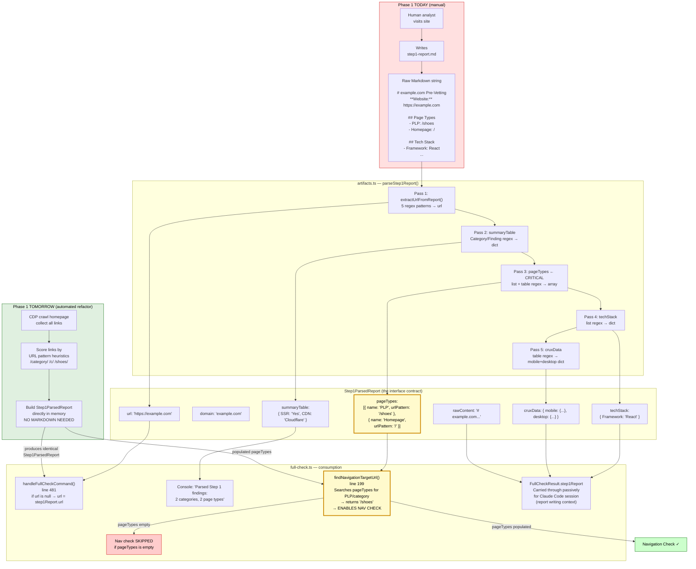

# Module 6 — The Artifacts and Report Layer (CRITICAL)

Files: `src/utils/artifacts.ts` · `src/utils/diff.ts` · `src/commands/execution-report.ts`

This module contains the single most important function for the refactor:
`parseStep1Report()`. Understanding it precisely defines what the autonomous replacement must produce.

---

## Concept 1 — parseStep1Report() / The Form Deserializer

### ELI5
Consider a paper form with fields that an analyst fills in by hand:
"URL: example.com", "Page Types: PLP at /shoes, Homepage at /",
"Tech Stack: React, Shopify". Someone scanned that form, producing an image
of handwriting. `parseStep1Report()` is the OCR software that reads the handwriting
and extracts each field into a structured Python-dict equivalent.
The problem: the form wasn't printed with checkboxes — it was filled in free-hand
Markdown, so the extraction uses fuzzy pattern matching that works most of the time
but not always.

### Technical
`parseStep1Report(content: string): Step1ParsedReport` runs five sequential
extraction passes over the raw Markdown string, each targeting a different section
of the report. None of them throw on failure — they silently produce empty values
if the pattern doesn't match.

**Pass 1 — URL Extraction** (`extractUrlFromReport()`):
Tries five regex patterns in order, stopping at the first match:

| Priority | Pattern | Example |
|---|---|---|
| 1 | Markdown bold key | `**Website:** https://example.com` |
| 2 | Plain text key | `Website: example.com` |
| 3 | Table cell | `\| Website \| example.com \|` |
| 4 | First `#` heading with domain | `# example.com Pre-Vetting` |
| 5 | First https:// in first 500 chars | Any raw URL near the top |

Then `normalizeUrl()` strips trailing punctuation and prepends `https://` if missing.

**Pass 2 — Summary Table** (Category → Finding map):
Regex targets a Markdown table whose header row contains "Category":
```
| Category | Finding |
|----------|---------|
| SSR      | Yes     |
```
Falls back to per-key pattern matching (SSR, Navigation, Images, CSP, CDN)
if no table is found.

**Pass 3 — Page Types** (THE CRITICAL PASS):
Two sub-strategies tried in sequence:

*List format:*
```
## Page Types Found
- PLP: /shoes
- Homepage: /
- PDP: /shoes/nike-air
```
Regex: `/Page\s*Types?\s*(?:Found)?[\s\S]*?\n((?:\s*[-*]\s*.+\n?)+)/i`
Each line matched as `- {name}: {urlPattern}`

*Table format (fallback):*
```
| Type     | URL           |
|----------|---------------|
| PLP      | /shoes        |
```

Produces: `pageTypes: [{ name: "PLP", urlPattern: "/shoes" }, ...]`

**Pass 4 — Tech Stack**:
List format only: `- Framework: React` → `{ Framework: "React" }`

**Pass 5 — CrUX Data**:
Table with Metric/Mobile/Desktop columns.
Only populated if the analyst included CrUX data (from Google's PageSpeed API).

### Refactor Implications
This function is the ONLY place Phase 1 data enters Phase 2.
The refactor must produce a `Step1ParsedReport` object that satisfies this
interface — but it is not necessary to go through Markdown. The object is built
directly in memory from CDP observations. Instead of OCR-ing a handwritten form,
the data is populated directly into the struct:

```typescript
// What parseStep1Report() produces from a human's text:
const fromHuman = parseStep1Report(markdownContent);

// What the refactor produces directly:
const fromCDP: Step1ParsedReport = {
  url:          discoveredUrl,
  domain:       extractDomain(discoveredUrl),
  summaryTable: {},                         // populated by checks themselves
  pageTypes:    await discoverPageTypes(url),  // new function
  techStack:    await detectTechStack(url),    // new function
  cruxData:     undefined,                  // optional, skip for now
  rawContent:   '',                         // no markdown, not needed
};
```

The interface is the contract. The parsing machinery is irrelevant once the
struct can be populated directly.

---

## Concept 2 — Step1ParsedReport / The Phase Bridge Interface

### ELI5
This is the data structure that stands between Phase 1 and Phase 2.
Think of it as a passport: it doesn't matter whether a human filled it out by hand
or a machine printed it — as long as the passport has all the right fields filled in
correctly, the border control (Phase 2) accepts it and proceeds. Currently only humans
can issue passports. The refactor teaches a machine to issue them.

### Technical

```typescript
// artifacts.ts:156
export interface Step1ParsedReport {
  url:          string;                              // main URL to test
  domain:       string;                             // hostname without www
  summaryTable: Record<string, string>;             // Category → Finding
  pageTypes:    Array<{                             // ← THE CRITICAL FIELD
                  name: string;                    // "PLP", "Homepage", etc.
                  urlPattern: string;              // "/shoes", "https://..."
                }>;
  techStack:    Record<string, string>;            // "Framework" → "React"
  cruxData?:    {                                  // optional CrUX metrics
                  mobile:  Record<string, string>;
                  desktop: Record<string, string>;
                };
  rawContent:   string;                            // original Markdown verbatim
}
```

**How each field is consumed downstream:**

| Field | Where consumed | How | Criticality |
|---|---|---|---|
| `url` | `handleFullCheckCommand()` line 481 | Used as main URL if no CLI arg | HIGH |
| `domain` | Not used directly | `extractDomain(url)` called instead | LOW |
| `summaryTable` | Console log count only | Passed through to `FullCheckResult` | LOW |
| `pageTypes` | `findNavigationTargetUrl()` | **Provides the nav check target URL** | **CRITICAL** |
| `techStack` | Not consumed by Phase 2 code | Passed through to `FullCheckResult` | LOW |
| `cruxData` | Not consumed by Phase 2 code | Passed through to `FullCheckResult` | LOW |
| `rawContent` | Not consumed by Phase 2 code | Passed through to `FullCheckResult` | LOW |

**The key insight:** Only TWO fields are directly consumed by Phase 2 logic —
`url` (trivial, already known from CLI arg) and `pageTypes` (the hard part).
Everything else is carried through passively to the Claude Code session for report writing.

This means the minimum viable autonomous Phase 1 replacement only needs to populate
`pageTypes` correctly. `techStack`, `summaryTable`, and `cruxData` are valuable
enrichments but not blockers.

### Refactor Implications
Knowing which fields are actually consumed vs passively carried enables precise
prioritisation of implementation work:
- **Must implement:** `pageTypes` discovery (enables nav check)
- **Should implement:** `techStack` detection (enriches Claude Code report)
- **Can skip initially:** `cruxData`, `summaryTable` from Phase 1 (Phase 2 checks
  produce this data directly)

---

## Concept 3 — createRunDir() and extractDomain() / The Filing System

### Technical
These are small utilities but they establish the output directory naming convention
every command follows.

`extractDomain(url: string): string`
```typescript
new URL(url).hostname.replace('www.', '')
// "https://www.example.com/page" → "example.com"
```

`createRunDir(siteName: string): string`
```typescript
// Creates: output/example_com_2026-05-11T12-30-00-000Z/
const timestamp = new Date().toISOString().replace(/[:.]/g, '-');
const sanitized = siteName.replace(/[^a-zA-Z0-9-]/g, '_');
// → output/{sanitized}_{timestamp}/
```

`ensureOutputDir()` creates the top-level `output/` directory if it doesn't exist.
`findLatestOutputDir()` sorts subdirectories by `mtime` and returns the most recent —
this is how `execution-report` finds the right run without being told explicitly.

### Refactor Implications
No changes needed here. The autonomous Phase 1 replacement will use `createRunDir()`
via the existing `full-check.ts` code path — the filing system is already correct.

---

## Concept 4 — diff.ts / The HTML Structural Differ

### Technical
Uses the `diff` npm package — nothing to do with CDP. Provides three exported functions:

`compareHtml(html1, html2, label1?, label2?): DiffResult`
- Runs `diffLines()` on the two HTML strings (line-by-line comparison)
- Counts added/removed lines
- Generates a unified diff patch via `createTwoFilesPatch()` (git-style `+`/`-` format)
- Calls `analyzeStructuralDiff()` which extracts and independently compares:
  `<head>`, `<body>`, all `<script>` tags, all `<style>` tags, all `<meta>` tags,
  all `<link>` tags (sorted, concatenated)

`compareScripts(html1, html2)`: extracts `src` attributes from all `<script>` tags
in both HTML strings, returns three sets: only-in-1, only-in-2, common.
Used by `compare-mobile-desktop.ts` to detect different JS bundles per device.

`generateCondensedDiff(html1, html2)`: simple line-by-line diff capped at 50
differences — used for console output to avoid flooding the terminal.

### Refactor Implications
No changes needed. `diff.ts` is a pure utility — no CDP, no state, no configuration.
It will work identically whether the HTML came from a human's Step 1 report or from
autonomous CDP fetching.

---

## Concept 5 — execution-report.ts / The Session Post-Mortem

### Technical
This is a reporting tool for the Claude Code operator, not for Speed Kit pre-vetting.
It exists for **process improvement** — tracking how long each run takes, what errors
occurred, and how much the Claude Code session cost.

**Data flow:**
1. Reads `execution-metrics.json` from the latest (or specified) output directory
2. Accepts operator-provided observations via CLI flags
3. Generates `execution-report.md` combining both

**What `generateExecutionReport()` produces:**

| Section | Source |
|---|---|
| Overview table (URL, start, end, total duration) | `ExecutionMetrics` + `report.md` |
| CLI Check Timings (duration + status per check) | `ExecutionMetrics.checks` |
| CLI Errors | `ExecutionMetrics.errors[]` |
| CLI Warnings | `ExecutionMetrics.warnings[]` |
| Token Usage + Cost estimate | CLI flags (`--input-tokens`, `--output-tokens`) |
| What worked well | CLI flag (`-w`) |
| What could be improved | CLI flag (`-i`) |
| Prompt improvement suggestions | CLI flag (`-p`) |

**Cost calculation** (hardcoded at Claude Sonnet pricing):
```typescript
inputCost  = (inputTokens  / 1_000_000) * 3   // $3 per 1M tokens
outputCost = (outputTokens / 1_000_000) * 15  // $15 per 1M tokens
```

Notable: `execution-report.ts` imports `ExecutionMetrics` from `full-check.ts`.
This creates a direct type dependency — adding new fields to `ExecutionMetrics`
causes the execution report's timing table to automatically include them on the next run
(because it iterates `checkOrder` which is a hardcoded array of check names).
New check names NOT in `checkOrder` will be silently omitted from the report.

### Refactor Implications
When a new pre-step (e.g., `pageDiscovery`) is added to the `ExecutionMetrics.checks`
object, `'pageDiscovery'` must also be added to the `checkOrder` array in
`execution-report.ts:127` to make it appear in the session report:
```typescript
const checkOrder = [
  'htmlComparison', 'ssrCheck', 'imageCheck',
  'headerCheck', 'navigationCheck',
  'pageDiscovery',   // ← ADD THIS
  'wpt'
] as const;
```

---

## The Critical Data Flow Diagram



---

## What the Refactor Must Produce — Minimum Viable Contract

```typescript
// The struct autonomous discovery must populate:
const autonomousReport: Step1ParsedReport = {

  url: urlArg,                          // ✅ already known from CLI
  domain: extractDomain(urlArg),        // ✅ already known

  summaryTable: {},                     // ⬜ optional — Phase 2 checks produce this
                                        //    data themselves (SSR, CDN, CSP found
                                        //    by check-ssr + get-headers)

  pageTypes: [                          // 🔴 MUST IMPLEMENT
    { name: 'PLP',      urlPattern: 'https://example.com/shoes' },
    { name: 'Homepage', urlPattern: 'https://example.com/' },
  ],                                    // ← discoverPageTypes(url) output

  techStack: {                          // 🟡 SHOULD IMPLEMENT
    'Framework': 'React',              // ← detectTechStack(url) output
  },

  cruxData: undefined,                  // ⬜ optional — external API, skip initially

  rawContent: '',                       // ✅ empty string is fine, not consumed
                                        //    by Phase 2 logic directly
};
```

The refactor is not a rewrite of the entire pipeline.
It is the implementation of two functions whose outputs slot precisely into
this one interface, replacing the one step that currently requires a human.
