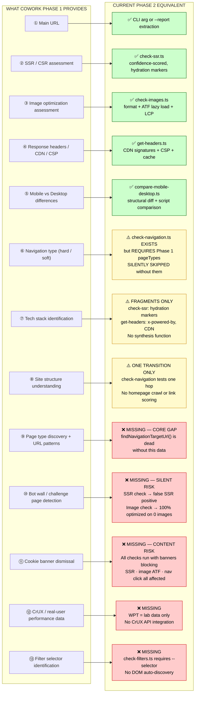

# Module 7 — Architectural Gap Analysis

**This document is the refactor specification.**
It synthesises everything from Modules 1–6 into a precise map of what exists,
what is partial, and what must be built to make Phase 2 fully autonomous.

---

## Gap Analysis Diagram



---

## Summary Table

| # | Phase 1 Capability | Phase 2 Status | Owner file |
|---|---|---|---|
| ① | Main URL | ✅ EXISTS | `cli.ts` + `artifacts.ts` |
| ② | SSR / CSR detection | ✅ EXISTS | `check-ssr.ts` |
| ③ | Image optimization + ATF lazy load | ✅ EXISTS | `check-images.ts` |
| ④ | Response headers / CDN / CSP | ✅ EXISTS | `get-headers.ts` |
| ⑤ | Mobile vs Desktop HTML diff | ✅ EXISTS | `compare-mobile-desktop.ts` |
| ⑥ | Navigation type (hard / soft) | ⚠️ PARTIAL | `check-navigation.ts` — needs pageTypes |
| ⑦ | Tech stack identification | ⚠️ PARTIAL | Fragments in `check-ssr.ts` + `get-headers.ts` |
| ⑧ | Site structure / link crawl | ⚠️ PARTIAL | `check-navigation.ts` — one hop only |
| ⑨ | Page type discovery + URL patterns | ❌ MISSING | **Core gap** |
| ⑩ | Bot wall / challenge page detection | ❌ MISSING | Silent false positive risk |
| ⑪ | Cookie banner dismissal | ❌ MISSING | Content visibility risk |
| ⑫ | CrUX / real-user performance data | ❌ MISSING | WPT is lab-only |
| ⑬ | Filter selector discovery | ❌ MISSING | `check-filters.ts` blocked |

---

## Function Signatures — The Refactor Specification

Listed in **implementation priority order** — each function unblocks the next.

---

### 1. `detectBotWall()` — MISSING · Safety Gate · Implement First

Run this against raw HTML **before any heuristic analysis begins**.
A bot wall silently corrupts SSR detection (false SSR positive) and image
analysis (vacuously perfect score on 0 images). This is the guard that prevents
the entire run's results from being fabricated.

```typescript
async function detectBotWall(rawHtml: string): Promise<BotWallResult>

interface BotWallResult {
  isWall: boolean;
  type: 'cloudflare' | 'distil' | 'datadome' | 'perimeterx' | 'generic' | null;
  confidence: 'high' | 'medium' | 'low';
  evidence: string[];  // e.g. ["Found 'cf-chl-bypass' marker", "Body text: 'Checking if the site...'"]
}
```

**Where it plugs in:** `check-ssr.ts` — after `Network.getResponseBody()` returns
`rawHtml`, before `analyzeContent()` is called. Also in `check-images.ts` — after
page load, before DOM queries.

---

### 2. `dismissConsentDialog()` — MISSING · Content Visibility Gate

Run this **after page load, before any content-reading check**.
A cookie banner covering the viewport pushes above-the-fold images below the fold
(corrupting `aboveTheFoldLazyLoaded` analysis), may show a minimal body to the SSR
check, and blocks link clicks in the navigation check.

```typescript
async function dismissConsentDialog(client: CDP.Client): Promise<ConsentResult>

interface ConsentResult {
  dismissed: boolean;
  method: 'cookiebot' | 'onetrust' | 'trustarc' | 'generic-accept' | null;
  selector: string | null;  // the CSS selector that was clicked, for logging
}
```

**Where it plugs in:** Each individual check command, after `Page.loadEventFired()`
and before any `Runtime.evaluate()` DOM queries. Candidate selectors to try:
`#CybotCookiebotDialogBodyButtonAccept`, `.onetrust-accept-btn-handler`,
`[id*="accept"]`, `[class*="cookie"] button`, `button:contains("Accept")`.

---

### 3. `discoverPageTypes()` — MISSING · Core Gap · Enables Nav Check

This is the primary function the refactor must deliver. Its output slots directly
into `Step1ParsedReport.pageTypes`, which `findNavigationTargetUrl()` consumes.

```typescript
async function discoverPageTypes(
  url: string
): Promise<Array<{ name: string; urlPattern: string }>>
```

Internally calls `crawlSiteLinks()`, then scores and classifies results.

**Where it plugs in:** `handleFullCheckCommand()` in `full-check.ts`, called
after `ensureChromeRunning()` and before `runFullCheck()`. Its output is used to
construct the `step1Report` object passed to `runFullCheck()`.

---

### 4. `crawlSiteLinks()` — PARTIAL · Supporting Utility for #3

Loads the homepage, queries all `<a href>` elements, scores each link by URL
pattern heuristics, and returns a ranked list. Provides the raw material that
`discoverPageTypes()` classifies.

```typescript
async function crawlSiteLinks(
  url: string,
  client: CDP.Client,
  maxLinks?: number             // default: 200
): Promise<SiteLink[]>

interface SiteLink {
  href: string;
  text: string;                 // anchor text, trimmed
  score: number;                // 0.0–1.0 heuristic confidence
  inferredType: 'plp' | 'pdp' | 'home' | 'content' | 'other' | null;
}
```

**Scoring heuristics (PLP signals — high weight):**
`/category/`, `/categories/`, `/c/`, `/collection/`, `/collections/`,
`/shop/`, `/department/`, `/aisle/`, `/browse/`

**Scoring heuristics (PDP signals — medium weight):**
`/product/`, `/products/`, `/p/`, `/item/`, `/detail/`, `/dp/`

**Exclusions (score = 0):**
`/cart`, `/checkout`, `/account`, `/login`, `/search?`, `#`, `mailto:`,
same-page anchors, external domains

---

### 5. `detectTechStack()` — PARTIAL → COMPLETE · Synthesises Existing Fragments

`check-ssr.ts` already looks for hydration markers. `get-headers.ts` already
captures `x-powered-by` and CDN signatures. This function combines both signal
sources plus additional DOM/HTML signals into one dict.

```typescript
async function detectTechStack(
  rawHtml: string,
  headers: Record<string, string>
): Promise<Record<string, string>>
// Returns e.g.: { Framework: 'Next.js', CMS: 'Shopify', CDN: 'Cloudflare' }
```

**Signal sources:**
- `rawHtml`: `__NEXT_DATA__` → Next.js, `__NUXT__` → Nuxt, `data-reactroot` → React,
  `data-v-` → Vue, `<meta name="generator">` → CMS, `window.Shopify` → Shopify,
  `window.Magento` → Magento, `window._mstConfig` → Salesforce CC
- `headers`: `x-powered-by`, `x-generator`, `server`, CDN signature from `get-headers.ts`

**Where it plugs in:** Called inside `runPhase1Discovery()`. Its output populates
`step1Report.techStack`.

---

### 6. `discoverFilterSelector()` — MISSING · Unblocks check-filters.ts

`check-filters.ts` is currently unusable without `--selector` because it needs to
know which DOM element to click to trigger a filter. This function heuristically
identifies likely filter elements on a PLP.

```typescript
async function discoverFilterSelector(
  client: CDP.Client,
  plpUrl: string
): Promise<string | null>
```

**Heuristic targets:** `[data-facet]`, `[class*="filter"]`, `[class*="facet"]`,
`[class*="refinement"]`, `input[type="checkbox"][name*="filter"]`,
`select[name*="sort"]`, sidebar `<ul>` with >3 `<li>` children near product grid.

**Where it plugs in:** `runPhase1Discovery()` calls this after `discoverPageTypes()`
has identified a PLP URL. The discovered selector is stored in `step1Report`
(requires a new optional field, or passed separately to `check-filters.ts`).

---

### 7. `fetchCruxData()` — MISSING · Real-User Data · Optional Enrichment

WPT provides lab measurements from a controlled server. CrUX provides field data —
real LCP, CLS, and INP percentiles from actual Chrome users over the past 28 days.
This is the data an analyst currently pulls from PageSpeed Insights manually.

```typescript
async function fetchCruxData(
  url: string,
  apiKey?: string               // Google PageSpeed API key, optional
): Promise<CruxData | null>     // returns null if API unavailable or no data

type CruxData = {
  mobile:  Record<string, string>;  // { LCP: '2.1s', CLS: '0.05', INP: '180ms' }
  desktop: Record<string, string>;
}
```

**API endpoint:** `https://www.googleapis.com/pagespeedonline/v5/runPagespeed`
with `?url={url}&strategy=mobile&fields=loadingExperience`

**Where it plugs in:** `runPhase1Discovery()` — called last (external API, slowest).
Output populates `step1Report.cruxData`.

---

### 8. `runPhase1Discovery()` — ORCHESTRATOR · Phase 1 Replacement Entry Point

The top-level function that replaces the human analyst entirely for the mechanical
parts of Phase 1. Calls functions 1–7 in sequence and assembles a `Step1ParsedReport`
directly in memory — no Markdown, no `parseStep1Report()` needed.

```typescript
async function runPhase1Discovery(url: string): Promise<Step1ParsedReport>
```

**Internal execution sequence:**
```
1. createNewTarget()          → open a fresh Chrome tab
2. Page.navigate(url)         → load the homepage
3. Network.getResponseBody()  → capture raw HTML
4. detectBotWall(rawHtml)     → ABORT with error if isWall = true
5. dismissConsentDialog()     → click away cookie banner
6. crawlSiteLinks()           → collect + score all links
7. discoverPageTypes()        → classify scored links → pageTypes[]
8. detectTechStack()          → rawHtml + headers → techStack{}
9. discoverFilterSelector()   → find PLP filter element (optional)
10. fetchCruxData()           → Google CrUX API (optional, can skip)
11. connection.close()        → destroy tab
12. return Step1ParsedReport  → { url, domain, pageTypes, techStack, cruxData, rawContent }
```

**Where it plugs in:** `handleFullCheckCommand()` in `full-check.ts`.
Called when no `--report` flag is provided and no `step1Report` exists.
Its output replaces the `parseStep1Report()` path entirely:

```typescript
// Current code (manual path):
step1Report = parseStep1Report(readReportContent(options.reportFile));

// New code (autonomous path):
step1Report = await runPhase1Discovery(url);

// Both paths produce the same Step1ParsedReport interface.
// runFullCheck() below is unchanged.
const result = await runFullCheck({ url, step1Report, ... });
```

---

## The New File This Creates

All 8 functions belong in a new file:

```
src/
└── commands/
    └── discover-phase1.ts    ← NEW FILE
        exports: runPhase1Discovery, detectBotWall, dismissConsentDialog,
                 discoverPageTypes, crawlSiteLinks, detectTechStack,
                 discoverFilterSelector, fetchCruxData
```

`full-check.ts` imports `runPhase1Discovery` from this file.
`check-ssr.ts` and `check-images.ts` import `detectBotWall` from this file.
No other existing files need modification except `full-check.ts` and
`execution-report.ts` (to add `pageDiscovery` to the `checkOrder` array).

---

## Implementation Roadmap

| Priority | Function | Effort | Impact |
|---|---|---|---|
| 1 | `detectBotWall()` | Low | Prevents silent false positives |
| 2 | `dismissConsentDialog()` | Low | Fixes ATF + SSR on banner-heavy sites |
| 3 | `crawlSiteLinks()` | Medium | Foundation for page discovery |
| 4 | `discoverPageTypes()` | Medium | **Enables nav check — main deliverable** |
| 5 | `detectTechStack()` | Low | Synthesises already-collected signals |
| 6 | `runPhase1Discovery()` | Low | Wires 1–5 together into orchestrator |
| 7 | `discoverFilterSelector()` | Medium | Unblocks check-filters.ts |
| 8 | `fetchCruxData()` | Low | External API enrichment |

Items 1–6 constitute the **minimum viable Phase 1 replacement**.
Items 7–8 are enrichments for a subsequent iteration.
