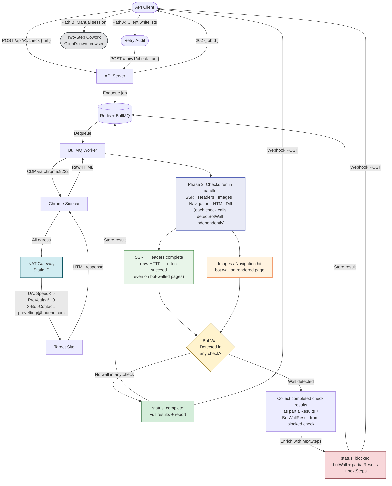

# Bot Management Strategy: Pre-Vetting CLI as a Deployed Service

**Date:** 2026-05-14
**Subject:** Options analysis for handling WAF/bot-manager blocking when the CLI runs as an unattended service
**Branch:** `feature/cdp-refactor`
**Status:** Proposal (no code changes)

---

## Executive Summary

When the pre-vetting CLI runs locally, a human analyst can solve CAPTCHAs,
switch browsers, or fall back to the Two-Step Cowork approach. When
deployed as a containerized service (see
[Docker Deployment Strategy](./docker-deployment-strategy.md)), there is no
human in the loop. Web Application Firewalls — Cloudflare, Akamai,
DataDome, PerimeterX, Imperva — will detect and block the automated Chrome
instance. The current codebase detects bot walls via `detectBotWall()` but
cannot recover from them: `BotWallError` aborts the audit with no
actionable response returned to the API caller.

This document evaluates three strategic options — aggressive evasion,
a browser-like middle ground, and transparent cooperation — and recommends
**transparent cooperation** as the approach aligned with Baqend's enterprise
positioning. The core argument is commercial, not technical: WAF vendors and
the companies that deploy them are Baqend's customer base. Evasion tactics
are technically viable but would undermine trust with the same organizations
Speed Kit is designed to serve. The recommended strategy builds on
verifiable network identity, explicit browser declaration, and vendor
partnerships, with graceful degradation to the existing Two-Step Cowork
workflow when blocking occurs.

This strategy assumes low audit volume — order of tens per day. Higher
volume would require additional pacing controls but no change to the
cooperative posture.

---

## 1. Current State

The codebase already has substantial bot-wall detection infrastructure.
What it lacks is any recovery mechanism or identity declaration.

### 1.1 Detection Infrastructure

**`detectBotWall()`** is a pure function in
[`bot-wall.ts:117-137`](../src/commands/discover-phase1/bot-wall.ts) that
inspects raw HTML for known bot-wall signatures. It operates on a string —
no CDP, no network. The function uses a registry pattern: a static array of
`BotDetector` objects, each containing weighted signal patterns.

The **`BOT_DETECTORS` registry**
([`bot-wall.ts:42-101`](../src/commands/discover-phase1/bot-wall.ts))
covers five providers:

| Provider | Signal Examples | Min Score |
|----------|----------------|-----------|
| Cloudflare | `cf-mitigated`, `cf-chl-bypass`, "Just a moment..." title | 0.8 |
| DataDome | `captcha-delivery.com`, `_dd_s` session marker | 0.7 |
| PerimeterX | `_px3` token, `PXJS` bundle, `px-captcha` | 1.0 |
| Distil/Akamai/Imperva | `distil_r_captcha`, `ak_bmsc`, "Incapsula" | 0.7 |
| Generic | "Access Denied" / "Robot Check" / "Verify you are human" titles | 0.7 |

Each detector returns a **`BotWallResult`**
([`bot-wall.ts:14-21`](../src/commands/discover-phase1/bot-wall.ts)) with
four fields:

```typescript
interface BotWallResult {
  isWall: boolean;
  type: 'cloudflare' | 'distil' | 'datadome' | 'perimeterx' | 'generic' | null;
  confidence: 'high' | 'medium' | 'low';
  evidence: string[];  // Human-readable matched signals
}
```

This interface is already rich enough to power structured API responses (see
Section 4).

### 1.2 Error Handling

**`BotWallError`**
([`orchestrator.ts:77-93`](../src/commands/discover-phase1/orchestrator.ts))
is thrown at Step 6 of Phase 1 discovery. It carries the target URL, wall
type, and confidence level:

```typescript
export class BotWallError extends Error {
  constructor(
    public readonly targetUrl: string,
    public readonly wallType: BotWallResult['type'],
    public readonly wallConfidence: BotWallResult['confidence'],
  ) {
    super(
      `Bot wall detected on ${targetUrl} (${wallType}, ${wallConfidence} confidence). ` +
      `Manual bypass required.`,
    );
    this.name = 'BotWallError';
  }
}
```

The message says "Manual bypass required" — accurate today, but in a
service context there is no human to perform manual bypass.

**Integration points:**

| File | Behavior on Bot Wall |
|------|---------------------|
| `orchestrator.ts` (Phase 1) | **Abort** — throws `BotWallError`, ends audit |
| `check-ssr.ts` (Phase 2) | **Warn** — logs warning, continues with available data |
| `check-images.ts` (Phase 2) | **Warn** — logs warning, continues with available data |

### 1.3 Browser Identity

[`connection.ts:110-129`](../src/cdp/connection.ts) defines three static
device profiles — all impersonating real Chrome browsers:

```typescript
export const DEVICE_PROFILES = {
  desktop: {
    userAgent: 'Mozilla/5.0 (Macintosh; Intel Mac OS X 10_15_7) AppleWebKit/537.36 ...',
    viewport: { width: 1920, height: 1080 },
    // ...
  },
  mobile: {
    userAgent: 'Mozilla/5.0 (Linux; Android 13; Pixel 7) AppleWebKit/537.36 ...',
    // ...
  },
  mobileIPhone: {
    userAgent: 'Mozilla/5.0 (iPhone; CPU iPhone OS 17_0 ...',
    // ...
  },
};
```

These user agents declare the bot as a regular browser session. There is no
custom bot identifier, no contact header, and no mechanism to switch
identity based on deployment mode.

### 1.4 The Gap

The current architecture follows a straight path: **detect → abort → dead
end.** There is no recovery loop, no partial result delivery, and no
actionable information returned to the caller. In a service deployment, this
means a blocked site produces an error response with no next steps — the
caller has no way to resolve the situation without human intervention.

---

## 2. The Three Strategic Options

### Option A: Aggressive Evasion

This is the approach most commonly documented in web automation literature.
It has genuine technical strengths that deserve fair consideration before
being evaluated against Baqend's specific context.

#### What It Looks Like

- **Browser fingerprint evasion:** Use `puppeteer-extra-plugin-stealth` or
  equivalent CDP commands to remove `navigator.webdriver`, inject realistic
  `navigator.plugins` and `navigator.languages`, spoof WebGL/Canvas
  fingerprints, and set proper `Sec-CH-UA` client hints matching the
  declared user agent.

- **Rotating residential proxies:** Route Chrome traffic through providers
  like Bright Data, Oxylabs, or SmartProxy. Each audit gets a different
  residential IP, bypassing datacenter IP reputation scoring. At
  pre-vetting volumes (~2-5 MB per audit), cost is approximately
  $0.01-0.07 per audit.

- **CAPTCHA-solving services:** When `detectBotWall()` identifies a CAPTCHA
  challenge, send it to a solving service (2Captcha, CapSolver). The
  service returns a solution token; inject it via CDP. Pricing: ~$1-3 per
  1,000 CAPTCHAs.

- **Behavioral simulation:** Random delays between navigations (300-1500ms
  jitter), mouse movement simulation via `Input.dispatchMouseEvent`, cookie
  jar maintenance across related checks.

- **Managed browser services:** Browserless.io (stealth mode), Bright
  Data's Scraping Browser, or Apify's anti-blocking infrastructure as
  turnkey alternatives. Integration: point `CDP_HOST` at the managed
  endpoint. Pricing: $50-500/month.

#### Genuine Strengths

- **Highest automated coverage.** Most sites would pass without manual
  intervention (order-of-magnitude estimate: 85-90% of e-commerce sites, to
  be validated against Baqend's production blocking data). No client
  involvement needed.

- **Well-documented playbook.** Large ecosystem of tools, providers, and
  community knowledge. The techniques are proven at scale by scraping
  companies.

- **Technically feasible at pre-vetting volumes.** Low traffic (one site at
  a time, ~5 page loads per audit) makes residential proxies cheap and
  CAPTCHA volumes negligible.

- **No client friction.** The bot handles everything autonomously. The
  prospect never needs to whitelist anything or coordinate with their IT
  team.

#### Why It's Wrong for This Context

The objection to Option A is commercial, not technical.

**WAF vendors and their clients are Baqend's customer base.** Speed Kit is
sold to enterprise e-commerce companies — the same companies that deploy
Cloudflare, Akamai, and Imperva. The pre-vetting bot visits a prospect's
site *before* the sales conversation begins. If that bot is caught using
residential proxies, stealth plugins, or spoofed fingerprints, the
conversation shifts from "let us accelerate your site" to "why were you
spoofing your identity on our infrastructure?"

This is not a hypothetical risk. WAF vendors publish detection reports,
enterprise clients review their bot traffic logs, and security teams
investigate suspicious access patterns. Discovery of evasion would:

- **Destroy trust before the sale.** The prospect's security team sees
  deceptive behavior from a vendor claiming to improve their infrastructure.

- **Create legal liability.** Many enterprise site Terms of Service
  explicitly prohibit automated access using evasion techniques. Residential
  proxy usage may violate the proxy provider's own terms if the traffic is
  routed through real users' connections without full disclosure.

- **Produce an arms race.** WAF vendors continuously update detection. Each
  new Chrome version, each new fingerprinting technique requires maintenance.
  The cost grows over time as each vendor patches the techniques used. This
  is a structural disadvantage for a small team.

- **Create internal inconsistency.** Baqend's production Speed Kit bot
  already operates transparently: fixed user agents, published IPs,
  pre-registered with WAF vendors. The pre-vetting tool would be the sole
  outlier using deception within Baqend's own tooling.

### Option B: Real Chrome + Declared Identity (Middle Ground)

A partial transparency approach: keep real browser fingerprints, declare
automated identity through HTTP headers, add polite rate limiting, and
notify clients per-audit.

#### What It Looks Like

- **Standard Chrome UA:** Keep the current `DEVICE_PROFILES` behavior —
  the bot looks like a real Chrome browser. No impersonation, but no custom
  bot identifier either.

- **Contact header:** Add `X-Bot-Contact: prevetting@baqend.com` on all
  requests, disclosing that the traffic is automated and providing a point
  of contact.

- **Polite rate limiting:** Configurable delay between navigations (1-3
  seconds), maximum concurrent audits per domain.

- **Per-audit client notification:** Before auditing a prospect's site,
  email or notify the client that an automated analysis will run, giving
  them the option to whitelist proactively.

- **Static egress IPs:** Route through a NAT Gateway for consistent IPs,
  but don't actively publicize them.

- **`robots.txt` compliance:** Respect `Crawl-delay` directives.

- **No evasion:** No stealth plugins, no proxy rotation, no CAPTCHA
  solving.

#### Strengths

- **Lowest implementation effort.** Mostly keeps current behavior; adds a
  contact header and configurable delays.

- **Doesn't trigger basic blocks.** Standard Chrome UA avoids UA-based
  blocking rules that target known automation tools (Puppeteer, Selenium).

- **Honest about automation.** The contact header provides a way for site
  operators to reach Baqend if they notice the traffic.

- **Per-audit notification gives clients agency.** The prospect knows the
  analysis is coming and can prepare.

- **Works for the majority of sites.** Sites with no WAF or basic WAF rules
  won't block standard Chrome traffic.

#### Where It Falls Short

Option B fails for different reasons than Option A. Where Option A is
rejected on commercial grounds, Option B is rejected on structural grounds:

- **No scalability path.** Per-audit client notification works at 5
  audits/day. At 50/day it becomes an operational bottleneck. Someone must
  send the notification, track the response, and coordinate timing. Option
  C's published IPs and UA scale without per-audit friction.

- **No foundation for vendor partnerships.** Without a custom bot UA and
  published identity page, there is no artifact to submit to Cloudflare's
  Verified Bots Program or Akamai's Bot Directory. Option B caps out at
  ad-hoc whitelisting for individual sites; Option C builds a reusable
  identity that compounds over time.

- **Ambiguous posture.** A standard Chrome UA from a datacenter IP with a
  contact header is neither evasive nor transparent. Sophisticated WAFs
  (Akamai Enterprise, Cloudflare Business/Enterprise) will still flag the
  traffic because the TLS fingerprint and IP reputation don't match a real
  browser session. When the WAF operator investigates, there is no published
  bot policy page to verify against — just a contact header that could be
  spoofed by anyone.

- **Client notification inverts the sales funnel.** Asking a prospect to do
  something (whitelist, respond to email) *before* they've seen value (the
  pre-vetting report) introduces friction at the wrong point. Option C's
  partial results + structured `BotWallError` deliver value first, then ask
  for whitelisting only when blocking actually occurs.

### Option C: Transparent Cooperation (Recommended)

Full declaration of identity and purpose, with infrastructure to make that
declaration verifiable.

#### Pillar 1: Verifiable Network Identity

Route Docker service outbound traffic through **static datacenter IPs**.
On AWS, this means a NAT Gateway attached to the VPC; on GCP, Cloud NAT.
All egress from the Chrome sidecar container exits through the same IP
range.

These IPs are published on a **public bot policy page** (e.g.,
`https://www.baqend.com/bot`). WAF operators who see traffic from these IPs
can look them up, verify the bot's purpose, and whitelist them explicitly.

The IPs never rotate. Consistency and traceability are the point — the
opposite of the residential proxy approach in Option A, where anonymity is
the goal.

From an infrastructure perspective, the NAT Gateway sits in front of the
VPC where the Docker service runs. It is configured once per deployment
environment and applies to all outbound traffic from the Chrome container.
This is a standard cloud networking pattern, not a custom build.

#### Pillar 2: Explicit Browser Identity

In service mode, the bot strips browser impersonation and declares itself
explicitly:

**Custom User-Agent:**
```
SpeedKit-PreVetting/1.0 (+https://www.baqend.com/bot)
```

This follows the established convention for declared bots (Googlebot,
Bingbot, Twitterbot all use this pattern). The URL in the UA string points
to the bot policy page where operators can verify the bot's purpose.

**Implementation:** [`connection.ts:110-129`](../src/cdp/connection.ts)
currently defines `DEVICE_PROFILES` with standard Chrome UAs. In service
mode, a `BOT_MODE=true` environment variable (or `BOT_UA` override) causes
the system to use the declared bot UA instead. The CDP command
`Network.setUserAgentOverride` applies it before the first navigation.

**Contact header:** All requests include
`X-Bot-Contact: prevetting@baqend.com`, providing a direct communication
channel for site operators.

**Session policy:** Cookies are allowed *within* a single audit. Filter
checks, navigation detection, and consent-wall handling require session
continuity across multiple page loads within the same audit. However, no
cross-audit identity persists — each audit starts with a clean browser
profile. This is stateless at the service level, not at the page level.

**`robots.txt` policy:** The bot respects `Crawl-delay` and rate-limit
directives. For `Disallow` rules, pre-vetting accesses public site sections
regardless. The rationale: pre-vetting is a one-off compatibility analysis
(typically 2-5 page loads total), not bulk scraping or indexing. It does not
store, redistribute, or monetize site content. The bot policy page states
this explicitly, and site operators who object can contact Baqend directly.

**Technical note on stateless checks:** SSR analysis, response headers, and
image optimization checks work without cross-page session state. Navigation
type detection uses a click-and-observe pattern within a single page
session — cookies from the initial page load carry through to subsequent
navigations within the audit. The only risk is consent walls that appear
before any cookies are set; `dismissBlockingModals()` handles this today
but may need extension for bot-specific consent patterns.

#### Pillar 3: Vendor Partnerships and Escalation

Pre-register the bot's signature with WAF "Good Bot" directories:

| Program | Provider | What's Required |
|---------|----------|-----------------|
| Verified Bots Program | Cloudflare | Application form, published documentation of bot purpose, demonstrated non-malicious behavior |
| Bot Directory | Akamai | Similar registration process, proof of legitimate use |
| Case-by-case outreach | Imperva, DataDome, PerimeterX | Direct contact with vendor's bot management team |

The **public bot policy page** serves as the verification artifact for all
directory applications. It lists:

- Bot name and purpose
- Published egress IP ranges
- User-Agent string
- Crawl behavior (rate limits, typical page count, no data stored)
- Contact information (email, company address)

This page exists from **day one** of deployment. Even before directory
applications are accepted, WAF operators who investigate the bot's traffic
can manually look up the policy page via the URL in the User-Agent string,
verify the IP match, and decide whether to whitelist.

Directory inclusion is a **medium-term effort** (weeks to months). Vendors
don't guarantee acceptance timelines, and the application process may
require back-and-forth with their bot management teams. But the policy page
provides immediate value as a self-service verification mechanism.

#### Pillar Interdependence

The three pillars are not independent layers to be deployed in any order.
They have a structural dependency:

**Pillars 1 + 2 together enable post-hoc verifiability.** When a WAF
operator investigates traffic from the bot, the static IP and custom UA lead
to the bot policy page, where the operator can confirm the bot's purpose and
contact Baqend. This works from day one, without any vendor relationship.

**Pillar 3 enables proactive allowlisting.** WAF vendors pre-approve the
bot before it ever hits a client's site. Sites using Cloudflare or Akamai
with Verified Bot support automatically allow the traffic — no per-site
whitelisting needed.

**Pillars 1 + 2 without Pillar 3** still work (operators can manually
verify). **Pillar 3 without Pillars 1 + 2** has nothing to register — there
is no stable identity to submit to the directory.

The implementation order reflects this dependency: identity infrastructure
first (Pillars 1 + 2), vendor partnerships second (Pillar 3).

---

## 3. Recommendation: Transparent Cooperation with Graceful Fallback

### Primary Argument: Commercial Conflict

WAF vendors (Cloudflare, Akamai, Imperva) and the companies that deploy
them constitute Baqend's customer base. Speed Kit is an enterprise product
sold to the same organizations that invest in bot management. The
pre-vetting bot visits a prospect's site before the sales conversation
begins — it is often the first technical touchpoint between Baqend and a
potential client.

If that bot is caught using evasion techniques, the reputational cost is not
hypothetical — it is structural. Enterprise security teams review bot
traffic. WAF dashboards surface anomalies. A prospect whose security team
discovers that a vendor was spoofing identity on their infrastructure will
not proceed to evaluate Speed Kit. Option A is ruled out regardless of its
technical merits.

### Supporting Evidence: Speed Kit Alignment

Speed Kit's production bot already operates on a transparent cooperation
model: fixed user agents, published egress IPs, pre-registered with WAF
vendors as a benign monitoring tool. Adopting a different posture for the
pre-vetting tool would create an inconsistency within Baqend's own
infrastructure — one product cooperates, another evades.

### Why Not Option B

Option B works at low scale and avoids the trust violation of Option A. It
is a reasonable starting position only if Option C's infrastructure (NAT
Gateway, bot policy page, custom UA) must be deferred. But the incremental
effort to go from B to C is small (a NAT Gateway configuration, a policy
page, a UA string change), and Option C's benefits compound: vendor
directory inclusion, reusable identity, no per-audit client coordination.

Option B's structural limitation is that it has no path to vendor
partnerships. Without a custom bot UA and published identity, there is
nothing to submit to Cloudflare's Verified Bots Program or Akamai's Bot
Directory. It caps out at ad-hoc whitelisting — which works for 5
sites/month but not for a scaled service.

### Coverage Model

These are qualitative bands, not measured percentages. The actual
distribution depends on how e-commerce sites in Baqend's target market
configure their WAFs — data that should be validated against Baqend's
production blocking experience once the service is deployed.

| Band | Scenario | Path to Result |
|------|----------|----------------|
| **High coverage (most sites)** | No WAF, or WAF does not block declared bots | Full automated audit succeeds |
| **Medium (sites with active WAF)** | WAF blocks the bot; client can whitelist the IP/UA | Automated audit succeeds after one-time client action |
| **Edge cases** | Client cannot or won't whitelist | Two-Step Cowork fallback (manual, always works) |

**Net: 100% of sites are coverable** across automated and manual paths.
"Coverable" is not the same as "auditable at scale" — the medium and
edge-case bands require human involvement (client whitelisting or Cowork
session).

### Evasion vs. Cooperation: Side-by-Side

| Dimension | Option A (Evasion) | Option C (Cooperation) |
|-----------|-------------------|----------------------|
| **Enterprise trust** | Undermines — evasion is adversarial | Strengthens — transparency signals partnership |
| **Ongoing cost** | Recurring (proxies ~$0.01-0.07/audit, CAPTCHA services, managed browsers) | One-time (NAT Gateway, bot policy page) |
| **Maintenance** | Arms race — WAFs continuously patch detection | Stable once identity is registered |
| **Automated coverage** | Highest (most sites, no client involvement) | Lower automated, but 100% with Cowork fallback |
| **Legal risk** | ToS violations possible; proxy legality varies by jurisdiction | Fully compliant — public declaration of intent |
| **Sales impact** | Negative if discovered (trust violation) | Positive (whitelisting = IT engagement) |
| **Scalability** | Scales autonomously | Scales via published identity (no per-audit friction) |

---

## 4. Graceful Degradation: `BotWallError` as a Feature

This is the critical architectural change that makes Option C viable despite
its lower automated coverage. Instead of treating a bot wall as a fatal
failure, the system treats it as a **structured response with actionable
next steps**.

### Current Behavior

```
Audit starts → detectBotWall() → isWall: true
→ throw BotWallError("Manual bypass required")
→ Audit aborted → API returns error → Dead end
```

No partial results. No explanation of which WAF blocked. No next steps for
the caller. The `BotWallResult` data (type, confidence, evidence) is
available at the point of detection but is discarded — only the error
message survives.

### Proposed Behavior

When `detectBotWall()` returns `isWall: true`, the system captures the full
`BotWallResult`, collects any partial results from checks that completed
before the wall was hit, and returns a structured response:

Example response (IP range and evidence strings are illustrative — actual
values come from NAT Gateway provisioning and the `BOT_DETECTORS` registry
in [`bot-wall.ts:42-101`](../src/commands/discover-phase1/bot-wall.ts)):

```json
{
  "jobId": "a1b2c3d4",
  "status": "blocked",
  "botWall": {
    "type": "cloudflare",
    "confidence": "high",
    "evidence": [
      "Cloudflare challenge text",
      "Cloudflare challenge token"
    ]
  },
  "partialResults": {
    "ssrCheck": { "isSSR": true, "ssrRatio": 0.92 },
    "headerCheck": { "cdn": "Fastly", "csp": "default-src 'self' ..." }
  },
  "nextSteps": [
    {
      "action": "whitelist",
      "description": "Ask the client to whitelist UA 'SpeedKit-PreVetting/1.0' from IP range 203.0.113.0/24",
      "botPolicyUrl": "https://www.baqend.com/bot"
    },
    {
      "action": "cowork",
      "description": "Fall back to Two-Step Cowork workflow — the client opens the site in their own browser, the CLI runs checks against that session"
    }
  ]
}
```

Key differences from the current behavior:

1. **`status: "blocked"` instead of `"failed"`.** The audit wasn't a
   failure — the bot was identified and rejected. This is a different
   outcome than a crash or timeout.

2. **`botWall` field.** The full `BotWallResult` data — type, confidence,
   and human-readable evidence — is returned to the caller. This tells them
   *what* blocked the bot and *how certain* the detection is.

3. **`partialResults`.** Phase 2 checks run in parallel. Some may complete
   before the bot wall triggers. SSR detection and header analysis, which
   use raw HTTP requests rather than rendered pages, often succeed even when
   the rendered page shows a challenge. These results are valuable — they
   tell the prospect about their site's architecture even without a full
   audit.

4. **`nextSteps`.** Two concrete paths forward:
   - **Path A (whitelist):** The prospect asks their IT team to add the
     bot's UA and IP range to the WAF allowlist. This is a one-time action
     per site. The bot policy URL provides verification.
   - **Path B (Cowork):** The prospect opens their site in their own
     browser — an organic session that no WAF will block — and the CLI runs
     checks against that session. This always works but requires human
     involvement.

### The Comprehensive Flow

The following diagram shows the full system flow from audit submission
through the Docker service to final result delivery, covering both the
success path and the bot-wall degradation path:



### Why This Matters Commercially

A blocking response with context and next steps is a **sales touchpoint**,
not a dead end. When the API returns `status: "blocked"` with a Cloudflare
wall type, Baqend's team can explain to the prospect:

- "Your Cloudflare configuration is blocking our analysis bot."
- "Here's our bot policy page — your IT team can verify the bot's identity
  and whitelist it in 5 minutes."
- "In the meantime, here are the partial results we gathered: your site
  uses SSR, runs on Apache with no CDN, and already serves 80% of images
  in modern formats."

The partial results demonstrate value. The whitelisting conversation opens a
technical dialogue with the client's IT team — exactly the relationship
needed for Speed Kit deployment. The blocking event, which was a dead end
under the current architecture, becomes the beginning of an engagement.

---

## 5. Docker Integration

This section maps the bot management strategy to the architecture proposed
in the [Docker Deployment Strategy](./docker-deployment-strategy.md). Each
element has a clear integration point.

### NAT Gateway (Infrastructure Layer)

The NAT Gateway is configured once per deployment environment. In the
sidecar architecture (Option B from the Docker strategy), the Chrome sidecar
runs on a network isolated from external access, with all outbound traffic
routed through the NAT Gateway. The API server and Redis containers do not
require external internet access.

On AWS, this is a VPC with a public subnet (NAT Gateway) and a private
subnet (ECS tasks). On GCP, Cloud NAT attached to the VPC router. The
Chrome sidecar's traffic exits through the NAT Gateway; the static Elastic
IP (or GCP external address) is published on the bot policy page.

### Bot UA (Code Layer)

The `connection.ts` `DEVICE_PROFILES` object gains awareness of deployment
mode via environment variables:

| Variable | Default | Effect |
|----------|---------|--------|
| `BOT_MODE` | `false` | When `true`, override UA with bot identifier |
| `BOT_UA` | `SpeedKit-PreVetting/1.0 (+https://www.baqend.com/bot)` | Custom UA string (overridable) |

The `orchestrator.ts` applies the bot UA via `Network.setUserAgentOverride`
before the first navigation, alongside the `X-Bot-Contact` header via
`Network.setExtraHTTPHeaders`. These are standard CDP commands already used
in the codebase for device emulation.

### Graceful Degradation (API Layer)

The REST endpoint from the Docker strategy (`POST /api/v1/check`) returns
`202 Accepted` as before. The BullMQ job completes with one of three
statuses:

| Status | Meaning | Response Fields |
|--------|---------|-----------------|
| `complete` | Audit succeeded | `result` (full `FullCheckResult`) |
| `blocked` | Bot wall detected | `botWall` + `partialResults` + `nextSteps` |
| `failed` | Infrastructure error | `error` (message + stack) |

The webhook payload (if `callbackUrl` was provided) includes the same
fields. The client's webhook handler can distinguish between a successful
audit, a blocked audit with actionable next steps, and an infrastructure
failure.

### Cowork Fallback

The Two-Step Cowork workflow exists outside the Docker service. It runs the
CLI locally against a human's browser session — an organic Chrome instance
that no WAF will block. The Docker deployment (Task 4) eliminates Cowork
from the *default* automated path — the service runs autonomously. But
Cowork is explicitly retained as the manual fallback for bot-blocked sites,
ensuring 100% site coverage regardless of WAF behavior.

This is the Task 3/Task 5 intersection: the autonomous path handles most
sites; the manual path handles the rest. Neither path is deprecated; they
serve different coverage bands.

---

## 6. Code Change Inventory

The changes below are organized by component. The core detection logic
(`detectBotWall()`, `BOT_DETECTORS`) requires **no modifications** — it
already produces the `BotWallResult` data structure that powers the
structured API response.

| Component | File | Change | Effort |
|-----------|------|--------|--------|
| Bot identity | [`connection.ts:110-129`](../src/cdp/connection.ts) | Add `bot` device profile or read `BOT_UA`/`BOT_MODE` env vars | Low |
| Bot identity | [`orchestrator.ts`](../src/commands/discover-phase1/orchestrator.ts) | Set bot UA + `X-Bot-Contact` header via CDP when `BOT_MODE=true` | Low |
| `robots.txt` | [`full-check.ts`](../src/commands/full-check.ts) | Fetch and parse `robots.txt` before crawling; respect `Crawl-delay` | Low-Medium |
| Detection | [`bot-wall.ts`](../src/commands/discover-phase1/bot-wall.ts) | **No changes** — detection stays as-is | None |
| Degradation | [`orchestrator.ts:77-93`](../src/commands/discover-phase1/orchestrator.ts) | Enrich `BotWallError` with `BotWallResult` data and partial results | Medium |
| API response | `server.ts` (new, from Task 4) | Return `botWall` + `partialResults` + `nextSteps` in job result | Medium |
| Infrastructure | Docker/AWS/GCP | NAT Gateway for static egress IPs | Infra config |
| Documentation | Public page (non-code) | `baqend.com/bot` — bot policy page with IPs, UA, behavior, contact | Content |

### Detail: `BotWallError` Enrichment

The current `BotWallError` carries `targetUrl`, `wallType`, and
`wallConfidence`. The enrichment adds:

```typescript
export class BotWallError extends Error {
  constructor(
    public readonly targetUrl: string,
    public readonly wallType: BotWallResult['type'],
    public readonly wallConfidence: BotWallResult['confidence'],
    public readonly wallEvidence: string[],           // NEW
    public readonly partialResults: Partial<FullCheckResult>,  // NEW
  ) {
    // ...
  }
}
```

The `partialResults` field captures whatever Phase 2 checks completed
before the bot wall was detected. Because checks run in parallel (SSR,
headers, images, navigation), some may finish before the orchestrator
reaches the bot-wall detection step.

---

## 7. Indicative Timeline

| Phase | What | Indicative Effort |
|-------|------|-------------------|
| Day 1 | Bot UA + `X-Bot-Contact` header + `BOT_MODE` env var | ~1 day (code) |
| Week 1 | NAT Gateway configuration + publish IP ranges | ~2-3 days (infrastructure) |
| Week 1 | Graceful `BotWallError` response with partial results | ~1 day (code) |
| Week 2 | Public bot policy page (`baqend.com/bot`) | ~1 day (content) |
| Month 1-3 | WAF vendor directory applications (Cloudflare, Akamai) | Ongoing (business development) |

*These are indicative effort estimates, not commitments. Actual timelines
depend on team capacity, cloud provider setup, and vendor response times.*

---

## 8. Limitations and Open Questions

This section documents what could go wrong, what remains unvalidated, and
what decisions are deferred.

### Good Bot Directory Timeline Is Unpredictable

Cloudflare and Akamai don't publish SLAs for their bot directory review
processes. Applications may require multiple rounds of documentation,
demonstration of non-malicious behavior over time, and alignment with the
vendor's internal criteria. The bot policy page provides immediate
self-service verification, but proactive allowlisting via directory
inclusion may take months.

### Not All WAFs Have Good Bot Programs

Custom WAF setups, smaller vendors (Sucuri, Wordfence, ModSecurity rule
sets), and enterprise-specific configurations may not have formal bot
directory or whitelisting mechanisms. For these sites, the fallback path is
either per-site IP whitelisting (if the client's IT team can configure it)
or the Two-Step Cowork workflow.

### Intra-Audit Session Requirements

Cookies are allowed within a single audit but no cross-audit identity
persists. Some sites serve different content to cookie-less visitors
(consent walls, geo-restricted content, A/B test assignment). Within an
audit, the browser has cookies from the initial page load, so subsequent
checks (filters, navigation type) operate within the same session.

The risk is consent walls that appear before any cookies are set.
[`dismissBlockingModals()`](../src/commands/discover-phase1/modals.ts)
handles common consent patterns today, but the bot's custom UA may trigger
different consent flows than a standard Chrome session. This needs testing
with real sites once the bot identity is implemented.

### Client Friction in the Sales Funnel

Asking a prospect to whitelist an IP range before they've seen a
pre-vetting report introduces friction at a sensitive point in the sales
process. The mitigation is partial results: the `status: "blocked"`
response includes whatever checks completed before the wall (SSR,
headers, sometimes images), so the prospect gets value even from a blocked
audit. The whitelisting request is framed as "unlock the full analysis,"
not "do work before we can help you."

### IP Range Stability

If the deployment moves between cloud providers, regions, or accounts, the
NAT Gateway's static IP changes. The bot policy page must be updated, and
any per-site whitelisting based on the old IP range becomes invalid. This
is an operational concern: the policy page is the single source of truth,
and it must be kept in sync with infrastructure changes.

### Volume Assumptions

As stated in the executive summary, this strategy assumes low audit volume
— order of tens per day. At higher volume, even legitimate declared bots
may trigger rate limits on individual target sites. Cloudflare's rate
limiting rules apply regardless of bot directory status for high request
volumes.

If volume grows significantly, the pacing controls from Option B
(configurable inter-navigation delays, maximum concurrency per domain)
can be added as defense-in-depth without violating the cooperative posture.
These controls are complementary to Option C, not a separate strategy.

### Unknown: Proportion of Blocked Sites

The coverage model in Section 3 uses qualitative bands (high/medium/edge
cases) because there is no production data yet on how many e-commerce sites
in Baqend's target market would block a declared bot. This is the most
important unknown. The first 50-100 audits through the deployed service
should be tracked to establish actual blocking rates, which will determine
whether Pillar 3 (vendor partnerships) needs to be accelerated or whether
Pillars 1 + 2 are sufficient for the target market.

---

## Appendix: Reference Files

| File | Lines | What's There |
|------|-------|--------------|
| [`src/commands/discover-phase1/bot-wall.ts`](../src/commands/discover-phase1/bot-wall.ts) | 42-101 | `BOT_DETECTORS` registry — 5 providers, signal patterns, weights |
| [`src/commands/discover-phase1/bot-wall.ts`](../src/commands/discover-phase1/bot-wall.ts) | 117-137 | `detectBotWall()` — pure function, string → `BotWallResult` |
| [`src/commands/discover-phase1/bot-wall.ts`](../src/commands/discover-phase1/bot-wall.ts) | 14-21 | `BotWallResult` interface — `type`, `confidence`, `evidence` |
| [`src/commands/discover-phase1/orchestrator.ts`](../src/commands/discover-phase1/orchestrator.ts) | 77-93 | `BotWallError` class — thrown at Phase 1 step 6 |
| [`src/cdp/connection.ts`](../src/cdp/connection.ts) | 110-129 | `DEVICE_PROFILES` — static Chrome UAs, no bot identity |
| [`src/commands/discover-phase1/modals.ts`](../src/commands/discover-phase1/modals.ts) | — | `dismissBlockingModals()` — consent wall handling |
| [`docs/docker-deployment-strategy.md`](./docker-deployment-strategy.md) | — | Docker sidecar architecture, async queue, webhooks |

---

*Document prepared as part of Task 5 — Bot Management Strategy for Deployed Service*
*No code changes included — this is an options analysis and strategy proposal*
