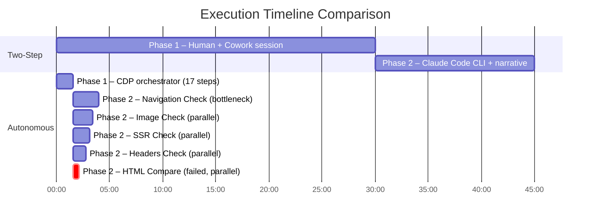
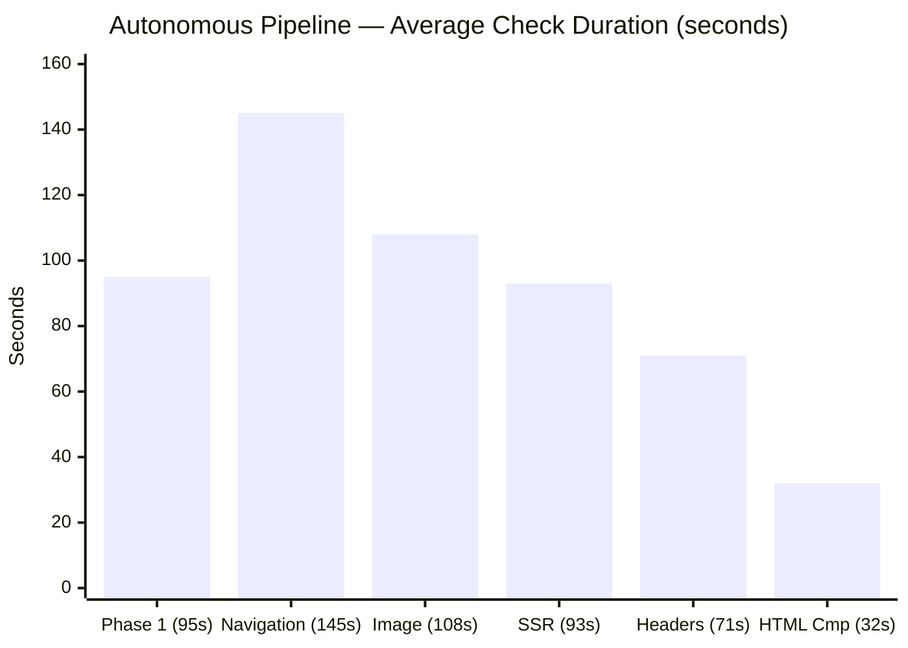
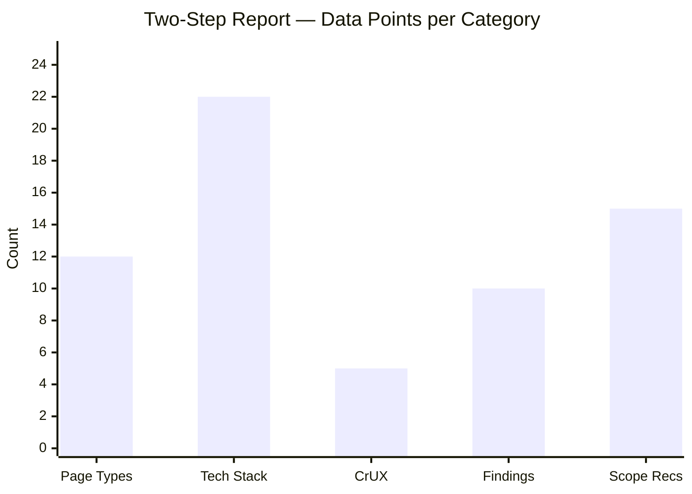
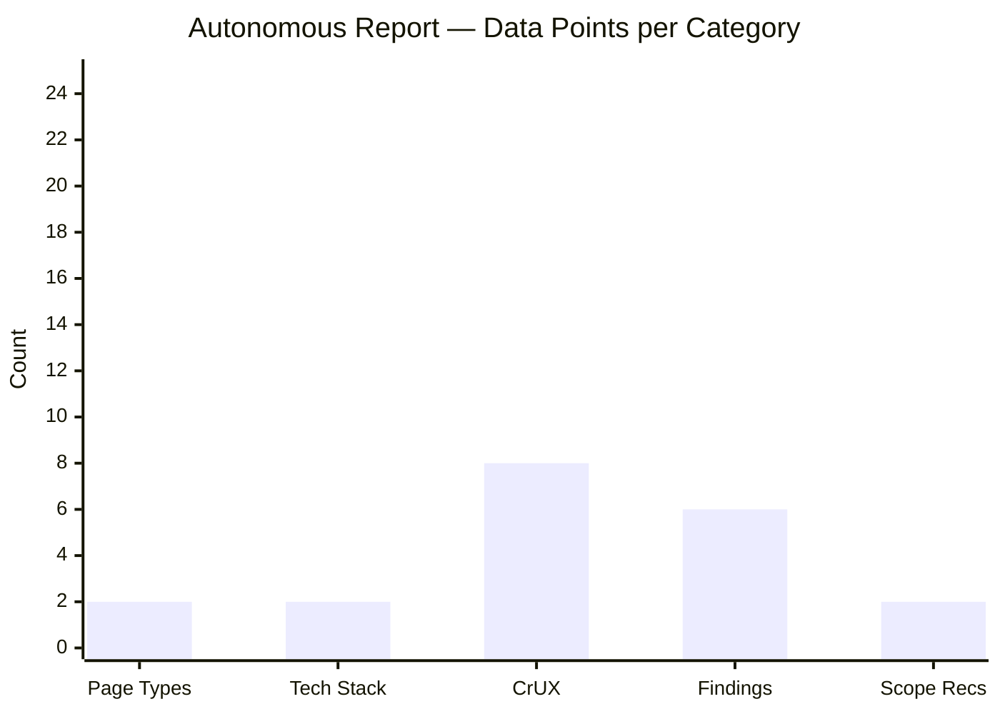
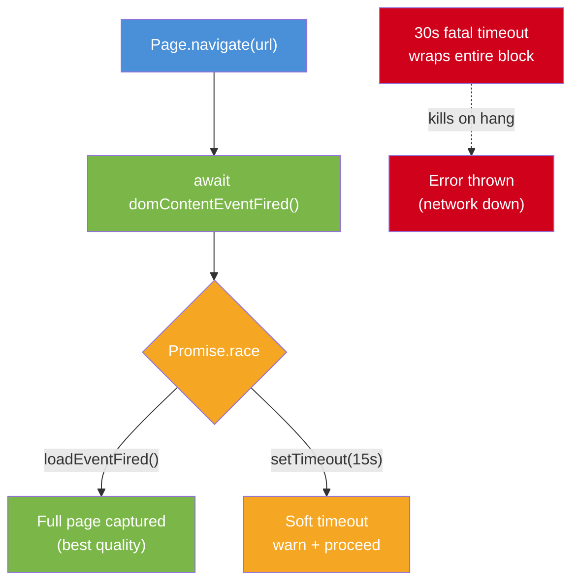
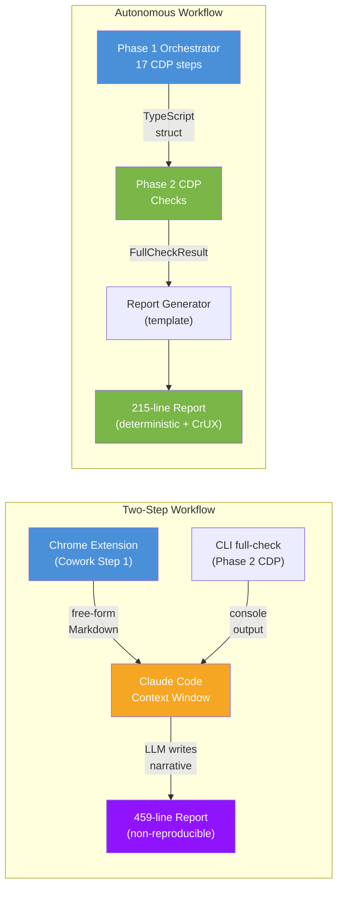
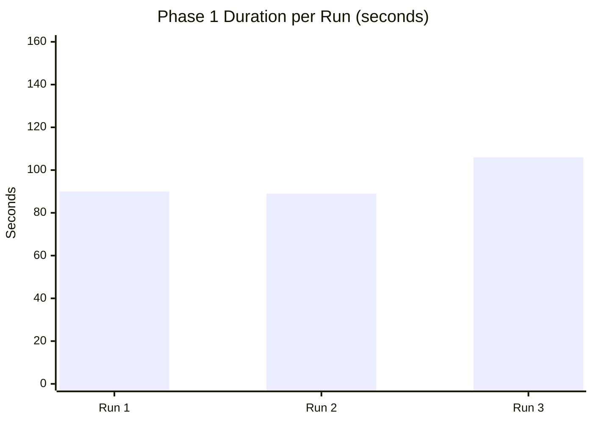
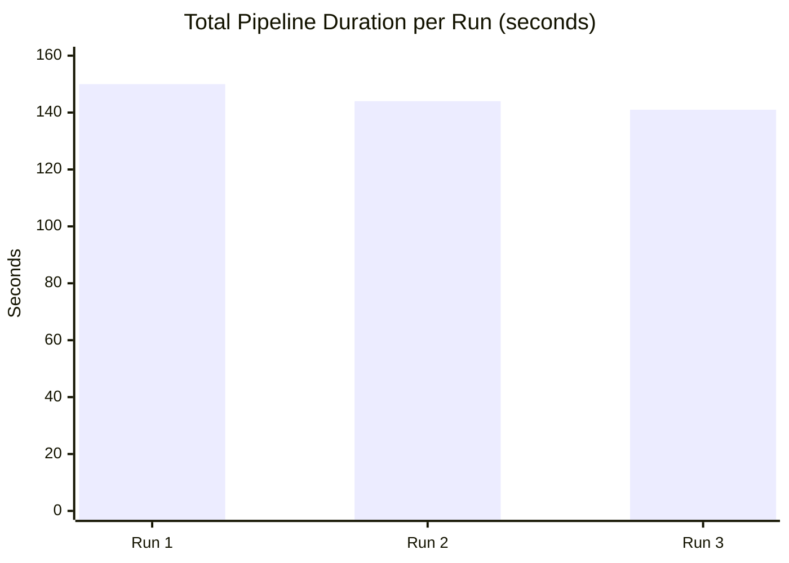
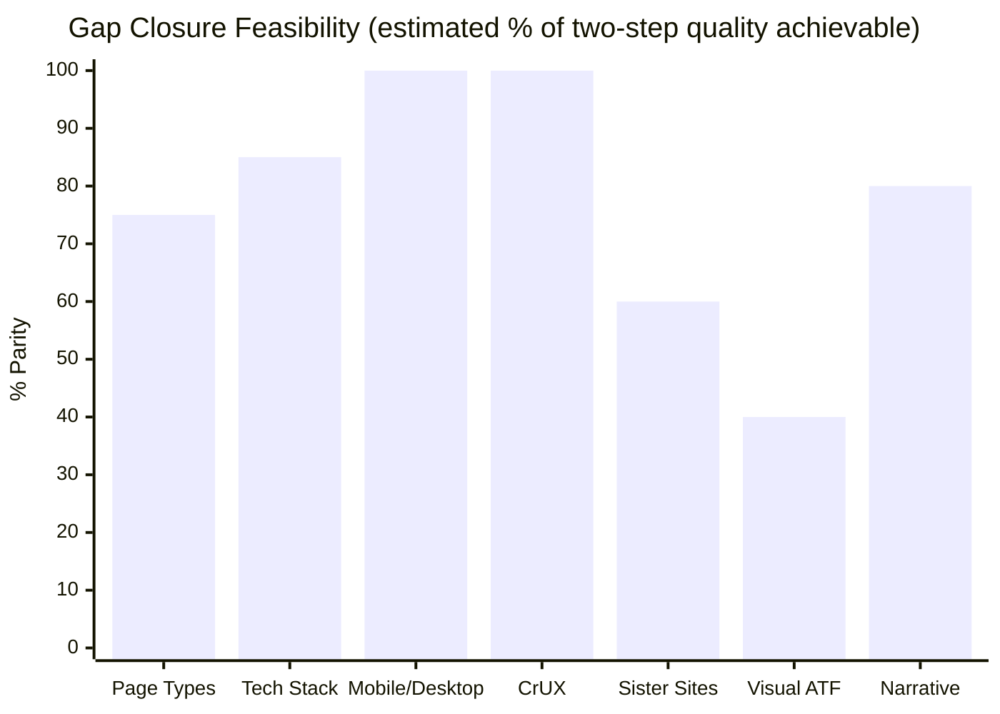

# Autonomous vs Two-Step Pre-Vetting: Trade-off Analysis

**Date:** 2026-05-14
**Subject:** fritz-berger.de
**Branch:** `feature/cdp-refactor`

---

## Executive Summary

This document compares two approaches to Speed Kit pre-vetting — the original
two-step workflow (human-driven Cowork + CLI) and the new autonomous pipeline
(single CLI command) — across three dimensions: speed, quality, and consistency.

**Speed.** The autonomous path completes in ~2.4 minutes vs ~45 minutes for the
two-step workflow — an **18x improvement**. Phase 1 replaces a 30-minute
human+Cowork session with a ~95-second orchestrator. Phase 2 replaces a
~15-minute Claude Code session (running CDP checks + reading reports + writing
459-line narrative) with the same CDP checks plus deterministic report
generation.

**Quality trade-offs.** The two-step report is significantly richer: 22 tech
stack components vs 2, 12 page types vs 2, successful Mobile/Desktop
comparison, sister site analysis, 10 strategic findings, scope
recommendations, and risk assessment — 459 lines of narrative produced by
Claude Code synthesizing both data sources. The autonomous path produces a
215-line factual report with full CrUX field data (LCP, CLS, INP, TTFB for
both mobile and desktop), accurate on what it covers (SSR 92%, hard
navigations, CSP, images) but limited by V1 detection gaps (tech stack scans
raw HTML only, missing client-side injected markers) and architectural
boundaries (no sister site discovery, no visual ATF analysis).

**Resilience.** The autonomous path required novel engineering — the Smart Wait
strategy — to handle tracker-heavy sites that block `Page.loadEventFired()`.
This solved Phase 1 navigation but the same problem persists in Phase 2's
`compare-html` check, which failed in all 3 autonomous runs while succeeding
in the two-step run (timing variance, not architectural difference).

**Recommendation: Hybrid workflow.** The approaches are complementary. Use the
autonomous path as the default screening pipeline (fast, deterministic, zero
human involvement). Escalate to the two-step workflow for deep pre-vetting,
bot-protected sites, and customer-facing deliverables that require strategic
narrative.

---

## 1. Methodology

This analysis compares three approaches to Speed Kit pre-vetting, using
fritz-berger.de as the test subject:

| Approach | Description | Data Source |
|---|---|---|
| **Cowork Step 1** | Claude Cowork + Chrome Extension. Human-driven. | [`output/fritz-berger-prevetting-step1.md`](../output/fritz-berger-prevetting-step1.md) |
| **Two-Step Final** | Claude Code follows `step2-prompt.md`: runs `full-check <url>` (Phase 2 CDP checks only), then reads both the CDP output and the Cowork Step 1 report in its context window, and writes a consolidated narrative report. | [`output/fritz-berger_de_2026-05-13_step2_report.md`](../output/fritz-berger_de_2026-05-13_step2_report.md) |
| **Autonomous** | Single `full-check <url> -s` invocation — Phase 1 orchestrator (17 CDP steps) + Phase 2 CDP checks + CrUX API + report generation. Zero human involvement. | 3 runs (all with CrUX + report): [`output/fritz-berger_de_2026-05-14T06-23-43-162Z/`](../output/fritz-berger_de_2026-05-14T06-23-43-162Z/) |

**How the two-step workflow works:** On the `feat/manual_result` branch, Step 2 means giving
Claude Code the [`prompts/step2-prompt.md`](../prompts/step2-prompt.md) prompt.
This prompt tells Claude Code to run `full-check <url> -s --skip-wpt` — just the
URL, no report file import. The CLI runs Phase 2 CDP checks only (SSR, images,
headers, navigation, compare-html). There is no Phase 1 discovery on `feat/manual_result` —
the CLI has no orchestrator. Claude Code itself is the integration layer: it
reads both the Cowork Step 1 report and the CLI's CDP output in its context
window, then writes the consolidated narrative following the prompt template.

**Note:** On the `feature/cdp-refactor` branch, the `--report` flag was renamed
to `--import-phase1` (`-i`). Without this flag, the autonomous
`runPhase1Discovery()` runs instead. This is the key architectural change.

**How the autonomous workflow works:** `runPhase1Discovery()` performs 17
sequential CDP-based detection steps in a single Chrome tab, producing
`Step1ParsedReport` directly as a TypeScript struct. The same Phase 2 CDP checks
then run. A report generator ([`src/utils/report-generator.ts`](../src/utils/report-generator.ts))
formats the structured results into a Markdown report saved as `report.md`.

**Limitations:** Two-step tests ran on 2026-05-13; autonomous runs on 2026-05-14,
same Chrome instance on localhost:9222. CrUX API key configured for autonomous
runs. All approaches tested the same site — results may vary on SPAs,
bot-protected sites, etc.

---

## 2. Speed

### Raw Timing Data (3 autonomous runs with CrUX)

| Check | Run 1 | Run 2 | Run 3 | Mean | σ |
|---|---|---|---|---|---|
| **Phase 1 Discovery** | 89.7s | 89.4s | 106.2s | **95.1s** | 9.6s |
| HTML Comparison | 32.1s | 31.2s | 31.3s | 31.5s | 0.5s |
| SSR Check | 102.7s | 91.5s | 83.5s | 92.6s | 9.6s |
| Image Check | 110.4s | 106.5s | 106.9s | 107.9s | 2.2s |
| Headers Check | 69.4s | 67.2s | 76.2s | 70.9s | 4.7s |
| Navigation Check | 150.5s | 144.1s | 141.3s | 145.3s | 4.8s |
| **Total (wall clock)** | **150.5s** | **144.1s** | **141.3s** | **145.3s** | 4.8s |

> **Source:** [`output/fritz-berger_de_2026-05-14T06-23-43-162Z/execution-metrics.json`](../output/fritz-berger_de_2026-05-14T06-23-43-162Z/execution-metrics.json),
> [`output/fritz-berger_de_2026-05-14T06-29-54-756Z/execution-metrics.json`](../output/fritz-berger_de_2026-05-14T06-29-54-756Z/execution-metrics.json),
> [`output/fritz-berger_de_2026-05-14T06-34-11-028Z/execution-metrics.json`](../output/fritz-berger_de_2026-05-14T06-34-11-028Z/execution-metrics.json)

Phase 2 checks run in parallel, so wall-clock time is driven by the slowest
check (Navigation Check, ~145s mean). Phase 1 now includes CrUX API calls
(~2s overhead, non-blocking).

### End-to-End Comparison

| Metric | Two-Step | Autonomous |
|---|---|---|
| Step 1 / Phase 1 | ~30 min (human + Cowork session) | ~95s (orchestrator + CrUX API) |
| Step 2 / Phase 2 | ~15 min (CLI + Claude Code reads, reasons, writes report) | ~145s (same CLI + template report gen) |
| Total | **~45 minutes** | **~2 min 25s** |
| Human involvement | Required (copy-paste between tools) | Zero |
| Runs per hour (theoretical) | ~1.3 | ~25 |
| Report output | 459-line LLM narrative (11 sections + Beta) | 215-line factual report (10 sections + CrUX) |

The autonomous path is **~18x faster** end-to-end. Both phases contribute:
Phase 1 replaces a 30-minute human+Cowork session with a ~95-second
orchestrator (including CrUX API fetch); Phase 2 replaces a ~15-minute
Claude Code session (running CDP checks, reading both reports, writing
narrative) with a ~145-second CLI run plus deterministic report generation.

### Execution Timeline: Two-Step vs Autonomous

The Gantt chart below shows how time is spent in each approach. The two-step
workflow is sequential and human-dependent; the autonomous pipeline runs
Phase 1 sequentially, then Phase 2 checks **in parallel**.



> **Key insight:** Phase 2 checks run in parallel — wall-clock time equals the
> slowest check (Navigation Check, ~145s). The autonomous pipeline finishes
> in ~2 min 25s total vs ~45 min for the two-step workflow.

### Per-Check Duration (Autonomous, 3-Run Average)



> Single series — all bars represent autonomous check durations (mean of 3 runs).
> Navigation Check is the bottleneck. HTML Comparison fails consistently at
> ~31s (strict `loadEventFired` timeout).

---

## 3. Quality — Trade-off Analysis by Theme

### Theme A: Deterministic / Machine-Readable Data

**Categories covered:** Tech Stack, Bot Protection, Service Workers, Data Layer,
Languages, Query Params, Third-Party Domains, Speculation Rules, CSPs, SSR,
Images, Navigation Type, PLP Filters.

These categories produce factual, machine-readable signals — either a vendor is
present or it isn't, either SSR content exists in raw HTML or it doesn't.

**Autonomous path strengths:**

- **CDP-verified raw data.** SSR detection compares raw HTML size to rendered DOM
  size, not heuristic guesses from rendered content. Headers are read directly from
  `Network.responseReceived`, not inferred from visible page behavior.
- **Registry-based detection is deterministic.** `detectTechStack()` applies the
  same regex patterns every run. No variability from LLM inference.
- **Structured output with report.** The autonomous path now generates a
  [`report.md`](../output/fritz-berger_de_2026-05-14T06-23-43-162Z/report.md)
  with 10 sections — Summary Table, CDP Findings, Page Types, Tech Stack,
  Performance (CrUX mobile + desktop), Key Findings, DataLayer, Scope
  Recommendations, Items Verified, and Conclusion.

**Autonomous path blind spots:**

- **Fewer page types discovered.** 2 page types (Homepage + PLP) across all 3
  runs vs **12** in the two-step report. This is a known limitation of the V1
  crawler implementation, not an architectural constraint — `discoverPageTypes()`
  currently only scans links from the homepage. The CDP infrastructure can
  navigate and classify any URL; what's missing is the crawl strategy to reach
  deeper pages (PDP, Search, Cart, etc.). Sitemap parsing and navigation-menu
  crawling are planned for V2 (see [Section 8 — Improve page type discovery depth](#high-priority)).
- **Mobile vs Desktop comparison failed.** `compare-html` timed out in all 3
  autonomous runs (strict `loadEventFired`). The two-step report confirmed
  server-side device detection (`_isMobile`, +136/-95 lines) — a critical cache
  configuration finding.
- **Visually blind.** Cannot assess ATF content, A/B test visual impact, or
  personalization layout. Would require `Page.captureScreenshot()`.
- **Static regex registries.** Only detects vendors in `HTML_SIGNALS` /
  `HEADER_SIGNALS`. The Cowork approach can reason about unfamiliar code.

**Two-step path strengths:**

- **12 page types** with body classes, URL patterns, and live TTFB measurements.
- **Mobile vs Desktop succeeded** — confirmed `_isMobile` flag, header nav,
  branch locator, `custom_data.platform`.
- **Contextual vendor ID** — identified `eTailer` as the platform by correlating
  CDN domain, Android package name, and media URL patterns.

**Two-step path blind spots:**

- Non-reproducible. Different sessions produce different prose, tables, emphasis.
- Step 1 findings are heuristic guesses from rendered DOM, corrected by CDP in
  Step 2 (e.g., Step 1: "ATF assets mis-tagged" → CDP: only 1 at 469px).

### Theme B: Subjective / Strategic Analysis

**Categories covered:** Speed Kit Scope, Risk Assessment, Personalization depth,
A/B testing ATF impact, Native App, Sister Sites.

The two-step report produced rich strategic content the autonomous path cannot:

| Content | Two-Step | Autonomous |
|---|---|---|
| Key Findings | 10 detailed paragraphs | 6 heuristic bullets |
| Scope Recommendations | 7 accelerate + 8 exclude | 2 accelerate + 0 exclude |
| Sister Sites | 3 domains compared with CrUX | Not attempted |
| Native App | iOS + Android identified | Not attempted |
| Risk Assessment | 7 risks with mitigations | Not produced |
| Value Proposition | Before/after projections | Not produced |
| Action Items | 8 recommendations | Not produced |
| DataLayer Mapping | 8 properties with examples | 2 interesting keys |

These are **inherent architectural limitations**. The autonomous path operates
within a single Chrome tab on a single origin. It cannot search the web, navigate
sister domains, or produce subjective business recommendations.

### Theme C: External API Data (CrUX / Performance)

The two-step report included CrUX data (5 metrics, 2 devices, distribution
buckets) from manual `cruxvis.withgoogle.com` navigation.

The autonomous path now fetches CrUX data via the PageSpeed Insights API
(`fetchCruxData()`) and returns **8 p75 metrics** (LCP, CLS, INP, TTFB for
both mobile and desktop). This actually exceeds the two-step report's 5
metrics. The data is perfectly consistent across runs (CrUX aggregates 28
days of Chrome user data, so p75 values don't change between requests).

> **Previously a gap, now resolved.** Configuring `CRUX_API_KEY` in `.env`
> was the only change needed — the implementation was already in place.

### Side-by-Side: What Each Approach Produced

| Finding | Two-Step Report | Autonomous Report | Match? |
|---|---|---|---|
| Page types | **12** (body classes catalogued) | **2** (Homepage + PLP) | Gap |
| Mobile vs Desktop | **Succeeded** (+136/-95 lines) | **Failed** (all 3 runs) | Gap |
| SSR ratio | **93%** (62,255 / 67,269 text) | **92%** (62,523 / 67,811 text) | Match |
| Images - WebP | **76%** (58/76) | **80%** (55/69) | Match |
| Images - payload | **370.9 KB** | **405.1 KB** | Match |
| CSP | `default-src 'self' ... data: *` | `default-src 'self' ... data: *` | Match |
| CDN | None (Apache direct) | Fastly (Phase 1) + Apache (headers) | Richer |
| TTFB Desktop | 818 ms (lab) | 472 ms p75 (CrUX field data) | Match |
| CrUX data | 5 metrics, distribution buckets | **8 metrics** (4 mobile + 4 desktop, p75) | Match |
| Tech stack | **22 components** | **2 components** | Gap |
| Sister sites | 3 domains compared | Not attempted | Gap |
| Key findings | 10 substantive paragraphs | 6 heuristic bullets | Gap |
| Scope recs | 7 accelerate + 8 exclude | 2 accelerate + 0 exclude | Gap |
| Report length | **459 lines** (LLM narrative) | **215 lines** (factual + CrUX) | Gap |

> **Source files:** Two-Step: [`fritz-berger_de_2026-05-13_step2_report.md`](../output/fritz-berger_de_2026-05-13_step2_report.md)
> | Autonomous: [`fritz-berger_de_2026-05-14T06-23-43-162Z/report.md`](../output/fritz-berger_de_2026-05-14T06-23-43-162Z/report.md)

### Coverage Comparison

**Two-Step coverage (what the human+LLM approach produces):**



**Autonomous coverage (what the CDP pipeline produces):**



> Comparing the two charts: the autonomous path now **exceeds** the two-step
> approach on CrUX (8 vs 5 metrics). The largest gaps remain in Page Types
> (2 vs 12) and Tech Stack (2 vs 22) — both addressable with V2 engineering
> work (see [Section 8 — Future Work](#high-priority)).

### Honest Assessment: Why the Autonomous Report Appears Weaker

The side-by-side table above shows both **gaps closed** and **gaps remaining**
in the V1 autonomous report. CrUX data — previously missing — now produces
8 p75 metrics (4 mobile + 4 desktop), actually exceeding the two-step report's
5 metrics. CDN detection found Fastly via Phase 1 response headers, a finding
the two-step report missed. However, significant gaps remain: 2 tech stack
entries vs 22, 2 page types vs 12, 6 heuristic bullets vs 10 substantive
paragraphs. These gaps have different root causes and different levels of
difficulty to fix:

**Tech Stack Detection (2 vs 22 components):**
The autonomous `detectTechStack()` scans only the **raw server HTML**
returned by `Network.getResponseBody` — the pre-JavaScript response. On
fritz-berger.de, most technology markers are client-side injected: OneTrust's
`cookielaw.org`, GTM's `window.dataLayer`, AB Tasty's `window.ABTasty`,
jQuery, and Baqend are all absent from the raw HTML. Additionally, the scan
limit (`HTML_SCAN_LIMIT = 250,000` chars) misses signals beyond that offset
— for example, `cdn.epoq.de` appears at position ~1.76M in the raw HTML,
well beyond the scan window. Only `searchhub.io` (at index ~5,929) falls
within the scannable raw HTML.

> **Fix path (medium effort):** Add a post-hydration scan of the rendered
> DOM (`Runtime.evaluate` to read `document.documentElement.outerHTML`)
> alongside the raw HTML scan. This would capture client-side injected
> markers. Increasing or removing `HTML_SCAN_LIMIT` would capture late-
> appearing signals in the raw HTML as well.
>
> **Reference:** [`src/commands/discover-phase1/tech-stack.ts:18`](../src/commands/discover-phase1/tech-stack.ts) (scan limit),
> [`src/commands/discover-phase1/tech-stack.ts:72-134`](../src/commands/discover-phase1/tech-stack.ts) (HTML_SIGNALS registry)

**Page Type Discovery (2 vs 12):**
As discussed in [Theme A: Deterministic / Machine-Readable Data](#theme-a-deterministic--machine-readable-data), the V1 orchestrator discovers only 2 page types
(Homepage + first link click) vs the Cowork approach's 12. This is a V1
scope limitation with a clear V2 path — see the [page type discovery roadmap in Section 8](#high-priority).

**Report Narrative (215 vs 459 lines):**
The two-step report is 459 lines because Claude Code reads both the Cowork
findings and the CLI output in its context window, then synthesizes a
narrative with strategic analysis, risk assessment, and business context.
The autonomous report generator (`report-generator.ts`) is a deterministic
template — it formats the data it has, but cannot reason about business
implications. This is an inherent architectural difference: the two-step
approach uses an LLM as a synthesis layer, while the autonomous path
produces machine-generated factual output.

**The V1 autonomous report is a proof-of-concept** that demonstrates the
pipeline works end-to-end: Phase 1 discovery → Phase 2 CDP verification →
structured Markdown output, all with zero human involvement. The data
quality gaps identified above are addressable engineering work, not
fundamental architectural limitations.

---

## 4. Resilience & The Edge Case

### The Problem: Tracker Bloat Kills Page Load

fritz-berger.de loads a heavy stack of third-party trackers: GTM (`GTM-5VZQDH`),
GA4 (`G-25PL1RZJ5Z`), AB Tasty, Epoq Inspire, SearchHub, OneTrust, Google Ads,
and Trusted Shops. These scripts make dozens of network requests to external
domains, and some of them never fully resolve.

The original autonomous implementation waited for `Page.loadEventFired()` — the
CDP event that fires when all resources (including third-party scripts) have
finished loading. On fritz-berger.de, this event **never fires** within a
reasonable timeout.

### The Evolution of the Fix

Three approaches were tried before arriving at the Smart Wait strategy:

1. **Strict `loadEventFired`** — fritz-berger.de crashed ("timed out after
   30000ms"). Third-party pixels hang indefinitely.
2. **Strict `domContentEventFired`** — Too fast. Fires before deferred JS
   (consent banners, language selectors, recommendation widgets) is injected.
   `detectTechStack()` missed patterns that depend on these scripts.
3. **Smart Wait** — The engineered solution:



| Scenario | Behavior |
|---|---|
| Load event fires in < 15s | Full page captured, best quality |
| Load event hangs (trackers) | Soft timeout at 15s, warn + proceed with DOM state |
| DOM never parses (network down) | Fatal timeout at 30s, error thrown |

In our 3 runs, the Smart Wait soft timeout triggered in 2 of 3 runs. All 3
produced identical detection results, confirming that 15 seconds is sufficient
to capture deferred JS injections on this site.

> **Source:** [`src/commands/discover-phase1/orchestrator.ts:164–197`](../src/commands/discover-phase1/orchestrator.ts)
> | Documentation: [`docs/discover-phase1/architecture/orchestrator.md`](discover-phase1/architecture/orchestrator.md)

### Why This Matters for the Comparison

The two-step approach never encountered this issue in Phase 1 because Cowork
uses the Chrome Extension, which does not rely on CDP page lifecycle events.

The autonomous path **must** handle this because it controls navigation
programmatically via CDP. If it cannot load the page, every downstream detection
step fails.

**However**, the same resilience issue affected both approaches in Phase 2.
The `compare-mobile-desktop.ts` check still uses strict `loadEventFired` and
failed in **all 3 autonomous runs** with "Page load timeout". The two-step
run's `compare-html` **succeeded** — likely due to timing variance (the load
event happened to fire before the timeout in that particular run). This is the
difference between the two-step report having a rich Mobile vs Desktop section
(+136/-95 lines with 8 structural differences) and the autonomous runs missing
this data entirely.

**Open issue:** The Smart Wait pattern should be extended to Phase 2 checks.
`compare-mobile-desktop.ts` is the highest-impact target — its consistent
failure is the single largest quality gap fixable with existing engineering.

---

## 5. Consistency & The LLM-as-Glue Architecture

### Data Flow: Two Fundamentally Different Architectures



### How the Two-Step Workflow Works

In the `feat/manual_result` branch workflow, the CLI and the Cowork report are **not
programmatically connected**. The prompt tells Claude Code to run `full-check
<url>` — just the URL, no report file passed. Claude Code (the LLM) is the
integration layer: it reads both data sources in its context window and writes
the narrative.

The report quality depends entirely on Claude Code's ability to cross-reference
and synthesize. The 12 page types, 10 key findings, scope recommendations, and
risk assessment all came from Claude Code's reasoning — not from programmatic
data flow.

### The Strength: LLM Resilience

This architecture worked remarkably well on fritz-berger.de. Claude Code:

- Read the Cowork report's `| Body class | URL pattern | Live TTFB |` table
  and correctly interpreted all 6 page types, then expanded to 12 by inferring
  additional patterns from the site's URL structure.
- Cross-referenced Step 1 findings ("ATF assets are mis-tagged with `loading='lazy'`")
  against CDP data (only 1 ATF image lazy-loaded at 469px) and reported the
  discrepancy with nuance.
- Combined CrUX data from the Cowork report with lab measurements from CDP to
  produce a unified Performance section.
- Identified strategic implications that neither data source stated explicitly
  (e.g., "No Origin CDN Amplifies Speed Kit Value").

### The Weakness: Non-Reproducibility

Run the same two-step workflow twice, and Claude Code will produce a different
report — different prose, different emphasis, potentially different conclusions.
The Cowork Step 1 report will also differ between sessions: different heading
levels, different table formats, different column names.

The `--report` (`-r`) flag exists on `feat/manual_result` and does call `parseStep1Report()`
to extract page types via regex. But the prompt doesn't use it. If it were used,
it would silently break on the fritz-berger.de Cowork report — the regex
`/\|\s*(?:Page\s*)?Type\s*\|/i` does not match the column header `Body class`,
producing `pageTypes: []`. This is a latent risk, not an observed failure.

> **Source:** Parser regex at [`src/utils/artifacts.ts:232–263`](../src/utils/artifacts.ts)

### The Autonomous Path: Deterministic but Shallow

`runPhase1Discovery()` produces `Step1ParsedReport` directly as a TypeScript
struct. The report generator then formats it deterministically. No Markdown
serialization, no LLM interpretation, no format drift.

### Variance Across 3 Autonomous Runs (with CrUX)

| Field | Run 1 | Run 2 | Run 3 | Stable? |
|---|---|---|---|---|
| Page Types | 2 | 2 | 2 | Yes |
| SSR | Yes (medium) | Yes (medium) | Yes (medium) | Yes |
| SSR Ratio | 92% | 92% | 92% | Yes |
| Navigation | HARD | HARD | HARD | Yes |
| Image Optimization | 80% | 81% | 81% | Minor variance |
| ATF Lazy Issues | 1 | 1 | 1 | Yes |
| CDN (Phase 1) | Fastly | Fastly | Fastly | Yes |
| CSP | Yes | Yes | Yes | Yes |
| CrUX - LCP Mobile | 1321 (FAST) | 1321 (FAST) | 1321 (FAST) | Yes |
| CrUX - TTFB Mobile | 753 (FAST) | 753 (FAST) | 753 (FAST) | Yes |
| Phase 1 duration | 89.7s | 89.4s | 106.2s | ±10s variance |
| Total duration | 150.5s | 144.1s | 141.3s | ±5s variance |
| HTML Comparison | Failed | Failed | Failed | Consistent failure |
| Report generated | Yes (215 lines) | Yes (215 lines) | Yes (215 lines) | Yes |

> **Source:** [`fritz-berger_de_2026-05-14T06-23-43-162Z/`](../output/fritz-berger_de_2026-05-14T06-23-43-162Z/),
> [`fritz-berger_de_2026-05-14T06-29-54-756Z/`](../output/fritz-berger_de_2026-05-14T06-29-54-756Z/),
> [`fritz-berger_de_2026-05-14T06-34-11-028Z/`](../output/fritz-berger_de_2026-05-14T06-34-11-028Z/)

**All detection results were identical across 3 runs.** CrUX field data was
perfectly stable (same p75 values across all runs — expected, since CrUX
aggregates 28 days of user data). The only variance was in timing (network
latency, ±5s total) and minor image count differences (69 images in all runs,
but optimization % varied by 1 point).

**Phase 1 duration across runs:**



**Total wall-clock time across runs:**



> Phase 1 variance: σ = 9.6s (network-dependent). Total variance: σ = 4.8s
> (parallel execution absorbs Phase 1 jitter). All detection results were
> identical across runs — only timing varied.

### The Trade-off

The autonomous path is **consistent but shallow**: 2 page types, every time,
identical results, deterministic 215-line report with CrUX data. The two-step
path is **rich but non-reproducible**: 12 page types, 10 key findings, full
strategic analysis — but the richness comes from Claude Code's contextual
reasoning, which will produce different output every session.

---

## 6. When to Use What

The two approaches are complementary, not competing. Each has a role in a
mature pre-vetting workflow.

### Recommended Hybrid Workflow

| Scenario | Recommended Approach | Rationale |
|---|---|---|
| **High-volume screening** | Autonomous | Fast (~2.5min), deterministic, zero human bottleneck. Answers "is this site a Speed Kit candidate?" at scale. |
| **Deep pre-vetting** | Two-Step or Autonomous + analyst | The two-step report produced 459 lines with scope recommendations, risk assessment, and action items. Needed for customer-facing deliverables. |
| **Aggressive bot protection** | Two-Step (Cowork first) | Human can solve CAPTCHAs. The autonomous `detectBotWall()` throws `BotWallError` — the two-step path is the designed escalation. |
| **Visual ATF analysis** | Autonomous + manual review | Run autonomous for data, human reviews ATF for personalization and A/B test concerns. |
| **New/unknown tech stacks** | Autonomous + Cowork supplement | Cowork identifies vendors through contextual reasoning; developers add patterns to the registry. |

### The Key Insight

The autonomous path is a **data-collection pipeline** — fast, deterministic,
repeatable, with a structured factual report. The two-step path is an
**analytical workflow** — slower, human-dependent, non-reproducible, but
produces the strategic narrative that customer engagements require.

The fritz-berger.de comparison makes this concrete: the autonomous path
correctly identified the site as an SSR MPA with hard navigations, WebP images,
Fastly CDN, permissive CSP, and excellent CrUX field data (all metrics FAST)
— in under 2.5 minutes, three times in a row, with identical results. But it
missed 10 of 12 page types, failed to capture Mobile vs Desktop differences,
had no sister site analysis, and produced 6 heuristic findings vs 10
substantive ones. The two-step report had all of these.

For production: the autonomous path should be the default screening pipeline.
The two-step approach becomes the deep-dive mechanism for:
1. Sites that pass screening and need customer-facing deliverables
2. Sites blocked by bot protection (`BotWallError` → manual bypass)
3. Registry expansion — Cowork identifies new vendors, developers add patterns

---

## 7. Can the Autonomous Path Match the Manual One?

The comparison in Sections 2–6 shows the autonomous path is 18x faster but
produces a shallower report. The natural question: **can these gaps be closed,
making the autonomous pipeline a general-purpose tool for any e-commerce
site?**

The answer is yes — with targeted engineering work — but some trade-offs are
inherent and worth understanding before committing to that direction.

### Gap-by-Gap Analysis

#### Closable Gaps (engineering work, clear path)

**1. Page Type Discovery (2 → 8–10)**

| Approach | Effort | Expected Yield |
|---|---|---|
| Sitemap.xml parser | Low | PDP, Search, Cart, static pages — immediately visible |
| `<nav>` menu crawling | Medium | Category hierarchies, brand pages, theme pages |
| Recursive link following (PLP → PDP) | Medium | Product detail pages from catalog links |

*Pros:* Pure CDP work, no external dependencies. Generalizes to any e-commerce
site with standard sitemaps and navigation structures. Deterministic — same
sitemap produces same page types every run.

*Cons:* Won't find pages behind authentication (account, checkout post-login).
Non-standard sites (SPAs with hash routing, JS-only navigation) may need
custom strategies. Depth limits are needed to prevent runaway crawling on
large catalogs (100k+ product URLs).

*Verdict:* Sitemap + nav menu alone would close the majority of the gap.
The remaining 2–3 types require manual input or authenticated crawling,
which is an acceptable limitation for a screening tool.

**2. Tech Stack Detection (2 → 15–20)**

| Approach | Effort | Expected Yield |
|---|---|---|
| Post-hydration DOM scan (`Runtime.evaluate`) | Medium | Client-side injected markers (GTM, OneTrust, AB Tasty, jQuery, etc.) |
| Remove/increase `HTML_SCAN_LIMIT` | Low | Late-appearing signals in raw HTML (e.g., `cdn.epoq.de` at 1.76M) |
| Network request URL pattern matching | Medium | Third-party SDKs loaded via `<script src>` that don't leave DOM markers |

*Pros:* The rendered DOM contains everything the Cowork approach sees —
scanning it levels the playing field. Network request patterns catch tools
that load via external scripts without modifying the DOM.

*Cons:* The rendered DOM is timing-dependent — signals that arrive after the
Smart Wait window are missed. New/obscure vendors still require registry
updates (a maintenance burden). False positives increase with broader
scanning (e.g., a marketing pixel from a vendor that shares a domain with
a different product).

*Verdict:* Post-hydration scan + removing the scan limit would capture
15–20 of the 22 components the two-step report found. The remaining few
are typically identified by the Cowork approach through contextual
reasoning about script names — harder to automate but low impact.

> **Reference:** [`src/commands/discover-phase1/tech-stack.ts:18`](../src/commands/discover-phase1/tech-stack.ts)
> (scan limit), [`src/commands/discover-phase1/tech-stack.ts:72-134`](../src/commands/discover-phase1/tech-stack.ts)
> (HTML_SIGNALS registry)

**3. Mobile vs Desktop HTML (failed → working)**

| Approach | Effort | Expected Yield |
|---|---|---|
| Apply Smart Wait to `compare-mobile-desktop.ts` | Low–Medium | Same `Promise.race` pattern already proven in Phase 1 |

*Pros:* The fix is already engineered and validated in the Phase 1
orchestrator. This is a copy-paste of the same pattern. Mobile vs Desktop
was the two-step report's most actionable CDP finding (`_isMobile` class,
+136/-95 line diff → server-side device detection → cache must be split).

*Cons:* None significant. This is the highest-value, lowest-effort
improvement remaining.

*Verdict:* Should be the first item implemented. Closes the single
most impactful quality gap.

#### Partially Closable Gaps (feasible with external dependencies)

**4. Sister Site / hreflang Discovery**

*Approach:* Parse `<link rel="alternate" hreflang="...">` tags from the
homepage, follow each URL, check if they share DNS records, server
infrastructure, or Speed Kit configuration.

*Pros:* hreflang is a standard HTML pattern — reliable extraction. DNS
lookups are deterministic. Useful for any multi-market e-commerce site.

*Cons:* Determining whether sister sites share a Speed Kit backend
requires knowledge of Baqend infrastructure (specific IP ranges, CNAME
patterns). This is domain-specific knowledge that would need to be
maintained. Also, some sister sites use different hostnames that aren't
linked via hreflang (e.g., `fritz-berger.at` isn't referenced from
`fritz-berger.de`'s HTML — it was discovered by the Cowork approach
through manual exploration).

*Verdict:* hreflang crawling is automatable and worth doing. Manual
discovery of non-linked sister sites remains a human task.

**5. Visual ATF Analysis (screenshots + vision)**

*Approach:* Capture above-the-fold screenshots via `Page.captureScreenshot()`
during Phase 1, then optionally pass them to Claude's vision API to detect
A/B test variations, personalization banners, and layout concerns.

*Pros:* Screenshot capture is trivial CDP work. Vision API analysis would
provide automated ATF assessment without human review. Could flag sites
where "above the fold varies significantly between visits" — a key Speed
Kit configuration concern.

*Cons:* Adds an API dependency (Claude vision) and associated latency/cost.
Vision analysis is probabilistic, not deterministic — results may vary
between runs, breaking the consistency guarantee that makes the autonomous
path valuable. Would need careful thresholding to avoid false alarms.

*Verdict:* Screenshot capture (without vision analysis) is a quick win
that enables post-run human review. Full vision-based ATF analysis is a
V3 feature that requires careful evaluation of the consistency trade-off.

**6. Native App Detection**

*Approach:* Search App Store / Play Store APIs for the brand name, or
look for `<meta name="apple-itunes-app">` and `<link rel="manifest">`
tags in the HTML.

*Pros:* HTML meta tags are reliable and already parseable in Phase 1.
App Store API queries would catch apps not linked from the website.

*Cons:* App Store APIs are unofficial and may break. Brand name matching
produces false positives (common words). The pre-vetting value is low —
knowing an app exists doesn't directly affect Speed Kit configuration.

*Verdict:* HTML meta tag scanning is worth adding (low effort). Full
App Store searching is over-engineered for the use case.

#### The Strategic Narrative Gap (architecturally different)

**7. Key Findings & Scope Recommendations (6 bullets → 10+ paragraphs)**

This is the most interesting gap because it's not a missing data problem —
it's a missing *reasoning* problem. The autonomous report has the same
underlying facts (SSR, CDN, CSP, images, CrUX) but produces 6 template
bullets. The two-step report produces 10 substantive paragraphs because
Claude Code *reasons* about the data — connecting SSR status to caching
strategy, correlating CrUX scores with Speed Kit potential, assessing
risk based on the combination of findings.

**Option A: Keep the template (status quo)**

*Pros:* Deterministic, reproducible, fast. The 6 bullets answer the core
question ("is this a Speed Kit candidate?") for screening purposes.

*Cons:* Not suitable for customer-facing deliverables. Lacks the strategic
depth that sales and partnerships teams need.

**Option B: Add an LLM synthesis step**

The most impactful architectural change: after the deterministic CDP pipeline
collects all data, pass the structured `FullCheckResult` to the Claude API
to generate a strategic narrative.

```
CDP Pipeline (deterministic) → FullCheckResult (structured data)
                                      ↓
                              Claude API call
                                      ↓
                          Strategic narrative report
```

*Pros:*
- Best of both worlds — reliable data collection + LLM-quality analysis
- Zero human involvement — the LLM reads the same data a human analyst would
- The structured input means the LLM's output is grounded in verified facts,
  not hallucinated from general knowledge
- Generalizes to any site — the LLM adapts its analysis to whatever data
  the pipeline produces
- Could produce reports of comparable quality to the two-step approach
- The `FullCheckResult` interface already exists — the data is ready to pass

*Cons:*
- **Breaks determinism.** LLM output varies between runs — the same input
  produces different prose, different emphasis, potentially different
  conclusions. This undermines the consistency advantage of the autonomous path.
- **Adds latency.** Claude API call adds 15–60 seconds depending on output
  length and model. This extends the pipeline from ~2.5 min to ~3–3.5 min
  (still far faster than 45 min, but no longer pure-CDP speed).
- **Adds cost.** Each run incurs API charges (input tokens for the structured
  data + output tokens for the narrative). At ~$0.10–0.30 per run, this is
  negligible for individual analyses but adds up at scale.
- **Adds a dependency.** The pipeline now requires API credentials, network
  access to Anthropic's API, and error handling for rate limits/timeouts.
  The current pipeline only needs Chrome on port 9222.
- **Quality is only as good as the prompt.** The LLM synthesis step needs
  a well-crafted system prompt that knows what Speed Kit needs, what to
  flag as risks, and how to structure recommendations. This prompt becomes
  a critical maintenance surface.

**Option C: Hybrid — template + optional LLM enhancement**

Generate the deterministic template report (current behavior), then
optionally invoke the LLM synthesis as a post-processing step. The user
chooses at runtime: `--report-mode template` (fast, deterministic) or
`--report-mode llm` (richer, non-deterministic).

*Pros:* Preserves the screening use case (fast template) while enabling
the deep-dive use case (LLM narrative) without human involvement. The
template report serves as a fallback if the API call fails.

*Cons:* Two code paths to maintain. Users must decide which mode to use.
The LLM mode's output quality depends on prompt engineering that must
evolve with the data structures.

### Summary: Parity Assessment



| Gap | Current | Achievable | Effort | Approach |
|---|---|---|---|---|
| Page Types | 2 / 12 | 8–10 / 12 | Medium | Sitemap + nav crawling |
| Tech Stack | 2 / 22 | 15–20 / 22 | Medium | Post-hydration DOM scan |
| Mobile/Desktop | Failed | Working | Low | Smart Wait in Phase 2 |
| CrUX | **8 / 5** | Done | **Done** | API key configured |
| Sister Sites | 0 / 3 | 1–2 / 3 | Medium | hreflang crawling |
| Visual ATF | None | Screenshots | Low–Medium | `Page.captureScreenshot()` |
| Narrative | 6 / 10 | 8–10 / 10 | Medium | LLM synthesis (Option B or C) |

### Conclusion: General-Purpose Viability

**Yes, the autonomous pipeline can become a general-purpose pre-vetting tool
for e-commerce sites.** The gaps are engineering work, not architectural
limitations. The CDP infrastructure already supports everything needed —
the missing pieces are crawl strategies (page types), scan targets (rendered
DOM for tech stack), and an optional LLM layer (strategic narrative).

The recommended path for a production-grade tool:

1. **V2 (near-term):** Fix Mobile/Desktop (Smart Wait), improve page types
   (sitemap + nav), improve tech stack (rendered DOM scan). These three
   changes close ~70% of the quality gap with medium engineering effort.

2. **V3 (mid-term):** Add LLM synthesis option, screenshot capture,
   hreflang crawling. These close another ~20% and make the autonomous
   report suitable for customer-facing use.

3. **Remaining ~10%:** Sister sites not linked via hreflang, authenticated
   page types, vendor identification through contextual reasoning. These
   are inherently human tasks — the two-step workflow remains the
   escalation path for edge cases.

The critical insight is that **the two approaches are not competing for the
same job.** The autonomous pipeline is a screening tool that should handle
80–90% of pre-vetting volume. The two-step workflow is a deep-dive tool
for the remaining 10–20% that require human judgment. Closing the gaps
above doesn't eliminate the two-step path — it reduces how often it's needed.

---

## 8. Future Work

### High Priority

1. **Extend Smart Wait to Phase 2 checks.** `compare-mobile-desktop.ts` still uses
   strict `loadEventFired` and failed in all 3 runs. Apply the same
   `Promise.race([loadEventFired, softTimeout])` pattern. This is the single
   largest quality gap — Mobile vs Desktop was the two-step report's most
   valuable CDP finding.
   *(Medium effort, high value)*

2. **Improve page type discovery depth.** `discoverPageTypes()` finds only 2
   page types vs 12 — the largest data coverage gap after Mobile/Desktop.
   The V1 crawler only scans links on the homepage. Three concrete approaches
   for V2:
   - **Sitemap.xml parser** — Most e-commerce sites publish a sitemap. Parsing
     it and classifying URLs by path pattern (`/artikel/`, `/suche/`, `/cart/`)
     would immediately surface PDP, Search, Cart, and static page types.
     *(Low effort, high yield)*
   - **Navigation menu crawling** — Extract links from `<nav>` elements and
     follow them one level deep. Would capture category hierarchies, brand
     pages, and theme pages that don't appear in homepage body links.
     *(Medium effort)*
   - **Recursive link following** — From discovered PLPs, follow product links
     to discover PDPs. Requires depth limits and deduplication to avoid
     runaway crawling on large catalogs.
     *(Medium effort)*

   Combining sitemap + nav menu crawling would likely increase coverage from
   2 to 8–10 page types, closing the majority of the gap. The remaining 2–3
   types (account pages behind auth, conditional pages like filtered PLPs)
   would still require manual input or authenticated crawling.
   *(Medium effort overall, high value)*

### Medium Priority

4. **ATF screenshot capture.** Use `Page.captureScreenshot()` during Phase 1.
   Enables post-run human review of visual layout.
   *(Medium effort)*

5. **Dynamic vendor registry.** Load tech stack patterns from JSON config.
   New vendors without code changes.
   *(Medium effort)*

6. **Sister site / hreflang crawling.** Follow hreflang links to check whether
   sister domains share the same Speed Kit backend.
   *(Medium effort)*

### Lower Priority

7. **Smart Wait tuning.** Adaptive soft timeout based on observed network
   activity instead of fixed 15s.
   *(High effort, marginal improvement)*

8. **PSI distribution buckets.** Parse Good/NI/Poor percentages from PSI API.
   *(Low effort, low priority)*

---

## Appendix: Raw Data References

| Artifact | Path |
|---|---|
| Cowork Step 1 report | [`output/fritz-berger-prevetting-step1.md`](../output/fritz-berger-prevetting-step1.md) |
| Two-step final report | [`output/fritz-berger_de_2026-05-13_step2_report.md`](../output/fritz-berger_de_2026-05-13_step2_report.md) |
| Step 2 prompt template | [`prompts/step2-prompt.md`](../prompts/step2-prompt.md) |
| Autonomous run 1 (report + metrics + CrUX) | [`output/fritz-berger_de_2026-05-14T06-23-43-162Z/`](../output/fritz-berger_de_2026-05-14T06-23-43-162Z/) |
| Autonomous run 2 (report + metrics + CrUX) | [`output/fritz-berger_de_2026-05-14T06-29-54-756Z/`](../output/fritz-berger_de_2026-05-14T06-29-54-756Z/) |
| Autonomous run 3 (report + metrics + CrUX) | [`output/fritz-berger_de_2026-05-14T06-34-11-028Z/`](../output/fritz-berger_de_2026-05-14T06-34-11-028Z/) |
| Report generator | [`src/utils/report-generator.ts`](../src/utils/report-generator.ts) |
| Smart Wait implementation | [`src/commands/discover-phase1/orchestrator.ts:164–197`](../src/commands/discover-phase1/orchestrator.ts) |
| Parser (latent break) | [`src/utils/artifacts.ts:232–263`](../src/utils/artifacts.ts) |
