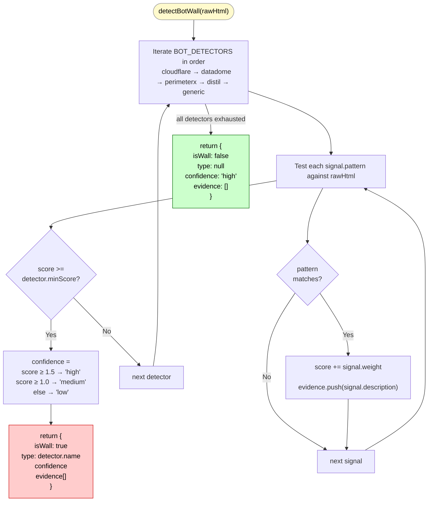
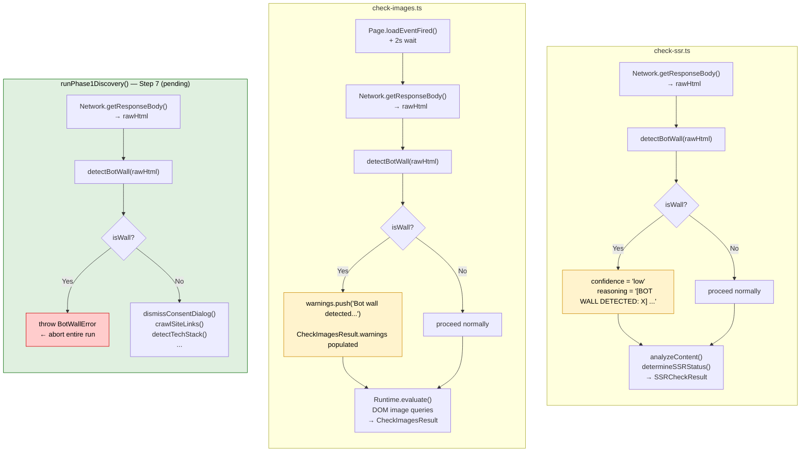

# detectBotWall()

**File:** `src/commands/discover-phase1.ts`
**Tests:** `src/__tests__/discover-phase1/detectBotWall.test.ts` (4 tests)
**Status:** Implemented ✅

---

## Purpose

A safety gate that must run on raw HTML **before any heuristic analysis begins**.

Without this check, two existing checks silently produce misleading results when a site
returns a challenge page instead of real content:

| Check | Without gate | With gate |
|---|---|---|
| `check-ssr.ts` | Reports SSR=YES (challenge page has substantial text content) | Downgrades confidence to `low`, prefixes reasoning with `[BOT WALL DETECTED]` |
| `check-images.ts` | Reports 100% optimized on 0 images (vacuously true) | Adds a `warnings[]` entry; result is flagged as unreliable |

---

## Diagram 1 — Registry Execution Flow



---

## Diagram 2 — Integration Points



---

## Signature

```typescript
export async function detectBotWall(rawHtml: string): Promise<BotWallResult>

export interface BotWallResult {
  isWall: boolean;
  type: 'cloudflare' | 'distil' | 'datadome' | 'perimeterx' | 'generic' | null;
  confidence: 'high' | 'medium' | 'low';
  evidence: string[];   // human-readable list of matched signals
}
```

---

## Implementation Pattern: Registry

The function uses a **Registry pattern** — every known bot provider is described
as a data object in the `BOT_DETECTORS` array. The function body itself is a
simple loop that never needs to change:

```typescript
const BOT_DETECTORS: BotDetector[] = [
  {
    name: 'cloudflare',
    minScore: 0.8,
    signals: [
      { pattern: /cf_chl_opt/i, weight: 1.0, description: 'Cloudflare challenge options' },
      // ...
    ],
  },
  // datadome, perimeterx, distil, generic ...
];

export async function detectBotWall(rawHtml: string): Promise<BotWallResult> {
  for (const detector of BOT_DETECTORS) {
    // sum weights of matching signals
    // if sum >= minScore → return { isWall: true, type: detector.name, ... }
  }
  return { isWall: false, type: null, ... };
}
```

**To add a new bot provider:** append one `BotDetector` object to `BOT_DETECTORS`.
Nothing else changes.

---

## Confidence Scoring

| Cumulative signal weight | Confidence |
|---|---|
| ≥ 1.5 | `high` — multiple strong signals matched |
| ≥ 1.0 | `medium` — one strong or two weak signals |
| ≥ minScore (< 1.0) | `low` — minimum threshold met |

---

## Where It Plugs In

### `check-ssr.ts` (line ~105)
```
getResponseBody() → rawHtml
    ↓
detectBotWall(rawHtml)       ← HERE
    ↓
analyzeContent(rawHtml)
determineSSRStatus(...)
    ↓
if (botWall.isWall) → analysis.confidence = 'low'
                    → analysis.reasoning = '[BOT WALL DETECTED: cloudflare] ...'
```

### `check-images.ts` (line ~190)
```
loadEventFired()
2s wait
    ↓
getResponseBody() for Document request
detectBotWall(rawHtml)       ← HERE
    ↓
if (botWall.isWall) → warnings.push('Bot wall detected ...')
                    → CheckImagesResult.warnings is populated
    ↓
DOM queries (getBoundingClientRect, etc.)
```

### `runPhase1Discovery()` (Step 7, not yet implemented)
```
getResponseBody()
detectBotWall(rawHtml)       ← HERE
    ↓
if (botWall.isWall) → throw new BotWallError(...)
                    → entire run aborts with clear message
```

---

## Supported Providers

| Provider | Key Signals |
|---|---|
| Cloudflare | `cf_chl_opt`, `cf-chl-bypass`, "Checking if the site connection is secure", "Just a moment..." |
| DataDome | `geo.captcha-delivery.com`, `captcha-delivery.com`, `datadome` |
| PerimeterX | `_px3`, `PXJS`, `pxchk`, `px-captcha`, `PerimeterX` |
| Distil/Imperva | `distil_r_captcha`, `ak_bmsc`, `Imperva`, `incapsula` |
| Generic | `<title>Access Denied</title>`, "verify you are human", "Please complete the security check" |

---

## fritz-berger.de Status

Bot wall: **NOT DETECTED** (baseline run, May 2026).
The site loads normally without challenge pages on desktop user agent.
Note: mobile UA responses may differ (Step 0 baseline showed mobile timed out —
investigate separately).

---

## Extending

```typescript
// Example: add Akamai Bot Manager detection
{
  name: 'distil',   // grouped with Distil/Imperva in the type union
  minScore: 1.0,
  signals: [
    { pattern: /_abck\b/,            weight: 1.0, description: 'Akamai bot cookie' },
    { pattern: /bm_sz\b/,            weight: 1.0, description: 'Akamai bot size marker' },
    { pattern: /akamai.*bot/i,       weight: 0.8, description: 'Akamai bot reference' },
  ],
},
```
