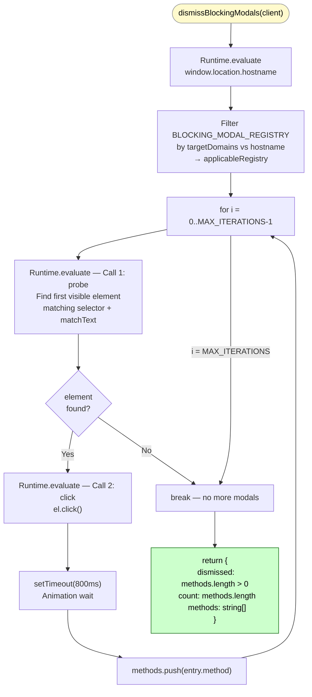
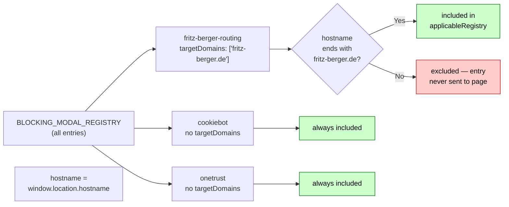

# dismissBlockingModals()

**File:** `src/commands/discover-phase1/modals.ts`
**Tests:** `src/__tests__/discover-phase1/dismissBlockingModals.test.ts` (5 tests)
**Status:** Implemented ✅

---

## Purpose

A content-visibility gate that must run on a loaded page **before any DOM-reading check begins**.

Sites can stack multiple pre-content overlays in sequence. This function loops until all
registered modals are cleared, so a single call handles any depth of stacking.

| Modal type | Example | Without gate | With gate |
|---|---|---|---|
| Geo/language routing | fritz-berger.de language picker | Stays on modal — redirect risk | "Stay on fritz-berger.de" clicked |
| GDPR/cookie consent | Cookiebot, OneTrust | Banner covers ATF content | Banner dismissed |
| Combined (stacked) | Routing modal → consent banner | Both block content | Both cleared, in sequence |

---

## Diagram 1 — Loop Execution Flow



---

## Diagram 2 — targetDomains Filtering



---

## Diagram 3 — Integration Points

```mermaid
flowchart TD
    subgraph IMG["check-images.ts"]
        I1["loadEventFired() + 2s wait"] --> I2["dismissBlockingModals(client)"]
        I2 --> I3["detectBotWall() + DOM queries"]
    end

    subgraph SSR["check-ssr.ts"]
        S1["loadEventFired()"] --> S2["dismissBlockingModals(client)"]
        S2 --> S3["3s JS wait → outerHTML → analyzeContent()"]
    end

    subgraph NAV["check-navigation.ts"]
        N1["loadEventFired() + waitForHydration()"] --> N2["dismissBlockingModals(client)"]
        N2 --> N3["findMatchingLink() → click → nav type"]
    end
```



---

## Signature

```typescript
export async function dismissBlockingModals(
  client: any,
  targetHostname?: string,  // e.g. 'www.fritz-berger.de' — enables dynamic routing detection
): Promise<DismissResult>

export interface DismissResult {
  dismissed: boolean;
  count: number;        // total modals cleared (0, 1, 2, ...)
  methods: string[];    // ordered list, e.g. ['dynamic-routing', 'cookiebot']
}
```

---

## Detection Strategy (per iteration)

Each probe expression runs two checks in priority order:

### 1. Dynamic routing check (when `targetHostname` is provided)

Queries all `button, [role="button"]` elements. If any visible button's `innerText`
contains the target hostname (case-insensitive), it is clicked and reported as
`method: 'dynamic-routing'`.

This catches language/geo routing modals on **any site** generically — no registry
entry or prior knowledge of the site is needed. The probe uses `String.includes()`
for detection; the returned `matchText` is the regex-escaped hostname so the click
expression's `new RegExp(matchText, flags)` finds the same element reliably.

`<a>` tags are intentionally excluded: nav links, footer links, and logo anchors
commonly contain the site hostname, creating false positives on every page.
Routing modal CTAs are always `<button>` elements.

### 2. Static registry check

Falls through to `BLOCKING_MODAL_REGISTRY` only if no dynamic routing match was found.
Handles known CMPs (Cookiebot, OneTrust, TrustArc) via stable CSS selectors.

---

## Implementation Pattern: Registry + Loop

```typescript
const BLOCKING_MODAL_REGISTRY: BlockingModalEntry[] = [
  // Static consent CMPs — stable selectors, no hostname needed
  { selector: '#CybotCookiebotDialogBodyButtonAccept', category: 'consent', method: 'cookiebot' },
  { selector: '.onetrust-accept-btn-handler',          category: 'consent', method: 'onetrust' },
  // ...
];
```

**To add a new CMP:** append one entry to `BLOCKING_MODAL_REGISTRY`.
For site-specific entries, set `targetDomains` — filtered in TypeScript before any CDP call.
Routing modals on new clients are handled automatically via the dynamic check; no registry
entry is needed.

---

## Two-Call Design Per Iteration

| Call | Purpose |
|---|---|
| Probe | Dynamic routing check, then static registry. Returns `{ found, selector, matchText, matchTextFlags, method }` |
| Click | Re-runs the same element-find logic using returned `selector` + `matchText`. Avoids stale element references. |

`matchText` RegExp objects are serialised as `{ source, flags }` strings for CDP transport,
then reconstructed with `new RegExp(source, flags)` inside the browser context.

---

## MAX_ITERATIONS Guard

Capped at **3 iterations**: covers routing → consent (2 modals) with one spare,
while preventing an infinite loop if a modal re-renders after dismissal.

---

## Supported Modals

| Detection | Trigger | Method label |
|---|---|---|
| Dynamic (any site) | `button` text contains `targetHostname` | `dynamic-routing` |
| Cookiebot | `#CybotCookiebotDialogBodyButtonAccept` | `cookiebot` |
| OneTrust (class) | `.onetrust-accept-btn-handler` | `onetrust` |
| OneTrust (id) | `#onetrust-accept-btn-handler` | `onetrust` |
| TrustArc | `.trustarc-agree-btn` | `trustarc` |
| Generic attribute | `[data-consent-accept]` | `generic-accept` |

---

## Extending

```typescript
// Add a new consent CMP:
{ selector: '[data-testid="uc-accept-all-button"]', category: 'consent', method: 'usercentrics' },

// Add a site-specific entry that only runs on one domain:
{
  selector: '#age-gate-confirm',
  targetDomains: ['example.com'],
  category: 'age-gate',
  method: 'example-age-gate',
},
```
