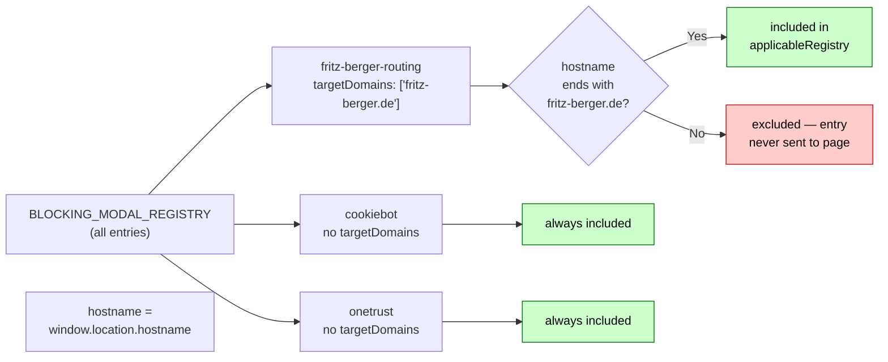

# dismissBlockingModals()

**File:** `src/commands/discover-phase1/modals.ts`
**Tests:** `src/__tests__/discover-phase1/dismissBlockingModals.test.ts` (5 tests)
**Status:** Implemented ✅

---

## Purpose

A content-visibility gate that must run on a loaded page **before any DOM-reading check begins**.

Sites can stack multiple pre-content overlays in sequence. This function loops until all
registered modals are cleared, so a single call handles any depth of stacking.

| Modal type | Example | Without gate | With gate |
|---|---|---|---|
| Geo/language routing | fritz-berger.de language picker | Stays on modal — redirect risk | "Stay on fritz-berger.de" clicked |
| GDPR/cookie consent | Cookiebot, OneTrust | Banner covers ATF content | Banner dismissed |
| Combined (stacked) | Routing modal → consent banner | Both block content | Both cleared, in sequence |

---

## Diagram 1 — Loop Execution Flow


---

## Diagram 2 — targetDomains Filtering



---

## Diagram 3 — Integration Points

```mermaid
flowchart TD
    subgraph IMG["check-images.ts"]
        I1["loadEventFired() + 2s wait"] --> I2["dismissBlockingModals(client)"]
        I2 --> I3["detectBotWall() + DOM queries"]
    end

    subgraph SSR["check-ssr.ts"]
        S1["loadEventFired()"] --> S2["dismissBlockingModals(client)"]
        S2 --> S3["3s JS wait → outerHTML → analyzeContent()"]
    end

    subgraph NAV["check-navigation.ts"]
        N1["loadEventFired() + waitForHydration()"] --> N2["dismissBlockingModals(client)"]
        N2 --> N3["findMatchingLink() → click → nav type"]
    end
```



---

## Signature

```typescript
export async function dismissBlockingModals(client: any): Promise<DismissResult>

export interface DismissResult {
  dismissed: boolean;
  count: number;        // total modals cleared (0, 1, 2, ...)
  methods: string[];    // ordered list, e.g. ['fritz-berger-routing', 'cookiebot']
}
```

---

## Implementation Pattern: Registry + Loop

```typescript
const BLOCKING_MODAL_REGISTRY: BlockingModalEntry[] = [
  // Routing modals first — they appear before the GDPR layer is rendered
  {
    selector: 'button',
    matchText: /stay on www\.fritz-berger\.de/i,
    targetDomains: ['fritz-berger.de'],
    category: 'routing',
    method: 'fritz-berger-routing',
  },
  // Consent banners
  { selector: '#CybotCookiebotDialogBodyButtonAccept', category: 'consent', method: 'cookiebot' },
  // ...
];
```

**To add a new modal:** append one `BlockingModalEntry` to `BLOCKING_MODAL_REGISTRY`.
If it is site-specific, set `targetDomains` — the entry will never be evaluated on other pages.
The function body never changes.

---

## targetDomains Constraint

The `targetDomains` field prevents site-specific text matchers from becoming false-positive
noise on unrelated sites. Without it, a `matchText: /stay on/i` pattern on a generic
`button` selector could accidentally click UI elements on other pages.

**Filtering happens in TypeScript before any CDP call**, so the probe expression sent to
the browser never contains entries that don't apply to the current hostname.

---

## Two-Call Design Per Iteration

| Call | Purpose |
|---|---|
| Probe | Find first visible element matching `selector` + optional `matchText` |
| Click | Click that element (re-runs same find logic to avoid stale reference) |

`matchText` is serialised as `{ source, flags }` and reconstructed in the browser via
`new RegExp(source, flags)`, since `RegExp` objects cannot cross the CDP serialisation boundary.

---

## MAX_ITERATIONS Guard

The loop is capped at **3 iterations**. This covers the observed maximum (routing → consent = 2)
with one spare for unknown future stacking, while preventing an infinite loop if a modal
re-renders itself after being dismissed.

---

## Supported Modals

| Site / CMP | Selector | matchText | Category |
|---|---|---|---|
| fritz-berger.de | `button` | `/stay on www\.fritz-berger\.de/i` | routing |
| Cookiebot | `#CybotCookiebotDialogBodyButtonAccept` | — | consent |
| OneTrust (class) | `.onetrust-accept-btn-handler` | — | consent |
| OneTrust (id) | `#onetrust-accept-btn-handler` | — | consent |
| TrustArc | `.trustarc-agree-btn` | — | consent |
| Generic | `[data-consent-accept]` | — | consent |

---

## Extending

```typescript
// Add a new consent CMP with a stable selector:
{ selector: '[data-testid="uc-accept-all-button"]', category: 'consent', method: 'usercentrics' },

// Add a site-specific routing modal:
{
  selector: 'button',
  matchText: /continue to uk site/i,
  targetDomains: ['example.co.uk'],
  category: 'routing',
  method: 'example-routing',
},
```
