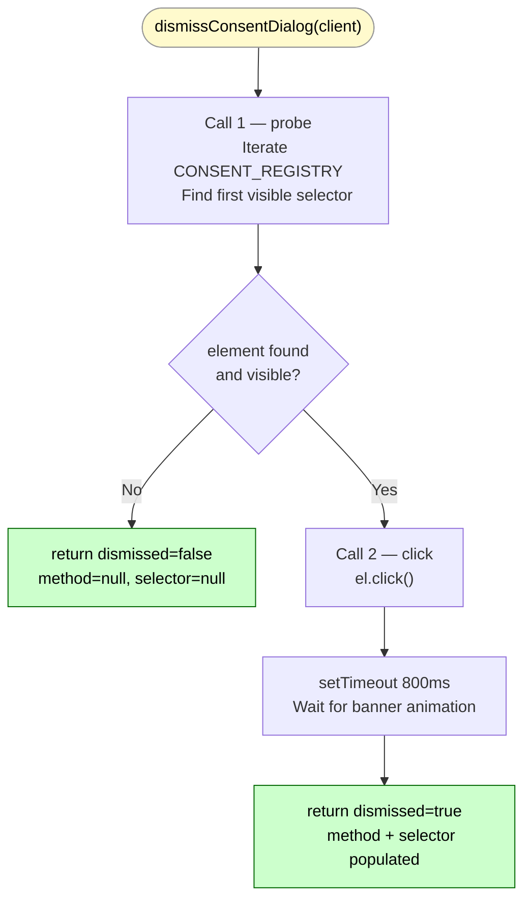
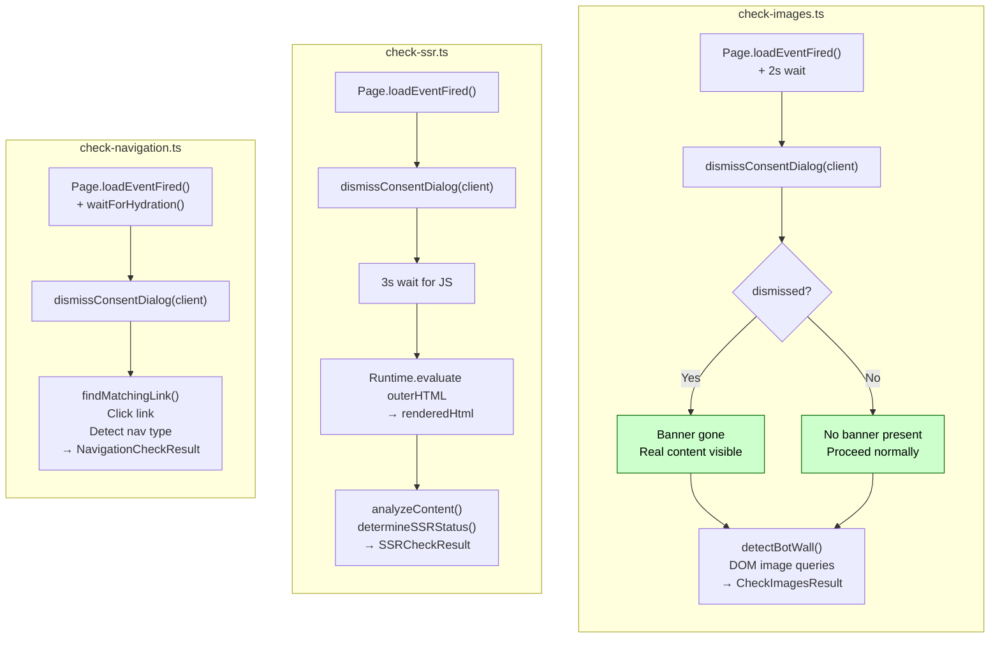

# dismissConsentDialog()

**File:** `src/commands/discover-phase1/consent.ts`
**Tests:** `src/__tests__/discover-phase1/dismissConsentDialog.test.ts` (3 tests)
**Status:** Implemented ✅

---

## Purpose

A content-visibility gate that must run on a loaded page **before any DOM-reading check begins**.

Without this, cookie/GDPR banners can hide real page content, causing:

| Check | Without gate | With gate |
|---|---|---|
| `check-images.ts` | ATF images may be zero (banner covers viewport) | Banner dismissed; real ATF image count |
| `check-ssr.ts` | Rendered DOM reflects banner overlay, not real content | Real rendered content analysed |
| `check-navigation.ts` | Nav links may be blocked/obscured by banner | Links are accessible and clickable |

---

## Diagram 1 — Registry Execution Flow



---

## Diagram 2 — Integration Points



---

## Signature

```typescript
export async function dismissConsentDialog(client: any): Promise<ConsentResult>

export interface ConsentResult {
  dismissed: boolean;
  method: 'cookiebot' | 'onetrust' | 'trustarc' | 'generic-accept' | null;
  selector: string | null;
}
```

---

## Implementation Pattern: Registry

The function uses a **Registry pattern** — every known CMP (Consent Management Platform)
is described as a data object in the `CONSENT_REGISTRY` array. The function body itself
is a two-call CDP sequence that never needs to change:

```typescript
const CONSENT_REGISTRY: ConsentEntry[] = [
  { selector: '#CybotCookiebotDialogBodyButtonAccept',  method: 'cookiebot' },
  { selector: '.onetrust-accept-btn-handler',           method: 'onetrust' },
  { selector: '#onetrust-accept-btn-handler',           method: 'onetrust' },
  { selector: '.trustarc-agree-btn',                    method: 'trustarc' },
  { selector: '[data-consent-accept]',                  method: 'generic-accept' },
];
```

**To add a new CMP:** append one `ConsentEntry` object to `CONSENT_REGISTRY`.
Nothing else changes.

---

## Two-Call Design

The probe and click are separated into two `Runtime.evaluate` calls deliberately:

| Call | Purpose | Returns |
|---|---|---|
| Call 1 — probe | Find first visible selector in CONSENT_REGISTRY | `{ found, selector, method }` |
| Call 2 — click | Click the found element | `true \| false` |

Separating them avoids injecting untrusted selector strings into a single `eval`-style
expression that both queries and acts. The selector from Call 1 is `JSON.stringify`-escaped
before being passed to Call 2.

**Short-circuit:** If `found=false`, Call 2 is never made. No timeout, no delay.

---

## Visibility Check

The probe only matches elements that are **currently visible on screen**:

```javascript
var rect = el.getBoundingClientRect();
var visible = rect.width > 0 && rect.height > 0;
```

This prevents false positives from CMPs that leave hidden fallback buttons in the DOM
after the banner has already been dismissed by a previous session cookie.

---

## 800ms Wait

After clicking, the function waits 800 ms to allow:
- CSS fade/slide animations to complete
- Any overlay `z-index` layers to be removed
- Subsequent DOM reads to see real page content

In tests, `jest.useFakeTimers()` + `jest.runAllTimersAsync()` are used to skip this wait.

---

## Supported CMPs

| CMP | Selector |
|---|---|
| Cookiebot | `#CybotCookiebotDialogBodyButtonAccept` |
| OneTrust (class) | `.onetrust-accept-btn-handler` |
| OneTrust (id) | `#onetrust-accept-btn-handler` |
| TrustArc | `.trustarc-agree-btn` |
| Generic | `[data-consent-accept]` |

---

## Extending

```typescript
// Example: add Usercentrics CMP
{ selector: '[data-testid="uc-accept-all-button"]', method: 'generic-accept' },

// Example: add a site-specific banner
{ selector: '#cookie-banner-accept', method: 'generic-accept' },
```

---

## fritz-berger.de Status

Consent banner: **NOT DETECTED in baseline run (May 2026)**.
The site does not appear to serve a GDPR banner to desktop clients from current test
location. The gate runs and returns `{ dismissed: false }` with no side effects.
