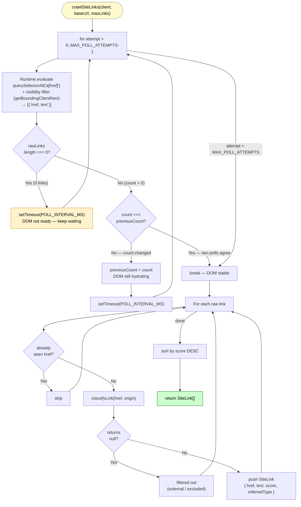
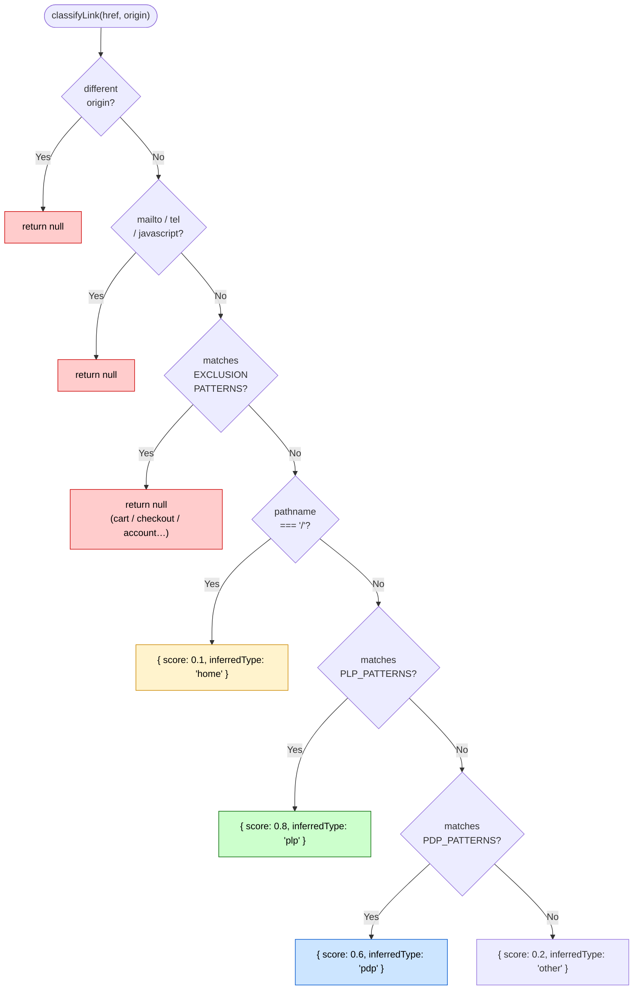
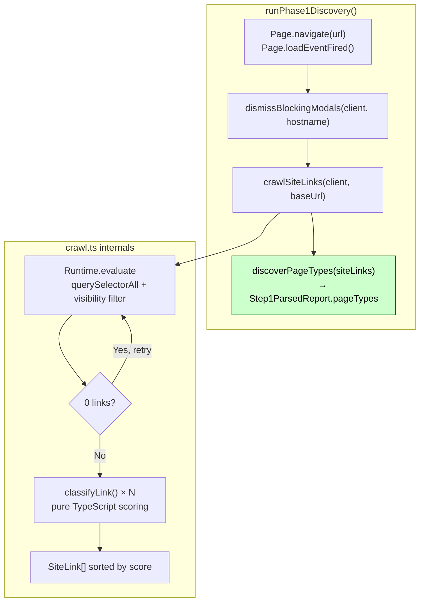

# crawlSiteLinks()

**File:** `src/commands/discover-phase1/crawl.ts`
**Tests:** `src/__tests__/discover-phase1/crawlSiteLinks.test.ts` (7 tests)
**Status:** Implemented ✅

---

## Purpose

Foundation utility that collects and scores every visible, same-origin link on the
currently loaded page. Its output feeds `discoverPageTypes()` directly — without
this, there is no input for PLP/PDP classification.

---

## Diagram 1 — Execution Flow



---

## Diagram 2 — classifyLink Decision Tree



---

## Diagram 3 — Integration Points



---

## Signature

```typescript
export async function crawlSiteLinks(
  client: any,
  baseUrl: string,   // full URL — used to derive same-origin filter
  maxLinks?: number, // default: 200
): Promise<SiteLink[]>

export interface SiteLink {
  href: string;
  text: string;
  score: number;          // 0.0–1.0 heuristic confidence
  inferredType: 'plp' | 'pdp' | 'home' | 'content' | 'other' | null;
}
```

---

## Safety Mechanisms

### Visibility Filter

The evaluate expression checks `getBoundingClientRect()` on every anchor element
before including it. Elements with `width === 0 && height === 0` are skipped.

This excludes:
- Mobile nav menus rendered off-screen on desktop viewports
- `display: none` elements (e.g. hidden tab panels, collapsed accordions)
- Off-screen drawers and flyout menus that share DOM with the visible nav

`getBoundingClientRect()` is used instead of `offsetParent === null` because
`offsetParent` returns `null` for `position: fixed` elements (sticky navs,
floating CTAs) even when they are fully visible on screen.

### SPA Hydration Polling — Stabilization Strategy

| Constant | Value | Purpose |
|---|---|---|
| `MAX_POLL_ATTEMPTS` | 6 | Hard cap on evaluate calls |
| `POLL_INTERVAL_MS` | 500 ms | Wait between attempts |

The loop runs until the visible link count is **identical across two consecutive polls**
and is non-zero. This handles three distinct loading patterns:

| Pattern | Behaviour |
|---|---|
| **SSR** — all links on first attempt | attempt 0 → N links, attempt 1 → N links (stable) → break. 1 extra poll (500ms overhead). |
| **SPA empty shell** — no links initially | count stays 0 (not stable); retries until links appear, then waits for stability. |
| **App shell trap** — header nav renders first, main content hydrates later | count changes (3 → 35); loop continues until count stabilises at 35. |

A count of `0` never triggers a break — zero links is never considered stable.
A count change between polls means the DOM is still populating — keep waiting.
Worst-case wait: 5 × 500ms = 2.5s (6 attempts, gap only between first 5).

---

## Extraction Pipeline

```
Runtime.evaluate                classifyLink() × N        sort + slice
─────────────────               ──────────────────        ────────────
Collect all visible             Score every link          Sort DESC by score
links up to                     in TypeScript.            then slice to maxLinks.
DOM_EXTRACTION_CEILING          Filter exclusions.
(default 2000).                 Deduplicate hrefs.
     ↑ browser                       ↑ pure TypeScript        ↑ pure TypeScript
```

`maxLinks` is enforced **after** sorting, not inside the evaluate expression.
This ensures high-score PLP/PDP links from the `<main>` content area are never
crowded out by mega-menu noise that happens to appear first in DOM order.

| Constant | Value | Purpose |
|---|---|---|
| `DOM_EXTRACTION_CEILING` | 2000 | Hard cap on DOM extraction — prevents memory overflow on pathological pages |
| `maxLinks` (parameter) | 200 (default) | Budget applied after sort — controls result size, not extraction scope |

All scoring, filtering, and deduplication run in TypeScript — no browser dependency.
`classifyLink` is fully unit-testable without a Chrome instance.

---

## Scoring

| inferredType | Score | Matched by |
|---|---|---|
| `plp` | 0.8 | `/category/`, `/categories/`, `/collection(s)/`, `/shop/`, `/c/`, `/department/`, `/browse/`, `/kategorie(n)/`, `/sortiment/` |
| `pdp` | 0.6 | `/product(s)/`, `/p/`, `/item(s)/`, `/detail(s)/`, `/dp/`, `/produkt(e)/` |
| `home` | 0.1 | pathname === `/` |
| `other` | 0.2 | same-origin, not excluded, no pattern match |

Result is sorted by score descending so highest-confidence links come first.

---

## Exclusions

Filtered out entirely (return `null` from `classifyLink`):

`/cart`, `/checkout`, `/account`, `/login`, `/signin`, `/signup`, `/register`,
`/logout`, `/auth`, `/wishlist`, external origins, `mailto:` / `tel:` / `javascript:`,
pure `#` fragments.

---

## Deduplication

Each unique `href` appears at most once in the result. Duplicate anchors (e.g. the
same PLP linked from header nav and footer) are deduplicated on first occurrence.
