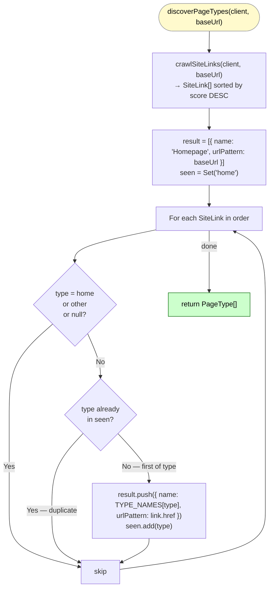
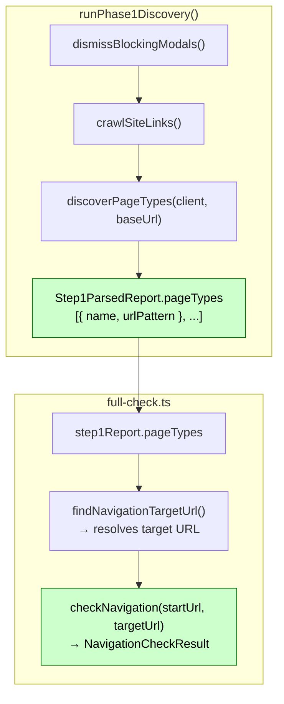

# discoverPageTypes()

**File:** `src/commands/discover-phase1/page-types.ts`
**Tests:** `src/__tests__/discover-phase1/discoverPageTypes.test.ts` (2 tests)
**Status:** Implemented ✅

---

## Purpose

Produces `Step1ParsedReport.pageTypes` — the field that enables `findNavigationTargetUrl()`
and unlocks the navigation check in `full-check.ts`.

Without this function, the navigation check is silently skipped because
`pageTypes` is empty and no target URL can be resolved.

---

## Diagram 1 — Execution Flow



---

## Diagram 2 — Integration Points



---

## Signature

```typescript
export async function discoverPageTypes(
  client: any,
  baseUrl: string,
): Promise<PageType[]>

export interface PageType {
  name: string;        // 'Homepage' | 'PLP' | 'PDP' | 'Content'
  urlPattern: string;  // representative URL for this page type
}
```

---

## Strategy

`crawlSiteLinks()` returns `SiteLink[]` already sorted by score descending.
`discoverPageTypes()` iterates once and picks the **first link of each type** —
which is already the highest-scoring representative, for free.

```
SiteLink[] (sorted DESC)        PageType[]
────────────────────────        ──────────────────────────────────────────
score=0.8  /category/boots  →   { name: 'PLP', urlPattern: '…/category/boots' }
score=0.8  /category/shoes      (skipped — PLP already seen)
score=0.6  /product/boot-x  →   { name: 'PDP', urlPattern: '…/product/boot-x' }
score=0.6  /product/shoe-y      (skipped — PDP already seen)
score=0.1  /             →      (skipped — home handled by Homepage entry)
```

Homepage is always the first entry, set to `baseUrl` directly — not picked from
crawled links, since the homepage may not appear as an anchor on the page itself.

---

## Type Mapping

| inferredType | PageType.name | Included? |
|---|---|---|
| `home` | — | Homepage entry added directly from `baseUrl` |
| `plp` | `PLP` | ✅ first match |
| `pdp` | `PDP` | ✅ first match |
| `content` | `Content` | ✅ first match |
| `other` | — | ❌ not a useful navigation target |

---

## Output Example (fritz-berger.de)

```typescript
[
  { name: 'Homepage', urlPattern: 'https://www.fritz-berger.de' },
  { name: 'PLP',      urlPattern: 'https://www.fritz-berger.de/kategorie/zelte' },
  { name: 'PDP',      urlPattern: 'https://www.fritz-berger.de/produkt/iglu-zelt-x' },
]
```
