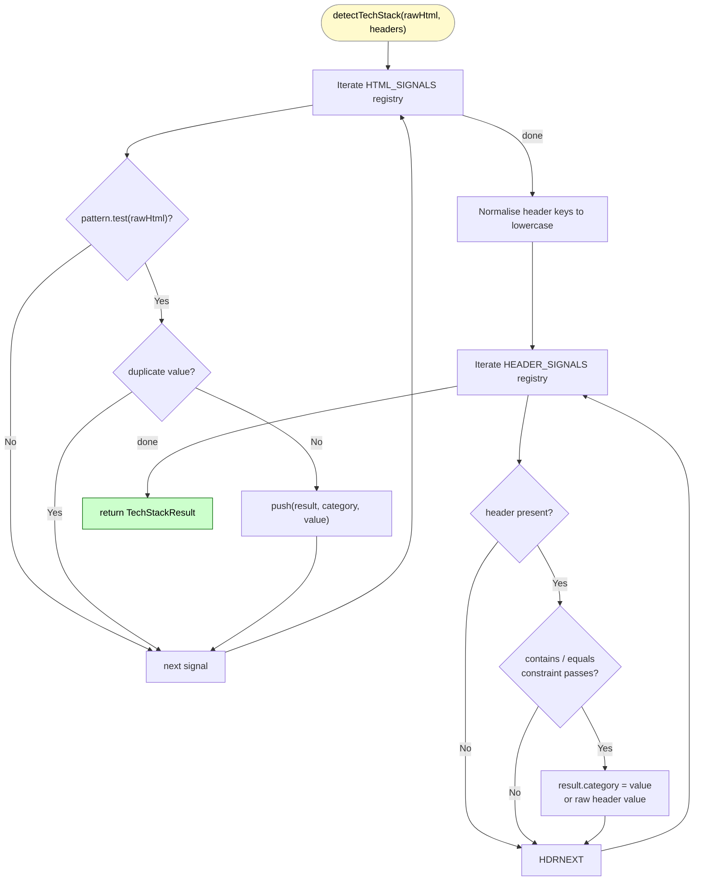
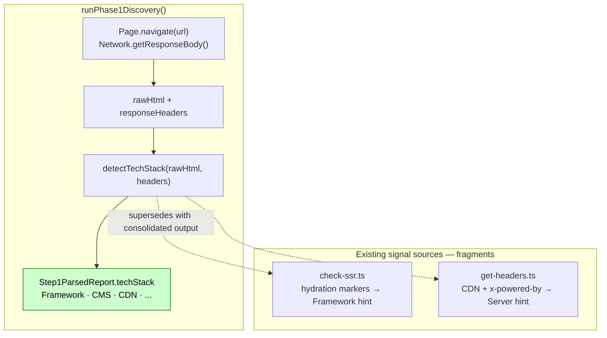

# detectTechStack()

**File:** `src/commands/discover-phase1/tech-stack.ts`
**Tests:** `src/__tests__/discover-phase1/detectTechStack.test.ts` (12 tests)
**Status:** Implemented ✅

---

## Purpose

Produces `Step1ParsedReport.techStack` — a flat `{ category: value }` dict
synthesising signals from raw HTML and response headers into a single
human-readable tech profile.

Without this function, tech stack identification is fragmented across
`check-ssr.ts` (hydration markers) and `get-headers.ts` (CDN, x-powered-by)
with no consolidated output and no CMS / A/B testing / Speed Kit coverage.

---

## Diagram 1 — Execution Flow



---

## Diagram 2 — Integration Points



---

## Signature

```typescript
export function detectTechStack(
  rawHtml: string,
  headers: Record<string, string>,
): TechStackResult

export type TechStackResult = Record<string, string[]>;
// e.g. { Framework: ['Next.js', 'React'], CMS: ['Shopify'], CDN: ['Cloudflare'] }
```

Pure synchronous function — no CDP, no async. All inputs are plain strings
collected upstream by `runPhase1Discovery()`.

---

## Strategy

Two static registries are iterated in order. **All matching signals accumulate**
per category (multi-value). A Next.js page correctly yields
`{ Framework: ['Next.js', 'React'] }` because both markers are present.
Adding a new technology = adding one entry to the appropriate registry —
function body never changes.

### HTML Signals (42 entries, 12 categories)

**Frameworks:**

| Pattern | Value |
|---|---|
| `__NEXT_DATA__` | Next.js |
| `__NUXT__` / `window.__nuxt` | Nuxt |
| `data-reactroot` | React |
| `data-v-[a-f0-9]` | Vue |

**CMS / E-commerce:**

| Pattern | Value |
|---|---|
| `window.Shopify =` | Shopify |
| `window.Magento =` | Magento |
| `window._mstConfig` / `window.SalesforceInteractions` | Salesforce CC |
| `window.Shopware` / `shopware` | Shopware |
| `woocommerce` | WooCommerce |
| `PrestaShop` | PrestaShop |

**A/B Testing:**

| Pattern | Value |
|---|---|
| `window.optimizely` / `window.Optimizely` | Optimizely |
| `window.VWO` | VWO |
| `window.ABTasty =` | ABTasty |
| `window.google_optimize` | Google Optimize |

**Personalization / Recommendations:**

| Pattern | Value |
|---|---|
| `window.Nosto` / `nostojs` | Nosto |
| `window.DY` / `window.DYO` | Dynamic Yield |
| `window.Bloomreach` / `brSM` | Bloomreach |
| `window.Monetate` | Monetate |
| `cdn.epoq.de` / `epoq-inspire` | Epoq |
| `window.FactFinder` / `factfinder` | FactFinder |

**Search:**

| Pattern | Value |
|---|---|
| `algolia` / `algoliasearch` | Algolia |
| `searchhub.io` | SearchHub |
| `window.Klevu` | Klevu |
| `window.Doofinder` | Doofinder |
| `searchspring` | Searchspring |

**RUM/APM:**

| Pattern | Value |
|---|---|
| `window.newrelic` / `NREUM` | New Relic |
| `window.DD_RUM` / `datadoghq` | Datadog |
| `window._satellite` | Adobe Launch |
| `window.Sentry` / `sentry-trace` | Sentry |
| `clarity.ms` | Microsoft Clarity |

**Consent:**

| Pattern | Value |
|---|---|
| `cookiebot` / `CybotCookiebot` | Cookiebot |
| `onetrust` / `cookielaw.org` | OneTrust |
| `usercentrics` | Usercentrics |
| `consentmanager` | Consentmanager |

**Image CDN:**

| Pattern | Value |
|---|---|
| `cloudinary.com` | Cloudinary |
| `imgix.net` | imgix |
| `scene7.com` | Scene7 |

**Other:**

| Pattern | Category | Value |
|---|---|---|
| `window.dataLayer =` | Tag Manager | GTM |
| `<script type="speculationrules"` | Speculation Rules | Yes |
| `SW_BAQEND` / `"baqend"` | Speed Kit | Active |

### Header Signals (14 entries)

| Header | Constraint | Category | Value |
|---|---|---|---|
| `cf-ray` | present | CDN | Cloudflare |
| `x-amz-cf-id` | present | CDN | CloudFront |
| `x-akamai-transformed` | present | CDN | Akamai |
| `x-served-by` | contains `cache-` | CDN | Fastly |
| `x-cdn` | equals `imperva` | CDN | Imperva |
| `via` | contains `cloudfront` | CDN | CloudFront |
| `via` | contains `varnish` | CDN | Varnish |
| `server` | contains `cloudflare` | CDN | Cloudflare |
| `server` | contains `akamai` | CDN | Akamai |
| `x-cache-status` | present | CDN | Generic CDN |
| `x-shopify-stage` | present | CMS | Shopify |
| `x-newrelic-app-data` | present | RUM/APM | New Relic |
| `x-powered-by` | present | Server | *(raw value)* |
| `x-generator` | present | CMS | *(raw value)* |

Header names are normalised to lowercase before comparison.

---

## CDN Detection Note

The CDN header patterns mirror `detectCDN()` in `get-headers.ts` intentionally.
They are kept co-located here rather than imported to avoid a cross-command
import dependency — `tech-stack.ts` is a Phase 1 Discovery module and
`get-headers.ts` is a standalone check command with its own CDP lifecycle.

---

## Output Example

```typescript
// fritz-berger.de (after flattening in orchestrator)
{
  'Tag Manager': 'GTM',
  Consent:       'OneTrust',
  'AB Testing':  'ABTasty',
  Search:        'SearchHub',
  Personalization: 'Epoq',
  'RUM/APM':     'Microsoft Clarity',
}

// Shopify store with multiple frameworks
{
  Framework:    'Next.js, React',
  CMS:          'Shopify',
  CDN:          'Fastly',
  'AB Testing': 'Optimizely',
  Consent:      'Cookiebot',
}
```
