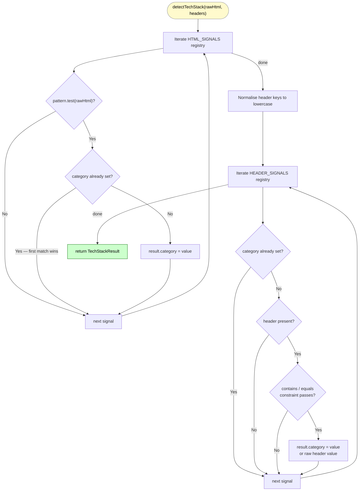
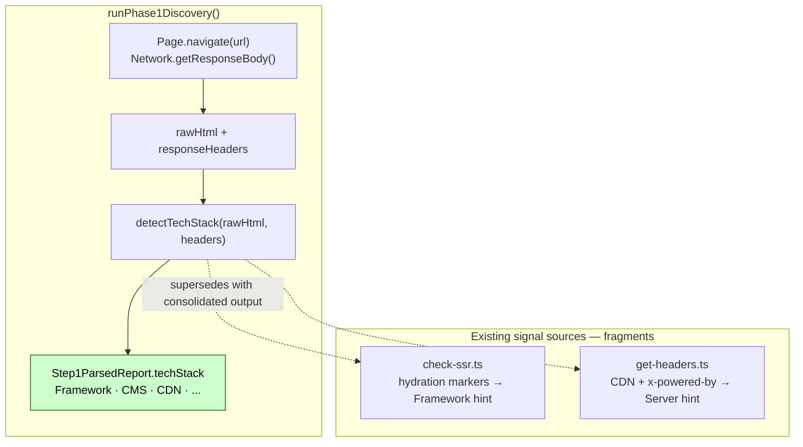

# detectTechStack()

**File:** `src/commands/discover-phase1/tech-stack.ts`
**Tests:** `src/__tests__/discover-phase1/detectTechStack.test.ts` (3 tests)
**Status:** Implemented ✅

---

## Purpose

Produces `Step1ParsedReport.techStack` — a flat `{ category: value }` dict
synthesising signals from raw HTML and response headers into a single
human-readable tech profile.

Without this function, tech stack identification is fragmented across
`check-ssr.ts` (hydration markers) and `get-headers.ts` (CDN, x-powered-by)
with no consolidated output and no CMS / A/B testing / Speed Kit coverage.

---

## Diagram 1 — Execution Flow



---

## Diagram 2 — Integration Points



---

## Signature

```typescript
export function detectTechStack(
  rawHtml: string,
  headers: Record<string, string>,
): TechStackResult

export type TechStackResult = Record<string, string>;
// e.g. { Framework: 'Next.js', CMS: 'Shopify', CDN: 'Cloudflare', 'Tag Manager': 'GTM' }
```

Pure synchronous function — no CDP, no async. All inputs are plain strings
collected upstream by `runPhase1Discovery()`.

---

## Strategy

Two static registries are iterated in order. **First match per category wins.**
Adding a new technology = adding one entry to the appropriate registry —
function body never changes.

### HTML Signals

| Pattern | Category | Value |
|---|---|---|
| `__NEXT_DATA__` | Framework | Next.js |
| `__NUXT__` / `window.__nuxt` | Framework | Nuxt |
| `data-reactroot` | Framework | React |
| `data-v-[a-f0-9]` | Framework | Vue |
| `window.Shopify =` | CMS | Shopify |
| `window.Magento =` | CMS | Magento |
| `window._mstConfig` / `window.SalesforceInteractions` | CMS | Salesforce CC |
| `window.optimizely` / `window.Optimizely` | AB Testing | Optimizely |
| `window.VWO` | AB Testing | VWO |
| `window.ABTasty =` | AB Testing | ABTasty |
| `window.google_optimize` | AB Testing | Google Optimize |
| `window.dataLayer =` | Tag Manager | GTM |
| `<script type="speculationrules"` | Speculation Rules | Yes |
| `SW_BAQEND` / `"baqend"` | Speed Kit | Active |

Next.js is listed before generic React because every Next.js page also has
`data-reactroot` — the more specific pattern must win.

### Header Signals

| Header | Constraint | Category | Value |
|---|---|---|---|
| `cf-ray` | present | CDN | Cloudflare |
| `x-amz-cf-id` | present | CDN | CloudFront |
| `x-akamai-transformed` | present | CDN | Akamai |
| `x-served-by` | contains `cache-` | CDN | Fastly |
| `x-cdn` | equals `imperva` | CDN | Imperva |
| `via` | contains `cloudfront` | CDN | CloudFront |
| `via` | contains `varnish` | CDN | Varnish |
| `server` | contains `cloudflare` | CDN | Cloudflare |
| `server` | contains `akamai` | CDN | Akamai |
| `x-cache-status` | present | CDN | Generic CDN |
| `x-powered-by` | present | Server | *(raw header value)* |
| `x-generator` | present | CMS | *(raw header value)* |

Header names are normalised to lowercase before comparison so casing
differences between servers never cause missed detections.

For `x-powered-by` and `x-generator`, the raw header value is used as-is
(the `value` field is an empty-string sentinel, replaced with the actual
header value at runtime).

---

## CDN Detection Note

The CDN header patterns mirror `detectCDN()` in `get-headers.ts` intentionally.
They are kept co-located here rather than imported to avoid a cross-command
import dependency — `tech-stack.ts` is a Phase 1 Discovery module and
`get-headers.ts` is a standalone check command with its own CDP lifecycle.

---

## Output Example

```typescript
// fritz-berger.de
{
  Framework: 'Next.js',
  CDN:       'Cloudflare',
  'Tag Manager': 'GTM',
}

// Shopify store
{
  CMS:         'Shopify',
  CDN:         'Fastly',
  'AB Testing': 'Optimizely',
}
```
