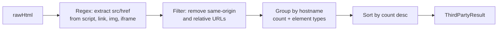

# detectThirdPartyDomains()

**File:** `src/commands/discover-phase1/third-party.ts`
**Tests:** `src/__tests__/discover-phase1/detectThirdPartyDomains.test.ts` (2 tests)
**Status:** Implemented

---

## Purpose

Extracts all external (third-party) domains referenced in page HTML by scanning
`<script src>`, `<link href>`, ``, and `<iframe src>` attributes. Groups
results by domain with a count and list of element types, sorted by frequency.

This gives the analyst a quick overview of external dependencies — CDNs, analytics,
ad networks, font providers — without requiring network interception.

---

## Signature

```typescript
export interface ThirdPartyResult {
  domains: Array<{ domain: string; count: number; types: string[] }>;
}

export function detectThirdPartyDomains(rawHtml: string, origin: string): ThirdPartyResult
```

---

## How It Works



1. A single regex scans for `src=` and `href=` attributes on `<script>`, `<link>`,
   ``, and `<iframe>` elements
2. Each matched URL is parsed; relative URLs and same-origin URLs are discarded
3. Results are grouped by hostname, accumulating count and unique element types
4. Final array is sorted by count descending (most-referenced domains first)

---

## Inputs / Outputs

| Input | Source | Description |
|---|---|---|
| `rawHtml` | `Network.getResponseBody()` | Full page HTML |
| `origin` | `new URL(url).origin` | Origin to filter out same-domain refs |

| Output | Type | Description |
|---|---|---|
| `domains` | `Array<{ domain, count, types }>` | External domains sorted by frequency |

---

## Example Output

```typescript
{
  domains: [
    { domain: 'cdn.shopify.com', count: 12, types: ['script', 'link'] },
    { domain: 'www.googletagmanager.com', count: 3, types: ['script'] },
    { domain: 'fonts.googleapis.com', count: 2, types: ['link'] },
    { domain: 'www.google-analytics.com', count: 1, types: ['script'] },
  ]
}
```

---

## Integration

Called by `runPhase1Discovery()` in `orchestrator.ts` as Step 10 (non-fatal).
Result stored in `Step1ParsedReport.thirdPartyDomains`.

Pure function — no CDP dependency.

---

## Tests

| Test | What it verifies |
|---|---|
| External scripts found | Correctly extracts domains from script/img tags, ignores same-origin |
| No external scripts | Returns empty domains array for HTML with only relative URLs |
