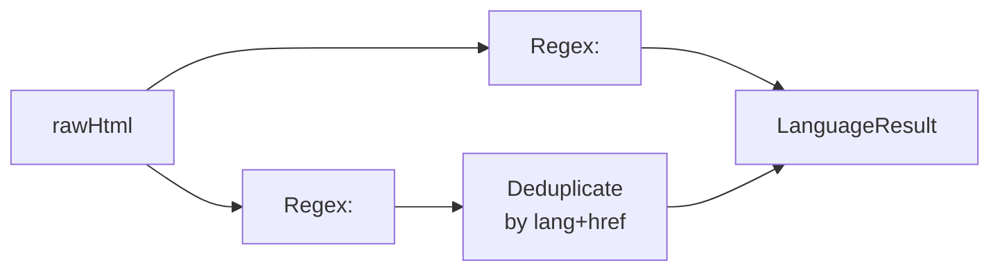

# detectLanguages()

**File:** `src/commands/discover-phase1/languages.ts`
**Tests:** `src/__tests__/discover-phase1/detectLanguages.test.ts` (2 tests)
**Status:** Implemented

---

## Purpose

Detects language and locale configuration from page HTML by parsing the
`<html lang>` attribute and `<link rel="alternate" hreflang>` tags. This tells
the analyst whether the site serves multiple languages/regions and how they are
structured (subdirectories, subdomains, separate TLDs).

---

## Signature

```typescript
export interface LanguageResult {
  htmlLang: string | null;
  hreflangTags: Array<{ lang: string; href: string }>;
}

export function detectLanguages(rawHtml: string): LanguageResult
```

---

## How It Works



1. Extracts `lang` attribute from the `<html>` tag (first match)
2. Scans for `<link rel="alternate" hreflang="..." href="...">` tags
3. Handles both attribute orderings (`hreflang` before `href` and vice versa)
4. Deduplicates by `lang|href` key to avoid double-counting

---

## Inputs / Outputs

| Input | Source | Description |
|---|---|---|
| `rawHtml` | `Network.getResponseBody()` | Full page HTML |

| Output | Type | Description |
|---|---|---|
| `htmlLang` | `string \| null` | Value of `<html lang>`, or null if absent |
| `hreflangTags` | `Array<{ lang, href }>` | All alternate language URLs found |

---

## Example Output

```typescript
{
  htmlLang: 'de',
  hreflangTags: [
    { lang: 'de', href: 'https://example.de/' },
    { lang: 'en', href: 'https://example.com/' },
    { lang: 'fr', href: 'https://example.fr/' },
    { lang: 'x-default', href: 'https://example.com/' },
  ]
}
```

---

## Integration

Called by `runPhase1Discovery()` in `orchestrator.ts` as Step 11 (non-fatal).
Result stored in `Step1ParsedReport.languages`.

Pure function — no CDP dependency.

---

## Tests

| Test | What it verifies |
|---|---|
| Hreflang tags present | Extracts htmlLang and multiple hreflang entries |
| No language info | Returns null htmlLang and empty hreflangTags for plain HTML |
