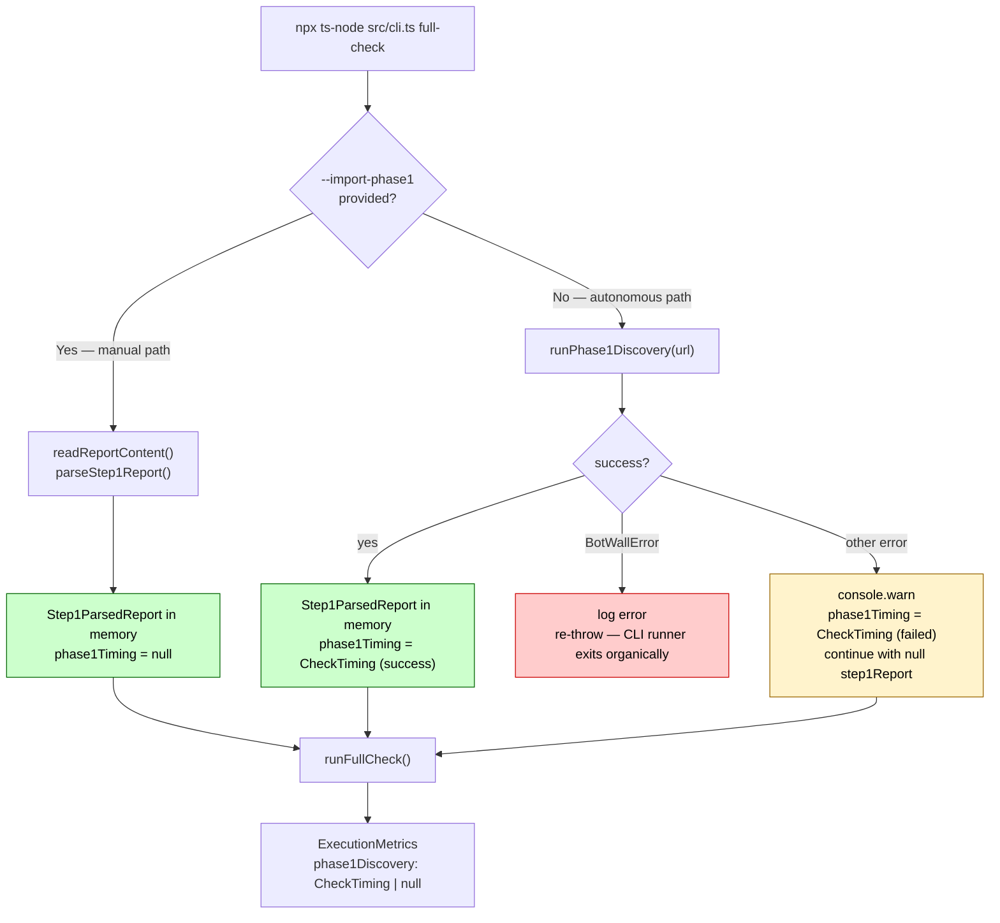
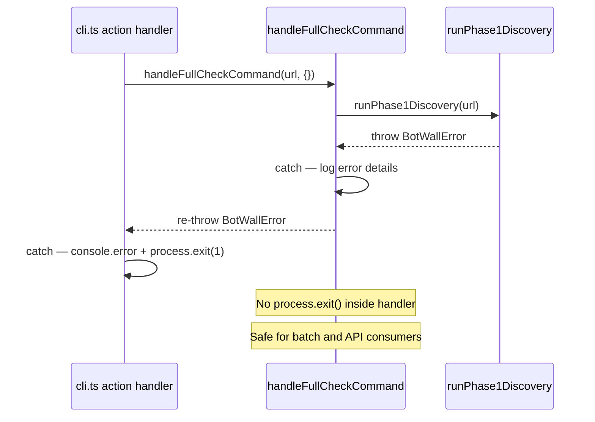

# Step 8 — Wiring runPhase1Discovery into full-check.ts

**Files modified:**
- `src/commands/full-check.ts` — autonomous path + `phase1Discovery` timing slot
- `src/commands/execution-report.ts` — `phase1Discovery` prepended to `checkOrder`
- `src/cli.ts` — flag renamed from `-r, --report` to `-i, --import-phase1`

**Tests:** `src/__tests__/full-check-integration.test.ts` (4 tests)
**Status:** Implemented ✅

---

## Purpose

Connects `runPhase1Discovery()` to the CLI entry point so that `full-check` can
run autonomously — without a human-produced Step 1 report — while preserving the
manual `--import-phase1` fallback for sites that require bot-wall bypass.

---

## Diagram 1 — Two Invocation Paths



---

## Diagram 2 — BotWallError Re-throw Contract



---

## Convergence Guarantee

Both paths converge on the same `Step1ParsedReport` interface before
`runFullCheck()` is called. `runFullCheck()` is unchanged — it reads
`options.step1Report` exactly as before.

```
Manual path:   parseStep1Report(file)     → Step1ParsedReport
Autonomous:    runPhase1Discovery(url)    → Step1ParsedReport
                                              ↓
                                        runFullCheck({ step1Report })
```

The navigation check unlock flows naturally: when `step1Report.pageTypes` is
populated, `findNavigationTargetUrl()` resolves and `checkNavigation()` runs.

---

## phase1Discovery Timing Slot

`ExecutionMetrics.checks` gained a new field:

```typescript
checks: {
  phase1Discovery: CheckTiming | null;   // null when --import-phase1 is used
  htmlComparison: CheckTiming;
  ssrCheck: CheckTiming;
  // ...
}
```

| Scenario | `phase1Discovery` value |
|---|---|
| Autonomous, succeeded | `CheckTiming` with `status: 'success'` |
| Autonomous, non-fatal error | `CheckTiming` with `status: 'failed'` + `error` message |
| `--import-phase1` used | `null` |
| `BotWallError` thrown | — (function does not return) |

`execution-report.ts` renders `phase1Discovery` as the first row in the Check
Timings table when present.

---

## Graceful Degradation

When `runPhase1Discovery` throws a non-`BotWallError` (e.g. CDP connection refused,
empty HTML, timeout), the handler:

1. Records `status: 'failed'` timing with the error message
2. Emits `console.warn` (two lines)
3. Continues with `step1Report = null` — same behaviour as running without a report

Phase 2 checks (SSR, images, headers, etc.) still run. Navigation check is skipped
because `step1Report` is null.

---

## BotWallError Re-throw Contract

`BotWallError` is intentionally **not** caught by `handleFullCheckCommand`'s outer
try/catch. Instead it propagates to the CLI action handler in `cli.ts`, which calls
`process.exit(1)` after logging.

This keeps `handleFullCheckCommand` safe for batch runners and API consumers that
want to catch `BotWallError` and apply their own retry / bypass logic.

```typescript
// handleFullCheckCommand outer catch — does NOT swallow BotWallError
} catch (error) {
  if (error instanceof BotWallError) {
    throw error;   // re-throw — CLI runner handles organic exit
  }
  console.error('Error:', (error as Error).message);
  process.exit(1);
}
```

---

## CLI Flag Rename

| Old | New |
|---|---|
| `-r, --report <file>` | `-i, --import-phase1 <file>` |
| `options.reportFile` | `options.importPhase1` |

The old flag is no longer registered. Users who had scripts using `--report` must
update to `--import-phase1`.

---

## Tests

`src/__tests__/full-check-integration.test.ts` — 4 scenarios covering the new
branching logic in `handleFullCheckCommand`:

| Test | What it verifies |
|---|---|
| Autonomous path | `runPhase1Discovery` called once with the URL |
| Manual path | `runPhase1Discovery` not called; `parseStep1Report` called |
| `BotWallError` re-throw | Propagates as `BotWallError`, not swallowed |
| Generic discovery error | `console.warn` called; function resolves (no throw) |

All CDP check functions are mocked — no real Chrome connection needed.
