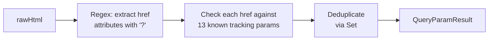

# detectQueryParams()

**File:** `src/commands/discover-phase1/query-params.ts`
**Tests:** `src/__tests__/discover-phase1/detectQueryParams.test.ts` (2 tests)
**Status:** Implemented

---

## Purpose

Scans page HTML for known tracking and marketing query parameters in `href`
attributes. Identifies which tracking systems (UTM, Google Ads, Facebook, etc.)
are referenced in on-page links, giving the analyst insight into the site's
marketing instrumentation.

---

## Signature

```typescript
export interface QueryParamResult {
  trackingParams: string[];
}

export function detectQueryParams(rawHtml: string): QueryParamResult
```

---

## How It Works



1. A regex extracts all `href="..."` values that contain a `?` (query string)
2. Each href is checked against the known tracking parameter registry
3. Matches are deduplicated (a param is reported once regardless of how many links use it)
4. Returns the list of detected parameter names

---

## Known Tracking Parameters

| Parameter | Platform |
|---|---|
| `utm_source`, `utm_medium`, `utm_campaign`, `utm_term`, `utm_content` | UTM (Google Analytics) |
| `gclid` | Google Ads |
| `fbclid` | Facebook/Meta |
| `msclkid` | Microsoft Ads |
| `dclid` | DoubleClick |
| `twclid` | Twitter/X |
| `ttclid` | TikTok |
| `mc_cid`, `mc_eid` | Mailchimp |

---

## Inputs / Outputs

| Input | Source | Description |
|---|---|---|
| `rawHtml` | `Network.getResponseBody()` | Full page HTML |

| Output | Type | Description |
|---|---|---|
| `trackingParams` | `string[]` | Names of detected tracking parameters |

---

## Example Output

```typescript
{
  trackingParams: ['utm_source', 'utm_medium', 'gclid']
}
```

---

## Integration

Called by `runPhase1Discovery()` in `orchestrator.ts` as Step 12 (non-fatal).
Result stored in `Step1ParsedReport.queryParams`.

Pure function — no CDP dependency.

---

## Tests

| Test | What it verifies |
|---|---|
| Params found | Detects utm_source and fbclid from href attributes |
| None found | Returns empty array for HTML with no tracking params |
