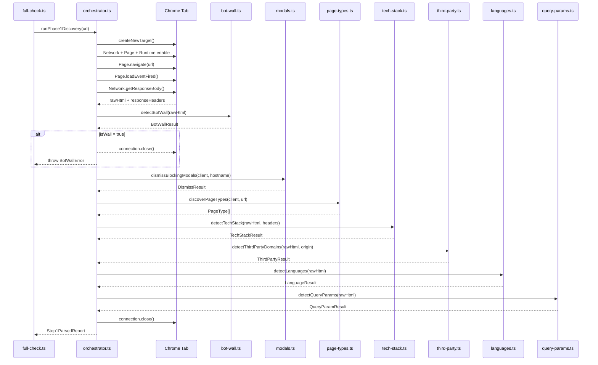
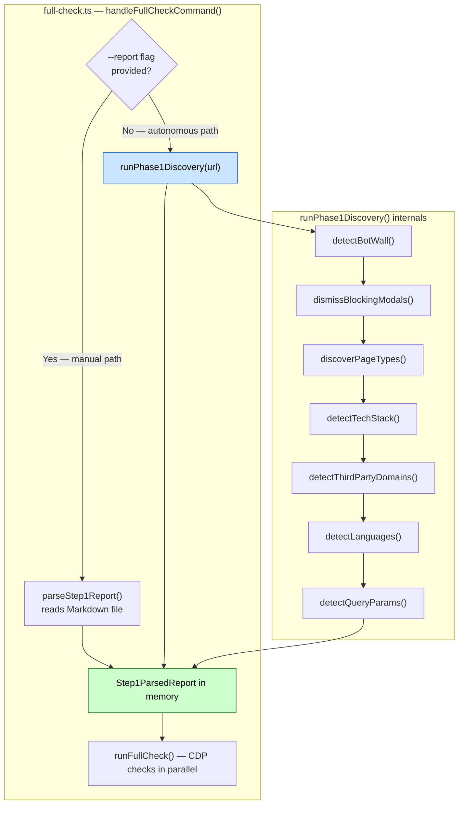

# runPhase1Discovery()

**File:** `src/commands/discover-phase1/orchestrator.ts`
**Tests:** `src/__tests__/discover-phase1/runPhase1Discovery.test.ts` (3 tests)
**Status:** Implemented ✅

---

## Purpose

Top-level entry point that replaces the human analyst for the mechanical parts
of Phase 1 pre-vetting. Orchestrates all Phase 1 helpers in a single Chrome tab
and returns a `Step1ParsedReport` directly in memory — no Markdown file, no
`parseStep1Report()` call needed.

This is the function `full-check.ts` calls when no `--report` flag is provided,
converting the tool from a two-phase workflow into a fully autonomous run.

---

## Diagram 1 — Execution Sequence



---

## Diagram 2 — Integration Points



---

## Signatures

```typescript
export async function runPhase1Discovery(url: string): Promise<Step1ParsedReport>

export class BotWallError extends Error {
  constructor(
    public readonly targetUrl: string,
    public readonly wallType: BotWallResult['type'],
    public readonly wallConfidence: BotWallResult['confidence'],
  )
  // message: "Bot wall detected on <url> (<type>, <confidence> confidence). Manual bypass required."
  // name: 'BotWallError'
}
```

---

## Execution Sequence

| Step | Action | Aborts on failure? |
|---|---|---|
| 1 | `createNewTarget()` — fresh isolated tab | Yes — connection error |
| 2 | `Network` + `Page` + `Runtime` enable | Yes |
| 3 | `Page.navigate(url)` | Yes |
| 4 | `Page.loadEventFired()` | Yes |
| 5 | `Network.getResponseBody()` — capture `rawHtml` + `responseHeaders` | No — warns and continues with empty string |
| 6 | `detectBotWall(rawHtml)` — safety gate | Yes — throws `BotWallError` |
| 7 | `dismissBlockingModals(client, hostname)` — consent / routing modals | No |
| 8 | `discoverPageTypes(client, url)` — crawl + classify → `pageTypes[]` | No |
| 9 | `detectTechStack(rawHtml, responseHeaders)` → `techStack{}` | Yes |
| 10 | `detectThirdPartyDomains(rawHtml, origin)` → external domains | No |
| 11 | `detectLanguages(rawHtml)` → html lang + hreflang tags | No |
| 12 | `detectQueryParams(rawHtml)` → tracking params | No |
| 13 | `connection.close()` — destroy tab | Always — runs in `finally` |

---

## Tab Lifecycle

The Chrome tab is always destroyed, regardless of outcome:

```typescript
try {
  // steps 2–12
} finally {
  await connection.close();  // runs even if BotWallError is thrown
}
```

This prevents tab leaks on both the success path and all error paths
(bot wall abort, CDP timeout, unexpected errors).

---

## Tech Stack Flattening

`detectTechStack()` returns `Record<string, string[]>` (multi-value).
`Step1ParsedReport.techStack` is `Record<string, string>` (single string per category).

The orchestrator flattens by joining values with `', '`:

```
{ Framework: ['Next.js', 'React'] }  →  { Framework: 'Next.js, React' }
```

This preserves backwards compatibility with the manual `--report` path, where
a human analyst always writes a single string per category.

---

## BotWallError

When `detectBotWall()` returns `isWall: true`, the orchestrator throws
`BotWallError` before any heuristic analysis runs. This prevents silent
false positives:

- SSR check would report false SSR positive (bot wall HTML has server-rendered content)
- Image check would report vacuously perfect score on zero real images

`BotWallError` is caught in `handleFullCheckCommand()` in `full-check.ts`,
logged clearly, and the run exits without producing a corrupted report.

---

## Output

Returns the same `Step1ParsedReport` interface consumed by `runFullCheck()`:

```typescript
{
  url:          'https://fritz-berger.de',
  domain:       'fritz-berger.de',
  summaryTable: {},                          // populated by CDP checks downstream
  pageTypes: [
    { name: 'Homepage', urlPattern: 'https://fritz-berger.de' },
    { name: 'PLP',      urlPattern: 'https://fritz-berger.de/kategorie/zelte' },
    { name: 'PDP',      urlPattern: 'https://fritz-berger.de/produkt/iglu-zelt-x' },
  ],
  techStack: {
    Framework:    'Next.js, React',
    CDN:          'Cloudflare',
    'Tag Manager': 'GTM',
  },
  thirdPartyDomains: {
    domains: [
      { domain: 'cdn.shopify.com', count: 12, types: ['script', 'link'] },
      { domain: 'www.googletagmanager.com', count: 3, types: ['script'] },
    ],
  },
  languages: {
    htmlLang: 'de',
    hreflangTags: [
      { lang: 'de', href: 'https://fritz-berger.de/' },
      { lang: 'x-default', href: 'https://fritz-berger.de/' },
    ],
  },
  queryParams: {
    trackingParams: ['utm_source', 'utm_medium'],
  },
  rawContent: '',
}
```

`summaryTable` is returned empty — it is populated by the individual CDP checks
(`check-ssr`, `check-images`, etc.) that run in parallel after Phase 1 completes.

The `thirdPartyDomains`, `languages`, and `queryParams` fields are optional —
they are `undefined` if their respective detection step fails (non-fatal).
