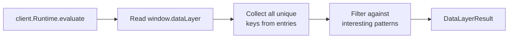

# detectDataLayer()

**File:** `src/commands/discover-phase1/data-layer.ts`
**Tests:** `src/__tests__/discover-phase1/detectDataLayer.test.ts` (2 tests)
**Status:** Implemented

---

## Purpose

Detects the presence of `window.dataLayer` (GTM) and extracts "interesting" keys
that reveal user state tracking, A/B testing, payment flows, and personalization
signals. This gives the analyst insight into the site's data instrumentation
without manually inspecting the browser console.

---

## Signature

```typescript
export interface DataLayerResult {
  hasDataLayer: boolean;
  entryCount: number;
  interestingKeys: string[];
}

export async function detectDataLayer(client: any): Promise<DataLayerResult>
```

---

## How It Works



1. Evaluates `window.dataLayer` in the page context
2. If absent or not an array, returns `hasDataLayer: false`
3. Collects all unique keys across all dataLayer entries
4. Filters keys against a registry of interesting patterns

---

## Interesting Key Patterns

Keys containing any of these substrings (case-insensitive) are flagged:

| Pattern | What it reveals |
|---|---|
| `user` | User state / login tracking |
| `payment` | Payment flow instrumentation |
| `test` | A/B test flags |
| `variant` | Test variant assignment |
| `experiment` | Experiment tracking |
| `currency` | Multi-currency support |
| `abtest` | A/B testing framework |
| `personali` | Personalization signals |
| `segment` | User segmentation |

---

## Integration

Called by `runPhase1Discovery()` in `orchestrator.ts` as Step 14 (non-fatal).
Result stored in `Step1ParsedReport.dataLayer`.

CDP-dependent — requires an active client connection.

---

## Tests

| Test | What it verifies |
|---|---|
| DataLayer with interesting keys | Detects dataLayer, filters for user/experiment/currency keys |
| No dataLayer exists | Returns `hasDataLayer: false` with empty results |
