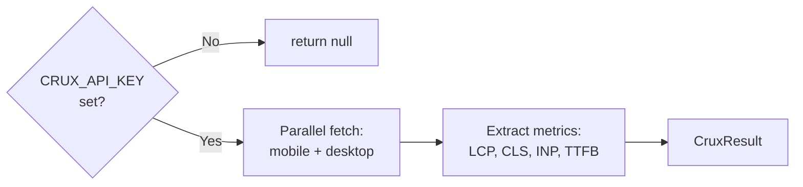

# fetchCruxData()

**File:** `src/commands/discover-phase1/crux.ts`
**Tests:** `src/__tests__/discover-phase1/fetchCruxData.test.ts` (2 tests)
**Status:** Implemented

---

## Purpose

Fetches Chrome UX Report (CrUX) field data via the PageSpeed Insights API for
both mobile and desktop strategies. Returns core web vitals metrics (LCP, CLS,
INP, TTFB) with their percentile values and categories.

This runs **after** the Chrome tab is closed since it only needs HTTP, not CDP.
Returns `null` if no `CRUX_API_KEY` environment variable is configured.

---

## Signature

```typescript
export interface CruxResult {
  mobile: Record<string, string> | null;
  desktop: Record<string, string> | null;
}

export async function fetchCruxData(
  url: string,
  apiKey?: string,
): Promise<CruxResult | null>
```

---

## How It Works



1. Checks for API key (parameter or `CRUX_API_KEY` env var)
2. If no key, returns `null` immediately
3. Fetches PageSpeed Insights API for both mobile and desktop in parallel
4. Extracts core web vitals from `loadingExperience.metrics`
5. Maps API metric names to short names (LCP, CLS, INP, TTFB)

---

## Metrics Extracted

| API Metric Name | Short Name | What it measures |
|---|---|---|
| `LARGEST_CONTENTFUL_PAINT_MS` | LCP | Largest content render time |
| `CUMULATIVE_LAYOUT_SHIFT_SCORE` | CLS | Layout stability |
| `INTERACTION_TO_NEXT_PAINT` | INP | Input responsiveness |
| `EXPERIMENTAL_TIME_TO_FIRST_BYTE` | TTFB | Server response time |

Each metric is formatted as `"<percentile> (<category>)"`, e.g. `"2500 (NEEDS_IMPROVEMENT)"`.

---

## Configuration

Requires a Google API key with PageSpeed Insights API enabled:

```bash
# .env
CRUX_API_KEY=your-api-key-here
```

Or pass directly: `fetchCruxData(url, 'your-api-key')`.

---

## Integration

Called by `runPhase1Discovery()` in `orchestrator.ts` as Step 17 (non-fatal).
Runs after `connection.close()` since it only needs HTTP.
Result stored in `Step1ParsedReport.cruxData`.

No CDP dependency — uses `fetch()`.

---

## Tests

| Test | What it verifies |
|---|---|
| CrUX metrics returned | Fetches mobile + desktop, extracts LCP metric |
| No API key | Returns `null` without making any fetch calls |
