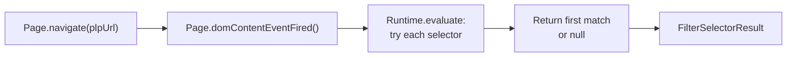

# discoverFilterSelector()

**File:** `src/commands/discover-phase1/filter-selector.ts`
**Tests:** `src/__tests__/discover-phase1/discoverFilterSelector.test.ts` (2 tests)
**Status:** Implemented

---

## Purpose

Navigates to a PLP (Product Listing Page) URL and probes the DOM for filter/facet
elements using a registry of heuristic selectors. Returns the first matching
selector, which downstream checks (`check-filters.ts`) can use to verify filter
behavior (URL-based vs session-based).

Only runs if `discoverPageTypes()` found a PLP in the page types array.

---

## Signature

```typescript
export interface FilterSelectorResult {
  found: boolean;
  selector: string | null;
  method: string;
}

export async function discoverFilterSelector(
  client: any,
  plpUrl: string,
): Promise<FilterSelectorResult>
```

---

## How It Works



1. Navigates to the provided PLP URL
2. Waits for `domContentEventFired` (DOM parsed, sufficient for selector queries)
3. Evaluates a JavaScript snippet that tries each selector in order
4. Returns the first selector that matches a DOM element, or null

---

## Selector Registry

Selectors are tried in order of specificity (most specific first):

| Selector | Target |
|---|---|
| `[data-filter-panel]` | Data attribute for filter panels |
| `[data-facet]` | Data attribute for facets |
| `[data-filters]` | Data attribute for filter containers |
| `.filter-panel` | Class-based filter panel |
| `.facet-panel` | Class-based facet panel |
| `.product-filter` | Product filter class |
| `.product-filters` | Product filters class |
| `#filter-sidebar` | ID-based filter sidebar |
| `#facet-sidebar` | ID-based facet sidebar |
| `[class*="filter"][class*="panel"]` | Compound class pattern |
| `[class*="facet"]` | Partial class match for facets |
| `aside[class*="filter"]` | Aside element with filter class |
| `nav[class*="filter"]` | Nav element with filter class |
| `form[class*="filter"]` | Form element with filter class |

---

## Integration

Called by `runPhase1Discovery()` in `orchestrator.ts` as Step 15 (non-fatal).
Only runs if `pageTypes` includes a PLP entry. Result stored in
`Step1ParsedReport.filterSelector`.

CDP-dependent — requires an active client connection. Performs an extra navigation.

---

## Tests

| Test | What it verifies |
|---|---|
| Filter element found | Navigates to PLP, finds `[data-filter-panel]` selector |
| No filter elements | Returns `found: false` with null selector |
