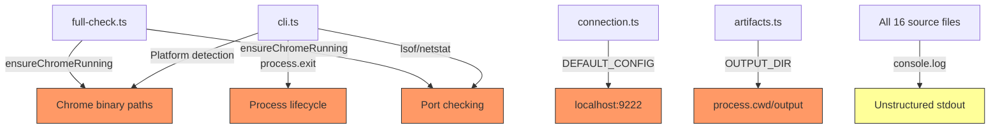
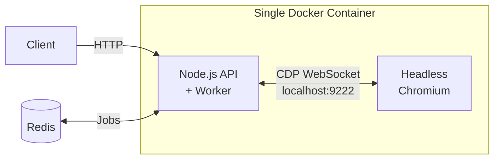
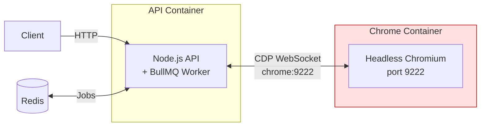
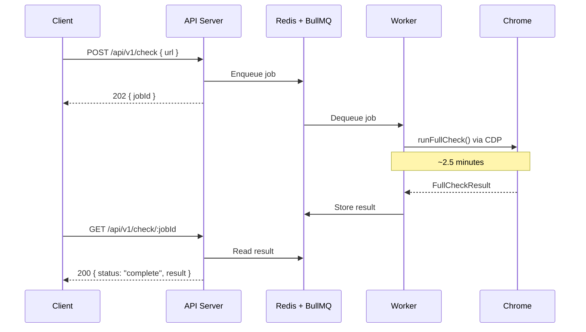
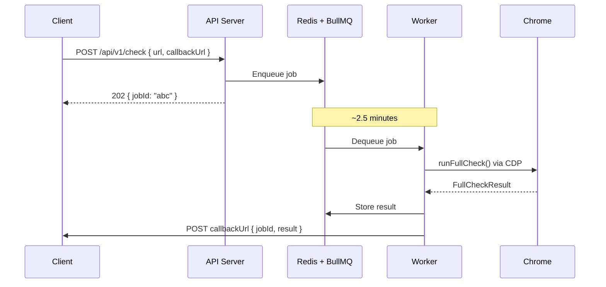

# Docker Deployment Strategy: Pre-Vetting CLI as a Service

**Date:** 2026-05-14
**Subject:** Containerization proposal for the Speed Kit Pre-Vetting tool
**Branch:** `master`
**Status:** Proposal (no code changes)

---

## Executive Summary

The pre-vetting CLI currently runs as an interactive tool on a developer's
local machine: start Chrome manually, run `npx ts-node src/cli.ts full-check
<url> -s`, read the output. This works for one-off analyses but cannot scale
to serve multiple consumers, run unattended, or deploy to cloud infrastructure.

This document proposes transforming the CLI into a **containerized service**
that accepts URLs via REST API and returns structured pre-vetting reports —
zero human involvement, deployable anywhere Docker runs.

**Recommended architecture:** A **sidecar pattern** (Option B) with the
Node.js API server and headless Chrome in separate containers. Chrome is
prone to memory leaks and zombie processes; isolating it ensures a crash
does not take down the API. Jobs are processed via an **async queue**
(Redis + BullMQ) because CDP audits take ~2.5 minutes — far too long for
synchronous HTTP.

**What needs to change:** 8 specific local-execution assumptions in the
codebase must be addressed. The core business logic (`runFullCheck()`,
`checkSSR()`, etc.) requires **zero changes** — it already returns typed,
serializable results ready for API responses.

---

## 1. Current Architecture: What Binds It to Local Execution

The codebase has 8 assumptions that prevent Docker deployment today.
Understanding each one is essential before proposing changes.

### 1.1 Platform-Specific Chrome Launch

The tool assumes Chrome is installed at OS-specific paths and launches it
via `child_process.exec()`:

```typescript
// src/commands/full-check.ts:107-113
if (os.platform() === 'darwin') {
  chromePath = '/Applications/Google Chrome.app/Contents/MacOS/Google Chrome';
} else if (os.platform() === 'win32') {
  chromePath = 'C:\\Program Files\\Google\\Chrome\\Application\\chrome.exe';
} else {
  chromePath = 'google-chrome';
}
```

The same pattern exists in `src/cli.ts:70-76`. Port availability checks use
`lsof` (macOS/Linux) and `netstat` (Windows) — neither works in minimal
Docker containers.

> **Reference:** [`src/commands/full-check.ts:92-153`](../src/commands/full-check.ts),
> [`src/cli.ts:30-110`](../src/cli.ts)

### 1.2 Hardcoded localhost:9222

The CDP connection defaults to `localhost:9222`:

```typescript
// src/cdp/connection.ts:14-17
const DEFAULT_CONFIG: CDPConfig = {
  host: 'localhost',
  port: 9222,
};
```

The `CDPConfig` interface already accepts `host` and `port` as optional
overrides, but **no CLI flag or environment variable exposes them**. Every
call to `createNewTarget()` uses the defaults. In a sidecar architecture,
Chrome runs at a different hostname (e.g., `chrome:9222`).

> **Reference:** [`src/cdp/connection.ts:8-17`](../src/cdp/connection.ts)

### 1.3 CLI-Only Interface

The entry point is a `commander`-based CLI in `src/cli.ts`. There is no HTTP
server, no request queue, no async job management. Every command runs, prints
to stdout, and exits. A service must accept requests over HTTP, process them
asynchronously, and stay alive between requests.

### 1.4 Local Filesystem Output

```typescript
// src/utils/artifacts.ts:4
const OUTPUT_DIR = path.join(process.cwd(), 'output');
```

Reports are written to `output/<domain>_<timestamp>/report.md`. Container
filesystems are **ephemeral** — files vanish when the container restarts
unless volumes are mounted or results are returned via API response.

> **Reference:** [`src/utils/artifacts.ts:4`](../src/utils/artifacts.ts)

### 1.5 Environment via .env File

`.env.example` defines `WPT_API_KEY` and `CRUX_API_KEY`, loaded via
`dotenv.config()` at the top of `cli.ts`. In containers, environment
variables are injected via `docker run -e` or Kubernetes secrets.

**This actually works as-is.** `dotenv` falls back gracefully to
`process.env` when no `.env` file exists. Low friction.

### 1.6 Console Output as the UI

The codebase has ~392 `console.log/warn/error` calls across 16 source files,
using `chalk` for colored terminal output. A service needs **structured
logging** (JSON format) so container platforms (Docker, Kubernetes, CloudWatch)
can parse, index, and alert on log events.

### 1.7 process.exit() in Error Handlers

Several error paths call `process.exit(1)`, which kills the entire process.
In a CLI, this is expected behavior. In a service, this crashes the server
and drops all in-flight requests.

### 1.8 Chrome Profile on Local Disk

Chrome uses `~/.chrome-debug-profile` as its user data directory. In a
container, this path must be writable and typically lives at `/tmp/chrome-profile`
or a mounted volume.

### Dependency Map

The following diagram shows which files carry which local-execution assumptions:



> Orange = must change for Docker. Yellow = should change for production.

---

## 2. Architecture Options

Three approaches to running Chrome alongside the Node.js service in Docker.

### Option A: Same Container

Chrome and Node.js run in a single Docker image.



| Aspect | Assessment |
|---|---|
| Simplicity | Highest — single image, single deploy unit |
| Image size | ~1.2 GB (Node.js + Chromium + system libs) |
| Fault isolation | **None** — Chrome crash kills the API server |
| Scaling | Cannot scale Chrome independently |
| CDP latency | Zero (localhost) |

**When to use:** Local Docker testing, prototyping, single-tenant deployments
where simplicity outweighs resilience.

### Option B: Sidecar Pattern (Recommended)

Chrome and Node.js run in separate containers, connected via Docker networking.



| Aspect | Assessment |
|---|---|
| Fault isolation | **Primary advantage.** Chrome crash does not affect the API |
| Chrome restarts | Auto-restart policy (`restart: unless-stopped`) recovers Chrome independently |
| Image sizes | API: ~200 MB (Node.js only), Chrome: ~800 MB (community image) |
| Scaling | Scale Chrome containers independently if needed |
| CDP latency | ~1-5ms per command (container-to-container networking) — negligible for this workload |

**Why fault isolation matters:**

Headless Chrome is not a stable, long-running server process. It is a browser
engine designed for interactive use, repurposed for automation. In practice:

- **Memory leaks:** Chrome's memory usage grows over time, especially with
  repeated tab creation/destruction. A 2 GB container can OOM after 20-30
  audits without periodic restarts.
- **Zombie processes:** Each Chrome tab spawns renderer, GPU, and utility
  child processes. When tabs close, these subprocesses sometimes fail to
  exit cleanly, accumulating as zombies.
- **Renderer crashes:** JavaScript-heavy pages can crash Chrome's renderer
  process, leaving the main Chrome process in an inconsistent state.

With Option A, any of these failures kills the API server. Queued jobs are
lost. Clients get connection resets. With Option B, Chrome crashes and the
API server continues accepting and queuing jobs. The Chrome container
restarts automatically, and the worker retries the failed job.

### Option C: External Chrome Pool

A managed Chrome pool (e.g., Browserless.io, or self-hosted cluster) shared
across multiple service instances.

| Aspect | Assessment |
|---|---|
| Scalability | Highest — amortize Chrome costs across services |
| Operational overhead | Highest — manage a separate Chrome cluster |
| CDP latency | Network-dependent (can be significant over WAN) |
| Cost | SaaS pricing or dedicated infrastructure |

**When to use:** Production deployments serving >10 concurrent pre-vetting
jobs, or when the Chrome pool is shared with other browser automation tools.

### Recommendation

**Option B (sidecar) is the target architecture** for any deployment beyond
local testing. The fault isolation argument alone justifies the additional
Docker Compose complexity. Option A is acceptable for prototyping and local
Docker testing where simplicity matters more than resilience.

---

## 3. Code Changes Required

The table below lists every file that needs modification, what changes, and
the estimated effort. Critically, **the core business logic requires no
changes** — `runFullCheck()`, `checkSSR()`, `checkImages()`, and all Phase 1
discovery functions already return typed, serializable TypeScript interfaces.

| File | Change | Effort |
|---|---|---|
| [`src/cdp/connection.ts`](../src/cdp/connection.ts) | Add `CDP_HOST`/`CDP_PORT` env vars to `DEFAULT_CONFIG` | Low |
| [`src/commands/full-check.ts`](../src/commands/full-check.ts) | Simplify `ensureChromeRunning()` — remove platform detection, use env vars | Low |
| [`src/cli.ts`](../src/cli.ts) | Make `start-chrome` a no-op when `CDP_HOST` is set (container mode) | Low |
| [`src/utils/artifacts.ts`](../src/utils/artifacts.ts) | Add `OUTPUT_DIR` env var to override `process.cwd()/output` | Low |
| `src/server.ts` **(new)** | HTTP API server wrapping `runFullCheck()` + BullMQ worker | Medium |
| All files with `console.log` | Replace with structured logger (e.g., `pino`) | High (mechanical) |
| Error handlers in `cli.ts` | Remove `process.exit()` calls; let errors propagate | Low |

### 3.1 CDP Connection (`connection.ts`)

The change is minimal — 2 lines:

```typescript
// Before
const DEFAULT_CONFIG: CDPConfig = {
  host: 'localhost',
  port: 9222,
};

// After
const DEFAULT_CONFIG: CDPConfig = {
  host: process.env.CDP_HOST || 'localhost',
  port: parseInt(process.env.CDP_PORT || '9222', 10),
};
```

No other file changes needed — all functions already spread `DEFAULT_CONFIG`
with caller-provided overrides. The `CDPConfig` interface is unchanged.

### 3.2 Chrome Lifecycle (`full-check.ts`)

`ensureChromeRunning()` (lines 92-153) currently launches Chrome via
platform-specific `exec()` calls. In a Docker deployment, Chrome is either
already running (sidecar) or started by the container entrypoint (same
container). The function becomes a **health check**:

```typescript
// Simplified for Docker
async function ensureChromeRunning(): Promise<void> {
  const maxRetries = 10;
  for (let i = 0; i < maxRetries; i++) {
    try {
      await listTargets();
      return; // Chrome is ready
    } catch {
      await new Promise(r => setTimeout(r, 1000)); // Wait for sidecar startup
    }
  }
  throw new Error(`Chrome not available at ${process.env.CDP_HOST || 'localhost'}:${process.env.CDP_PORT || 9222}`);
}
```

The retry loop handles the sidecar startup race condition: the Node.js
container may start before Chrome is ready to accept CDP connections.

### 3.3 Output Directory (`artifacts.ts`)

One-line change:

```typescript
const OUTPUT_DIR = process.env.OUTPUT_DIR || path.join(process.cwd(), 'output');
```

### 3.4 New HTTP Server (`server.ts`)

A new entry point that imports the same business logic the CLI uses. Both
entry points coexist:

- `npm run cli` → `node dist/cli.js` (local development)
- `npm run serve` → `node dist/server.js` (Docker service)

The server wraps `runFullCheck()` in an async job handler. Details in
Section 4.

---

## 4. Service Interface Design

### Why Async is Mandatory

A `full-check` audit takes **~2.5 minutes** (mean 145 seconds across 3
runs on fritz-berger.de). Most HTTP clients default to 30-60 second
connection timeouts. A synchronous `POST` → wait → response model will
result in:

- Client-side timeouts and retries (doubling the load)
- Proxy/load balancer timeouts (Nginx defaults to 60s, AWS ALB to 60s)
- Wasted Chrome resources when the client disconnects mid-audit

The API **must** return immediately and process the job asynchronously.

### Architecture: REST API + Job Queue



### API Endpoints

| Method | Path | Response | Description |
|---|---|---|---|
| `POST` | `/api/v1/check` | `202 Accepted` | Submit a pre-vetting job |
| `GET` | `/api/v1/check/:jobId` | `200 OK` | Poll job status and result |
| `GET` | `/api/v1/check/:jobId/report` | `200 OK` | Get Markdown report |
| `GET` | `/health` | `200 OK` | Chrome + Redis connectivity |

### Request and Response

**Submit a job:**

```json
POST /api/v1/check
{
  "url": "https://www.fritz-berger.de",
  "options": {
    "mobile": false,
    "skipWpt": true
  },
  "callbackUrl": "https://your-service.com/webhook/prevetting"
}
```

**Response (immediate):**

```json
HTTP 202 Accepted
{
  "jobId": "a1b2c3d4",
  "status": "queued",
  "estimatedDuration": "~150s"
}
```

The `options` field maps directly to the existing `FullCheckOptions` interface
in [`full-check.ts:29-37`](../src/commands/full-check.ts). The API layer
translates the JSON body into this TypeScript interface — no business logic
changes needed.

The `callbackUrl` field is optional (see Webhooks below).

### Job Status

```json
GET /api/v1/check/a1b2c3d4

// While running:
{ "jobId": "a1b2c3d4", "status": "running", "progress": "Phase 2: SSR Check complete" }

// When done:
{ "jobId": "a1b2c3d4", "status": "complete", "result": { /* FullCheckResult */ } }
```

The `result` field is the full `FullCheckResult` interface — the same
TypeScript struct that `runFullCheck()` already returns. It includes
`htmlComparison`, `ssrCheck`, `imageCheck`, `headerCheck`, `navigationCheck`,
`step1Report`, and `executionMetrics`. No transformation needed.

### Webhooks (Preferred over Polling)

Polling works but is wasteful: the client must send a `GET` request every
few seconds for ~2.5 minutes. For clients that can expose an HTTP endpoint,
**webhooks are the preferred notification mechanism.**

When a job includes a `callbackUrl`, the BullMQ worker `POST`s the result
to that URL upon completion:



If the webhook delivery fails (client is down, network error), the result
remains in Redis and can be retrieved via `GET /api/v1/check/:jobId`.

**Polling remains as a fallback** for clients that cannot expose webhook
endpoints (browser-based dashboards, CLI consumers, firewall-restricted
environments).

### Concurrency Control

Each `full-check` opens 5+ Chrome tabs in parallel (Phase 2 checks). Chrome
needs ~200-400 MB per tab. A single Chrome instance should handle at most
**2-3 concurrent jobs** to avoid OOM.

BullMQ supports a `concurrency` option on the worker:

```typescript
const worker = new Worker('prevetting', processJob, {
  concurrency: 2, // Max 2 jobs at a time per worker
});
```

To handle more concurrent requests, scale horizontally: add more
worker + Chrome sidecar pairs.

---

## 5. Container Design

### 5.1 Dockerfile (Option A — Same Container)

Key design decisions for the Docker image:

**Base image:** `node:20-slim` (Debian Bookworm). Alpine is smaller but
Chrome requires glibc and many shared libraries that are painful to install
on musl-based systems.

**Chromium installation:** Use the Debian package `chromium` (not Google
Chrome). It's open-source, available in the default apt repositories, and
doesn't require accepting proprietary licenses in automated builds.

**TypeScript compilation:** Run `npx tsc` during the Docker build and ship
only `dist/`. This eliminates `ts-node` runtime overhead and keeps dev
dependencies out of the production image.

**Chrome flags:**

| Flag | Why it's needed |
|---|---|
| `--headless=new` | Run without a display (new headless mode, Chrome 112+) |
| `--no-sandbox` | Required in Docker — container namespaces replace Chrome's sandbox |
| `--disable-dev-shm-usage` | Docker's default `/dev/shm` is 64 MB; Chrome needs more for rendering. This flag uses `/tmp` instead |
| `--disable-gpu` | No GPU available in most containers |
| `--remote-debugging-port=9222` | Expose CDP for the Node.js worker |

### The Init System Problem

**This is easy to overlook and critical to get right.**

When a Docker container starts, the first process becomes PID 1. PID 1 has
a special responsibility in Linux: it must **reap zombie child processes**.
When a child process exits, it stays in the process table as a "zombie"
until its parent calls `wait()`. If the parent is PID 1 and doesn't handle
`SIGCHLD` signals, zombies accumulate.

**Node.js does not reap zombies.** It is not designed to be an init system.

**Headless Chrome creates many child processes.** Every tab spawns renderer,
GPU broker, utility, and network service subprocesses. When a tab closes,
these subprocesses exit — but if Node.js is PID 1, they become zombies
instead of being cleaned up.

Over 20-30 audits (each opening 5+ tabs), hundreds of zombie processes
accumulate. Each zombie consumes a process table entry and a small amount
of memory. Eventually, the container hits the kernel's PID limit or OOMs.

**The fix: use `tini` as the Docker entrypoint.**

[`tini`](https://github.com/krallin/tini) is a minimal init system (~20 KB
binary) designed exactly for this purpose. It:

- Becomes PID 1 and spawns the Node.js process as its child
- Handles `SIGCHLD` by calling `wait()` — reaps all zombies automatically
- Forwards signals (`SIGTERM`, `SIGINT`) to the Node.js process for graceful shutdown

```dockerfile
# Install tini
RUN apt-get update && apt-get install -y tini

# Use tini as entrypoint
ENTRYPOINT ["tini", "--"]
CMD ["node", "dist/server.js"]
```

Without `tini`, the container works initially but degrades over hours of
continuous use. This is the kind of issue that doesn't appear in testing
(short runs) but crashes production containers overnight.

### 5.2 Docker Compose (Option B — Sidecar)

Two services connected via Docker's internal network:

```yaml
# Conceptual structure — not a complete production-ready file
services:
  api:
    build: .
    environment:
      CDP_HOST: chrome
      CDP_PORT: 9222
      REDIS_URL: redis://redis:6379
      CRUX_API_KEY: ${CRUX_API_KEY}
    depends_on:
      chrome:
        condition: service_healthy
      redis:
        condition: service_started
    deploy:
      resources:
        limits:
          memory: 512M

  chrome:
    image: zenika/alpine-chrome:latest
    command: ["chromium-browser", "--headless=new", "--no-sandbox",
              "--disable-dev-shm-usage", "--disable-gpu",
              "--remote-debugging-port=9222"]
    healthcheck:
      test: ["CMD", "wget", "-q", "--spider", "http://localhost:9222/json/version"]
      interval: 10s
      timeout: 5s
      retries: 3
    restart: unless-stopped
    deploy:
      resources:
        limits:
          memory: 2G

  redis:
    image: redis:7-alpine
    deploy:
      resources:
        limits:
          memory: 128M
```

**Key points:**

- The `api` service waits for Chrome's health check before starting
  (`condition: service_healthy`). This eliminates the startup race condition.
- Chrome has `restart: unless-stopped` — if it crashes or OOMs, Docker
  restarts it automatically. The API server continues running.
- Chrome gets 2 GB memory (5 tabs x ~400 MB). The API gets 512 MB.
- Redis stores job queue and results. Lightweight (128 MB).

### Environment Variables

| Variable | Default | Description |
|---|---|---|
| `CDP_HOST` | `localhost` | Chrome hostname (set to `chrome` in sidecar mode) |
| `CDP_PORT` | `9222` | Chrome debugging port |
| `OUTPUT_DIR` | `./output` | Report output directory (optional in API mode) |
| `REDIS_URL` | `redis://localhost:6379` | Redis connection string for BullMQ |
| `CRUX_API_KEY` | — | PageSpeed Insights API key |
| `WPT_API_KEY` | — | WebPageTest API key (optional) |
| `PORT` | `3000` | HTTP server port |
| `LOG_LEVEL` | `info` | Logging verbosity |
| `MAX_CONCURRENCY` | `2` | Max concurrent jobs per worker |

---

## 6. Operational Concerns

### 6.1 Health Checks

| Check | Endpoint / Method | What it verifies |
|---|---|---|
| Chrome liveness | `GET http://CDP_HOST:CDP_PORT/json/version` | Chrome process is running and accepting CDP |
| API readiness | `GET /health` | API can connect to Chrome + Redis |
| Queue depth | `GET /health` (extended) | Number of pending/active jobs |

The `/health` endpoint should return structured status:

```json
{
  "status": "healthy",
  "chrome": { "connected": true, "version": "125.0.6422.0" },
  "redis": { "connected": true, "pendingJobs": 3, "activeJobs": 1 },
  "uptime": "2h 15m"
}
```

### 6.2 Memory and Resources

| Component | Minimum | Recommended | Why |
|---|---|---|---|
| Chrome container | 1 GB | 2 GB | 5 parallel tabs x ~400 MB each |
| API container | 256 MB | 512 MB | Node.js + BullMQ worker |
| Redis | 64 MB | 128 MB | Job queue + result storage |

Monitor Chrome's RSS (Resident Set Size) over time. If it grows beyond
1.5 GB between audits, schedule periodic Chrome container restarts (e.g.,
every 50 jobs) to reset memory state.

### 6.3 Logging

Replace `console.log` with a structured logger that outputs JSON to stdout:

```json
{"level":"info","jobId":"abc123","url":"fritz-berger.de","check":"ssrCheck","msg":"SSR ratio 92%","ts":"2026-05-14T06:21:44Z"}
```

Docker captures stdout automatically. Container platforms (CloudWatch, GCP
Logging, Datadog) parse JSON logs natively, enabling filtering by `jobId`,
`url`, `check`, and `level`.

The structured logging migration affects ~392 call sites across 16 files.
This is the highest-effort change but is mechanical — each `console.log`
becomes a `logger.info()` call. Start with the critical path
(`full-check.ts`, `orchestrator.ts`) and expand incrementally.

### 6.4 Security

| Concern | Mitigation |
|---|---|
| `--no-sandbox` | Required in Docker. The container itself is the sandbox. Do not expose the Chrome port externally. |
| URL injection | Validate and sanitize input URLs before passing to `Page.navigate()`. Reject `file://`, `javascript:`, and internal network addresses. |
| API authentication | Add API key middleware (`Authorization: Bearer <key>`) to all `/api/v1/*` endpoints. |
| Rate limiting | Each audit uses Chrome for ~2.5 minutes. Limit to `MAX_CONCURRENCY` concurrent jobs. Reject excess requests with `429 Too Many Requests`. |
| Webhook security | Sign webhook payloads with HMAC so the receiver can verify authenticity. |

### 6.5 Graceful Shutdown

On `SIGTERM` (sent by Docker during container stop):

1. Stop accepting new HTTP requests
2. Stop consuming new jobs from the queue
3. Wait for in-flight jobs to complete (with a timeout, e.g., 180 seconds)
4. Close all active CDP connections
5. Exit cleanly

The existing codebase already uses `try/finally` blocks to close CDP
connections after each check — this pattern works as-is in the service
context.

---

## 7. Smart Wait and Timeout Considerations

The Smart Wait strategy (15-second soft timeout / 30-second fatal timeout)
in the [Phase 1 orchestrator](../src/commands/discover-phase1/orchestrator.ts)
is **page-dependent, not infrastructure-dependent**. These timeouts measure
how long a website takes to load its content, not how fast the container runs.

| Concern | Impact in Docker |
|---|---|
| Smart Wait 15s/30s timeouts | No change needed. Same page loads, same timing. |
| `--disable-gpu` rendering | Negligible. The tool analyzes HTML/DOM structure, not pixel rendering. |
| Container memory limits | If too low, Chrome OOM-kills tabs mid-audit. Set Chrome container to ≥2 GB. |
| Network latency (sidecar CDP) | ~1-5ms per CDP command. A full audit sends ~200 CDP commands. Total overhead: ~0.5s. Negligible vs 145s audit time. |
| Sidecar startup race | Chrome may start slower than Node.js. The retry loop in `ensureChromeRunning()` (Section 3.2) handles this. |

**No timeout changes are needed for Docker deployment.** The existing values
are calibrated for page behavior (tracker-heavy sites, deferred JavaScript),
not for infrastructure performance.

---

## 8. Incremental Migration Path

These steps are ordered by dependency and value. Each step is independently
deployable and backward-compatible with the existing CLI workflow.

1. **Configuration extraction** — Add `CDP_HOST`, `CDP_PORT`, `OUTPUT_DIR`
   environment variables to `connection.ts` and `artifacts.ts`. Defaults
   stay the same — existing CLI behavior is unchanged.
   *(Low effort. Prerequisite for everything else.)*

2. **Headless Chrome in Docker (CLI mode)** — Write a Dockerfile that
   installs Chromium and runs the existing CLI as a one-shot command.
   Validates that Chrome works in Docker, CDP connects, and reports are
   generated. No API server yet.
   *(Medium effort.)*

3. **HTTP API + async queue** — Create `src/server.ts` with Fastify/Express
   + BullMQ. Wrap `runFullCheck()` in an async job handler. Add `/health`,
   `POST /check`, `GET /check/:jobId` endpoints. Include webhook support.
   *(Medium effort.)*

4. **Chrome separation (sidecar)** — Docker Compose with separate `api`,
   `chrome`, and `redis` services. Add connection retry logic. Add `tini`
   init system to the API container.
   *(Low-Medium effort.)*

5. **Structured logging** — Replace `console.log` with a JSON logger.
   Start with `full-check.ts` and `orchestrator.ts`, then expand. Can be
   done in parallel with steps 3-4.
   *(High effort, mechanical.)*

6. **Production hardening** — Concurrency limits, API authentication,
   rate limiting, graceful shutdown, monitoring/metrics.
   *(High effort. Depends on deployment target.)*

---

## 9. What Changes and What Stays the Same

| Component | Changes? | Details |
|---|---|---|
| `runFullCheck()` | **No** | Already returns typed `FullCheckResult` — API-ready |
| `checkSSR()`, `checkImages()`, etc. | **No** | Pure functions with typed results |
| Phase 1 orchestrator | **No** | `runPhase1Discovery()` returns `Step1ParsedReport` |
| Smart Wait timeouts | **No** | Page-dependent, not infra-dependent |
| Report generator | **No** | `generateReport()` returns a string — works anywhere |
| CDP connection config | **Yes** | Add `CDP_HOST`/`CDP_PORT` env vars (2 lines) |
| Chrome launch | **Yes** | Simplify for Linux-only or remove for sidecar |
| Output directory | **Yes** | Add `OUTPUT_DIR` env var (1 line) |
| Entry point | **Add** | New `server.ts` alongside existing `cli.ts` |
| `process.exit()` | **Yes** | Remove from error handlers |
| Logging | **Yes** | Structured JSON for service mode |

The core insight: **the business logic is already service-ready.** The
`FullCheckOptions` → `runFullCheck()` → `FullCheckResult` pipeline is a
pure function that takes typed input and returns typed output. The only work
is wrapping it in an HTTP/queue interface and making the infrastructure
configuration flexible.

---

## Appendix: Reference Files

| File | Relevant Lines | What to Change |
|---|---|---|
| [`src/cdp/connection.ts`](../src/cdp/connection.ts) | 14-17 | `DEFAULT_CONFIG` → env vars |
| [`src/commands/full-check.ts`](../src/commands/full-check.ts) | 29-37, 74-86, 92-153 | `FullCheckOptions`, `FullCheckResult`, `ensureChromeRunning()` |
| [`src/utils/artifacts.ts`](../src/utils/artifacts.ts) | 4 | `OUTPUT_DIR` → env var |
| [`src/cli.ts`](../src/cli.ts) | 30-110 | `start-chrome` command |
| [`src/commands/discover-phase1/orchestrator.ts`](../src/commands/discover-phase1/orchestrator.ts) | 164-197 | Smart Wait (no changes needed) |
| [`src/utils/report-generator.ts`](../src/utils/report-generator.ts) | — | `generateReport()` (no changes needed) |

---

*Document prepared as part of Task 4 — Pre-Vetting CLI Containerization Proposal*
*No code changes included — this is an architectural strategy document*
